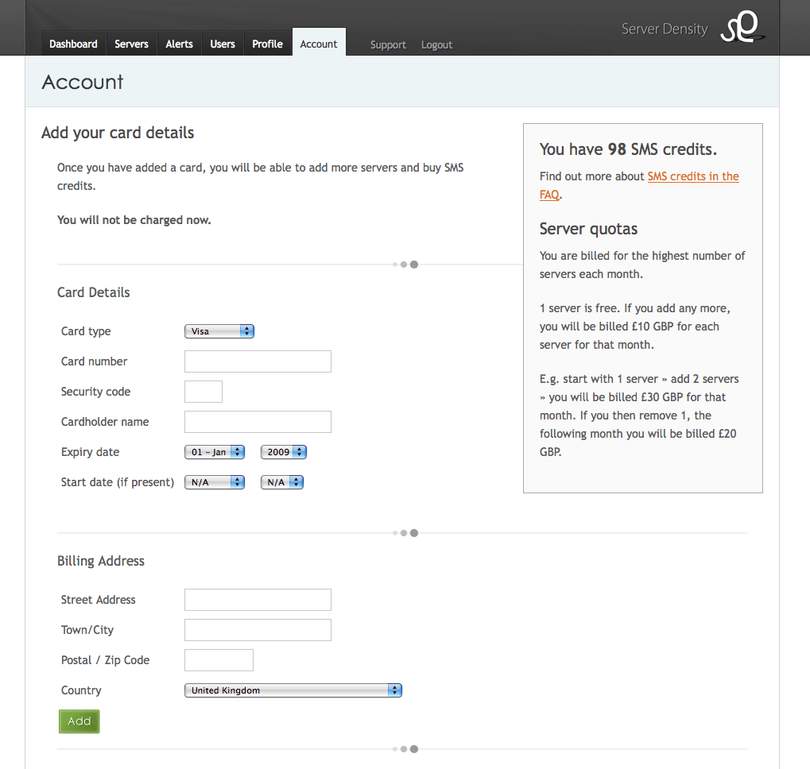

_Originally [published on the Server Density
blog](https://blog.serverdensity.com/taking-payments-online-merchant-account-payment-processor-fees/)._

There are quite a few options for taking online payments from customers but the
best way is to get a merchant account and use a 3rd party processor to handle
everything. When I say “best”, I mean that in a comparative sense verses using
the likes of Google Checkout or PayPal:

## Why get a merchant account?

- You can get better rates. These change based on volume but the initial rates
  from [Paypal](https://www.paypal.com/uk/cgi-bin/webscr?cmd=_display-receiving-fees-outside&countries=) and [Google](https://checkout.google.com/seller/fees.html?hl=en&gl=GB) are
  both 3.4% + £0.20. In contrast we are paying as low as 1.65% + £0.10 per
  transaction.
- It is more flexible. We bill customers for our server monitoring
  product, [Server Density](https://www.serverdensity.com/), on a monthly
  usage basis. This means the amount can change each month, something that
  Google and PayPal cannot handle.
- You can collect card details on your own site, within your own sales funnel.
  This means you can control every last detail to maximise conversion.

## How to get a merchant account

This can be quite difficult, depending on your business. For Boxed Ice doing
hosted software, it was less of a problem but if you are in risky markets such
as gambling then fees can be quite high. I recommend [a post by Daniel Tenner
“How to get a merchant
account”](http://danieltenner.com/posts/0006-how-to-get-a-merchant-account.html) which
goes into detail about the process.

When applying, the fees will be based on your estimated annual transaction
volume. You should not lie but use a high, yet still realistic estimate. When
applying for our accounts, we used £10,000 sales per month as the figure. This
is one of our internal goals for the first year and is not entirely unrealistic
(1000 customers paying to monitor 1 server each).

If you are going to be billing customers each month you need to make sure you
get a continuous authority merchant account as well. This is usually provided
for no extra fee so long as you let the bank know you want to bill customers on
a recurring basis.

You should make sure you start this well in advance of when you need the account
because it can take many weeks to get everything sorted. I started calling banks
at the end of April and everything will finally be set up by the end of this
month (merchant account is ready, waiting on the payment processor now).

## What is the difference between a merchant account and payment processor?

Sometimes you can get both from the same company, but you will be unlikely to
get the best rates if you do. The merchant account is the connection to your
bank’s processing systems. The payment processor provides the interface for you
to send customers through (either hosted or via an API) and they connect to your
merchant account at your bank to perform the actual transaction.

Both companies will charge you for their services and this is where the rest of
the post will go into detail about the fees you can expect from each of the
banks and payment processors.

## UK merchant accounts

We are based in the UK so all this information is UK specific. There are [a
number of banks that offer merchant
services](https://www.businesslink.gov.uk/bdotg/action/detail?r.l1=1073861169&r.l3=1073920405&r.lc=en&r.t=RESOURCES&type=RESOURCES&itemId=1073791016&r.i=1073791017&r.l2=1079589261&r.s=m) and
we contacted them all to get a quote for Boxed Ice.

You get different rates depending on the type of card used and there is always a
setup fee involved. There is also always a monthly minimum billing amount which
they charge if you do not reach that level in fees for the month. However,
everything is negotiable (except, it seems, the monthly minimum). Do not accept
the first quote you are given. Go to each bank and get a quote then go back to
each one and ask them to beat the best quote you got. I did this several times
and managed to reduce the rates quite substantially.

### Bank of Scotland

| Type        | Original | Negotiated |
| ----------- | -------- | ---------- |
| Setup       | £375     | £300       |
| Monthly min | £20      |
| Visa credit | 1.7%     |
| Visa debit  | 22p      | 18p        |
| MasterCard  | 2.1%     |

### Barclaycard Business

| Type           | Original | Negotiated |
| -------------- | -------- | ---------- |
| Setup          | £150     | £50        |
| Monthly min    | £20      |
| Consumer cards | 2.075%   | 1.85%      |
| Business cards | 2.458%   | 1.194%     |
| Debit cards    | £0.206   | £0.18      |

Barclays also imposed a 45 day deferred payment policy for the sole reason that
Boxed Ice is a software company. See [this blog
post](http://blog.boxedice.com/2009/05/07/barclays-hates-tech-startups/) for
more info.

### Streamline

| Type        | Original | Negotiated |
| ----------- | -------- | ---------- |
| Setup       | £200     | £50        |
| Monthly min | £15      |
| Visa credit | 2.6%     | 1.65%      |
| Visa debit  | 38p      | 19p        |
| MasterCard  | 2.6%     | 1.95%      |

[Streamline](https://www.streamline.com/) clearly have the best fees of the lot.
They advertise that they only deal with established businesses but that is not
the case – Boxed Ice is a startup and we have our merchant account with them
now. Otherwise, they will direct you to their sister
company, [WorldPay](http://www.worldpay.com/), who do not have good rates and
keep you money for weeks (Streamline and Bank of Scotland pay you within 3
days).

I also contacted HSBC but they require you to have a bank account with them for
at least 12 months before they will provide merchant services.

## UK payment processors

Once you have your merchant account, you need to get a payment processor to
handle the actual “front end” billing. Our requirements for variable monthly
billing mean that we need an API. The only 2 companies that provide such a
flexible service are:

- [PayPoint.net](http://www.paypoint.net/) (formerly SecPay)
- [NetBanx](http://www.netbanx.com/)

I had planned on using PayPoint because I have used them in the past. Their API
uses SOAP but is not well designed. There is very little documentation and it
always felt a little hacked up to integrate with.

They seem to have updated their [pricing
plans](http://www.paypoint.net/solutions/payment-gateway/) over the last few
days. Previously. it was £10 per month and 38p per transaction but their new
pricing is £20 per month, including 500 transactions and 10p per transaction
after that (you must use
their [Professional](http://www.paypoint.net/solutions/payment-gateway/professional/) plan
to get access to their API).

We decided to go with NetBanx. Their API (also SOAP) is much nicer and at the
time their prices were more competitive. I negotiated their setup fee down from
£345 to £0. Their transaction fees are 10p per transaction, with a minimum £20
per month billing. They also have [a much nicer control
panel](http://www1.netbanx.com/content/en/support_merchant_login.htm)compared to
PayPoint, which was awful the last time I used it.

It’s also worth noting that PayPoint charge every API call as a transaction,
whereas NetBanx only charge when you take a payment. When we collect card
details, we use their authorise API call to check the card is valid and then
store it with the processor (so we don’t have to). Then each month we bill that
card based on a unique reference. PayPoint charge for the authorise whereas
NetBanx do not.

Unfortunately, NetBanx are a little slow to respond to technical queries. I
submitted a ticket on Sunday and had to phone twice on Monday and again on
Tuesday before I got a response. I did speak to someone each time, but they just
said it was being worked on. A few tickets are still outstanding. That said, I
e-mailed PayPoint sales with a query about their billing and they never replied.

I also looked into [SagePay](http://www.sagepay.com/) (formerly Protx) but found
out [some](http://www.stephenbartholomew.co.uk/2007/7/27/protx-making-customers-feel-like-shit) [disturbing](http://www.channelregister.co.uk/2008/04/03/protx_upgrade_outage/)[stories](https://support.sagepay.com/forum/Topic6111-22-1.aspx) about
downtime and poor customer service.

And I checked [SecureTrading](http://www.securetrading.com/) but their API is
perhaps the worst I have ever seen – you have to install a Java application
through which you query their API. They tell you to pipe an HTTP connection
through it to call their API but provide little error handling and no source
code. I am not a Java programmer so if something goes wrong, I would be stuck.
It also feels like a horrible hack. ST’s fees were £50 setup, £0.20 per
transaction and £10 per month minimum billing.

## Conclusions

Negotiate everything, and use the best quote you get to get other providers to
reduce their fees.

Allow several days to get quotes and negotiate the merchant account; then 2
weeks to get it set up. The same applies to the payment processor.

For us, the best option was Streamline for the merchant account and NetBanx for
payment processing. With the latter, be prepared to be a little more to get a
better API / interface, although I have e-mailed them to find out if they will
match the new PayPoint pricing!

**Update 28th May 09:** NetBanx reduced their fees to 7p per transaction. It is
worth noting that the £20 per month fee from PayPoint is a special offer for 3
months, after which it rises to £40 per month, with 500 free transactions
included. After that, fees are 10p per transaction. The difference is that
PayPoint charge 500 free + 10p per transaction + £20/£40 per month whereas
NetBanx are charging us 7p per transaction, with a minimum billing amount of £20
per month. This means for 500 transactions, NetBanx will charge £35, whereas
PayPoint are charging £20/£40. As such, NetBanx are cheaper.
