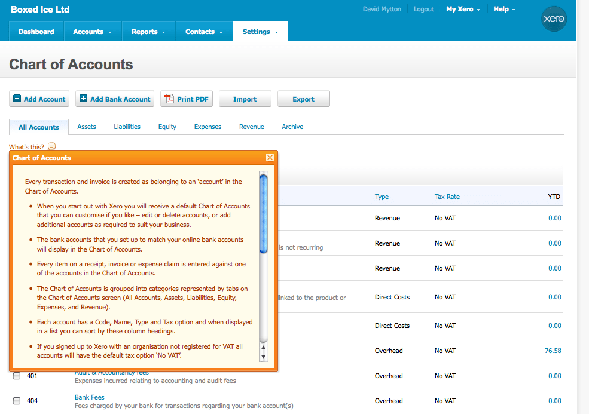
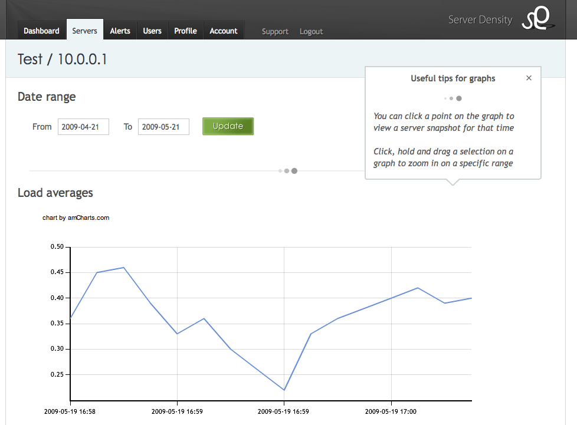
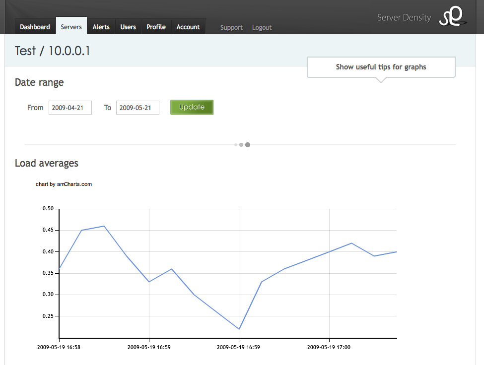

_Originally [published on the Server Density
blog](https://blog.serverdensity.com/exposing-hidden-features/)._

I met [Dave
Stone](http://builtbydave.co.uk/) at [DrinkTank](http://entrepreneur.meetup.com/1678/) last
night and talking about usability, he said something along the lines of “if you
need to explain something to users in writing then it’s not usable”. That is
very true and one of things we’ve been trying to do with our server monitoring
application, [Server Density](https://www.serverdensity.com/), is ensure that
the service is as easy to use as possible, in contrast to traditional monitoring
applications which have horrible interfaces.

Unfortunately, one of our best features is hidden away. [Server
snapshot](https://www.serverdensity.com/img/screenshots/serversnapshot-large.png) allows
you to see a breakdown of resource usage on your server at a particular point in
time. This is useful for troubleshooting because you can see a full, sortable
list of processes and out of those, which were using the most CPU and memory.
This is available for every data point for the last 30 days (i.e. every minute,
so over 30 days that is 43,200 snapshots) so the problem is making that easily
accessible.

The way we provide links to the snapshots for each data point is to make each
point on the graphs clickable. When you hover over the graph, the mouse changes
to a link hand pointer and if you click, you go through to the snapshot for that
time.

In the feedback phone calls I’ve been conducting, I have found that users are
not aware of this feature. This is annoying because they are also asking for
something to show exactly what the server snapshot feature shows.

We use [Xero](http://www.xero.com/) for our accounting and they have the option
to show a floating box that explains the current screen that you’re on.

The important thing is that the information is easily accessible, quickly
explains the features and can be hidden away when the user has seen it.

The solution that our design guru, [Harry](http://www.harrywincup.co.uk/), came
up with is similar to this. A small box now appears on the View Server page
which explains the 2 features hidden in the graphs – server snapshot and the
click/drag zooming. You can click on it to hide once you’ve read it and a cookie
is set to remember that next time you come back to the
page.

Hopefully this will allow everyone to find all the features in Server Density
whilst still keeping the interface clean because we still feel clicking on the
graph points is the best way to expose this feature. If you have a better
idea, [let us know](https://www.serverdensity.com/contact/)!
