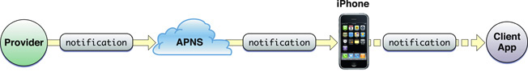

_Originally [published on the Server Density
Blog](https://blog.serverdensity.com/2009/07/10/how-to-build-an-apple-push-notification-provider-server-tutorial/)._

One of the widely anticipated features of the new [iPhone OS
3.0](https://www.apple.com/iphone/softwareupdate/) is [push
notifications](https://developer.apple.com/iphone/program/sdk/apns.html) which
allow messages to be sent directly to an individual device relevant to the
application that has been installed. Apple have demoed this as useful for news
alerts, or IM notifications however it fits in perfectly with the nature of
our [server monitoring service, Server Density](https://www.serverdensity.com/).

As part of the product, [we have an iPhone
application](http://blog.boxedice.com/2009/06/26/server-monitoring-iphone-app-development-screenshots/) that
includes push notifications as an alerting option so you can be notified via
push direct to your iPhone when one of your server alerts have been triggered.
This is useful since our app can then be launched to instantly see the details
of the server that has caused the alert.

Apple provides [detailed code documentation for the iPhone OS
code](https://developer.apple.com/iphone/library/documentation/NetworkingInternet/Conceptual/RemoteNotificationsPG/IPhoneOSClientImp/IPhoneOSClientImp.html) that
is needed to implement and handle the alerts on the device but only provides a
higher level guide for the provider server side.

As a provider, you need to communicate with the Apple Push Notification Service
(APNS) to send the messages that are then pushed to the phone. This is necessary
so that the device only needs to maintain 1 connection to the APNS, helping to
reduce battery usage.

This tutorial will go into code-level detail about how we built our push
notification provider server to allow us to interact with the APNS and use the
push notifications with our server monitoring iPhone application. Since we
develop in PHP, our examples will be in PHP 5.

**Basic Structure**

1. You connect to the APNS using your unique SSL certificate
2. Cycle through the messages you want to send (or just send 1 if you only have
   1.
3. Construct the payload for each message
4. Disconnect from APNS

> The flow of remote-notification data is one-way. The provider composes a
> notification package that includes the device token for a client application
> and the payload. The provider sends the notification to APNs which in turn
> pushes the notification to the device.

- [Apple
  documentation](https://developer.apple.com/iphone/library/documentation/NetworkingInternet/Conceptual/RemoteNotificationsPG/ApplePushService/ApplePushService.html)

**Restrictions**

- The payload is limited to 256 bytes in total – this includes both the actual
  body message and all of the optional and additional attributes you might
  wish to send. Push notifications are not designed for large data transfer,
  only for small alerts. For example we only send a short alert message
  detailing the server monitoring alert triggered.
- APNS does not provide any status feedback as to whether your message was
  successfully delivered. One reason for this is that messages are queued to
  be sent to the device if it is unreachable, however only the last sent
  message will be queued – overwriting any previously sent but undelivered
  messages.
- Push notifications should not be used for critical alerts because the
  message will only be delivered if the device has wifi or cellular
  connectivity, which is why we recommend combining push with another alerting
  method such as e-mail or SMS for our server monitoring alerts.
- The SSL certificates used to communicate with APNS, discussed below, are
  generated on an application level. The implementation discussed in this
  tutorial only concerns a single iPhone application so if you have several,
  you will need to adapt the code to use the appropriate certificate(s) where
  necessary.

**Device Token**

Each push message must be “addressed” to a specific device. This is achieved by
using a unique deviceToken generated by APNS within your iPhone application.
Once this token has been retrieved, you need to store it on your server, not
within your iPhone application itself. It looks something like this:

`c9d4c07c fbbc26d6 ef87a44d 53e16983 1096a5d5 fd825475 56659ddd f715defc`

For the Server Density iPhone application, we call the necessary generation
methods on app launch and pass it back to our servers via an [HTTP API
call](https://www.serverdensity.com/docs/api/functions/#iphone-setdevicetoken).
This stores the deviceToken in a database on our servers for that user so we can
then communicate with the device linked to that user.

**Feedback Service**

Apple provide a [feedback
service](https://developer.apple.com/iphone/library/documentation/NetworkingInternet/Conceptual/RemoteNotificationsPG/CommunicatingWIthAPS/CommunicatingWIthAPS.html#//apple_ref/doc/uid/TP40008194-CH101-SW3) which
you are supposed to occasionally poll. This will provide a list of deviceTokens
that were previously but are no longer valid, such as if the user has
uninstalled your iPhone application. You can then remove the deviceToken from
your database so you do not communicate with an invalid device.

Using the feedback service is not covered by this tutorial.

**Certificates**

The first thing you need is your Push certificates. These identify you when
communicating with APNS over SSL.

Generating the Apple Push Notification SSL certificate on Mac:

1. Log in to the [iPhone Developer Connection
   Portal](https://developer.apple.com/iphone/manage/overview/index.action) and
   click App IDs
2. Ensure you have created an App ID without a wildcard. Wildcard IDs cannot
   use the push notification service. For example, our iPhone application ID
   looks something like `AB123346CD.com.serverdensity.iphone`
3. Click Configure next to your App ID and then click the button to generate a
   Push Notification certificate. A wizard will appear guiding you through the
   steps to generate a signing authority and then upload it to the portal, then
   download the newly generated certificate. This step is also [covered in the
   Apple
   documentation](https://developer.apple.com/iphone/prerelease/library/documentation/NetworkingInternet/Conceptual/RemoteNotificationsPG/ProvisioningDevelopment/ProvisioningDevelopment.html#//apple_ref/doc/uid/TP40008194-CH104-SW4).
4. Import your `aps_developer_identity.cer` into your Keychain by double
   clicking the `.cer` file.
5. Launch Keychain Assistant from your local Mac and from the login keychain,
   filter by the Certificates category. You will see an expandable option
   called “Apple Development Push Services”
6. Expand this option then right click on “Apple Development Push Services” >
   Export “Apple Development Push Services ID123”. Save this as
   apns-dev-cert.p12 file somewhere you can access it.
7. Do the same again for the “Private Key” that was revealed when you expanded
   “Apple Development Push Services” ensuring you save it as apns-dev-key.p12
   file.
8. These files now need to be converted to the PEM format by executing this
   command from the terminal:openssl pkcs12 -clcerts -nokeys -out
   apns-dev-cert.pem -in apns-dev-cert.p12 openssl pkcs12 -nocerts -out
   apns-dev-key.pem -in apns-dev-key.p12
9. If you wish to remove the passphrase, either do not set one when
   exporting/converting or execute:openssl rsa -in apns-dev-key.pem -out
   apns-dev-key-noenc.pem
10. Finally, you need to combine the key and cert files into a apns-dev.pem
    file we will use when connecting to APNS:cat apns-dev-cert.pem
    apns-dev-key-noenc.pem > apns-dev.pem

It is a good idea to keep the files and give them descriptive names should you
need to use them at a later date. The same process above applies when generating
the production certificate.

**Payload Contents**

The [payload](https://developer.apple.com/iphone/library/documentation/NetworkingInternet/Conceptual/RemoteNotificationsPG/ApplePushService/ApplePushService.html#//apple_ref/doc/uid/TP40008194-CH100-SW1) is
formatted in JSON, compliant with the RFC 4627 standard. It consists of several
parts:

- Alert – the text string to display on the device
- Badge – the integer number to display as a badge by the application icon on
  the device home screen
- Sound – the text string of the name of the sound to accompany the display of
  the message on the device
- This tutorial will only deal with the basics by sending a simple alert text
  string but this can also be another dictionary containing various options to
  display custom buttons and the like.

**Creating the payload**

Using PHP it is very easy to create the payload based on an array and [convert
it to JSON](http://www.php.net/manual/en/function.json-encode.php):

$payload['aps'] = array('alert' => 'This is the alert text', 'badge' => 1,
'sound' => 'default'); $payload = json_encode($payload);

Echoing the contents of `$payload` would show you the JSON string that can be
sent to APNS:

{ "aps" : { "alert" : "This is the alert text", "badge" : 1, "sound" : "default"
} }

This will cause a message to be displayed on the device, trigger the default
alert sound and place a “1” in the badge by the application icon. The default
buttons “Close” and “View” would also appear on the alert that pops up.

For the Server Density server monitoring iPhone application, it is important for
the user to be able to tap “View” and go directly to the server that generated
the alert. To do this, we add an extra dictionary in of our own custom values:

$payload['aps'] = array('alert' => 'This is the alert text', 'badge' => 1,
'sound' => 'default'); $payload['server'] = array('serverId' => $serverId,
'name' => $name); $output = json_encode($payload);

The custom dictionary `server` is passed to the application on the device when
the user taps “View” so we can load the right server. The JSON looks like this:

{ "aps" : { "alert" : "This is the alert text", "badge" : 1, "sound" : "default"
}, "server" : { "serverId" : 1, "name" : "Server name") }

The size limit of 256 bytes applies to this entire payload, including any custom
dictionaries.

**The raw interface**

Once an alert is generated within Server Density, the payload is built and then
inserted into a queue. This is processed separately so that we can send multiple
payloads in one go if necessary.

Apple recommends this method because if you are constantly connecting and
disconnecting to send each payload, APNS may block your IP.

As [described](https://developer.apple.com/iphone/library/documentation/NetworkingInternet/Conceptual/RemoteNotificationsPG/CommunicatingWIthAPS/CommunicatingWIthAPS.html#//apple_ref/doc/uid/TP40008194-CH101-SW4) by
Apple:

> The raw interface employs a raw socket, has binary content, is streaming in
> nature, and has zero acknowledgment responses.

**Opening the connection**

The PHP 5 code to open the connection looks like this:

$apnsHost = 'gateway.sandbox.push.apple.com'; $apnsPort = 2195; $apnsCert =
'apns-dev.pem'; $streamContext = stream_context_create();
stream_context_set_option($streamContext, 'ssl', 'local_cert', $apnsCert); $apns
= stream_socket_client('ssl://' . $apnsHost . ':' . $apnsPort, $error,
$errorString, 2, STREAM_CLIENT_CONNECT, $streamContext);

If an error has occurred you can pick up the error message from `$errorString`.
This will also contain the details if your SSL certificate is not correct.

The certificate file is read in relative to the current working directory of the
executing PHP script, so specify the full absolute path to your certificate if
necessary.

Note that when testing you must use the sandbox with the development
certificates. The production hostname is `gateway.push.apple.com` and must use
the separate and different production certificate.

**Sending the payload**

At this point, the code we use loops through all the queued payloads and sends
them. Constructing the binary content to send to APNS is simple:

$apnsMessage = chr(0) . chr(0) . chr(32) . pack('H*', str_replace(' ', '',
$deviceToken)) . chr(0) . chr(strlen($payload)) . $payload; fwrite($apns,
$apnsMessage);

Note that the `$deviceToken` is included from our database and stripped of the
spaces it is provided with by default. We also include a check to send an error
to us in the event that the `$payload` is over 256 bytes.

`$apnsMessage` contains the correctly binary formatted payload and
the `fwrite` call writes the payload to the currently active streaming
connection we opened previously, contained in `$apns`.

Once completed, you can close the connection:

socket_close($apns); fclose($apns);

**php-apns**

There is a free, open source server library that does all the above
functionality called [php-apns](https://code.google.com/p/php-apns/). We chose
to implement it ourselves because it has a further dependancy
on [memcached](http://www.danga.com/memcached/), we do not want to rely on 3rd
party code for large and critical aspects of our code-base and I am apprehensive
about the suitability of PHP for running a continuous server process. We do all
the above queue processing using our own custom cron system which runs every few
seconds – that way PHP scripts do not need to be run as processes, something I’m
not sure they were designed to do!

**All done**

That’s it! If you have any problems, [Stack
Overflow](https://stackoverflow.com/search?q=push+notifications) is your friend.
