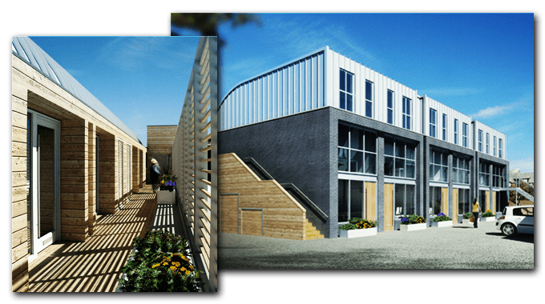
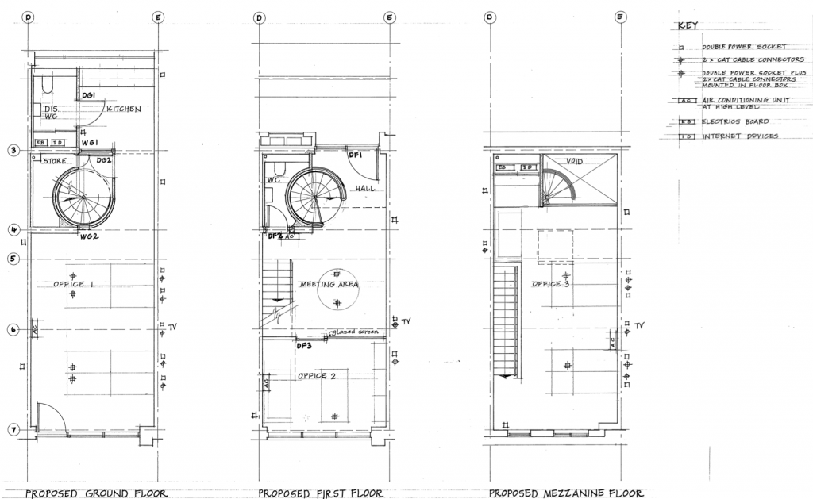
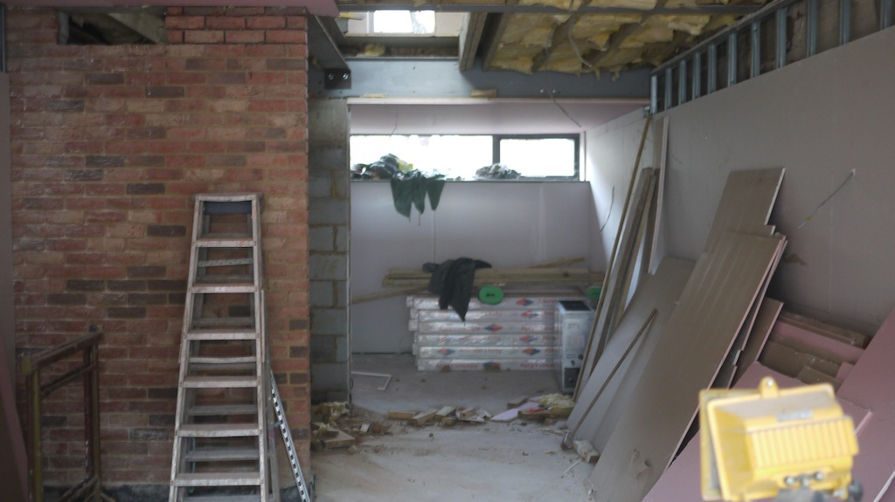
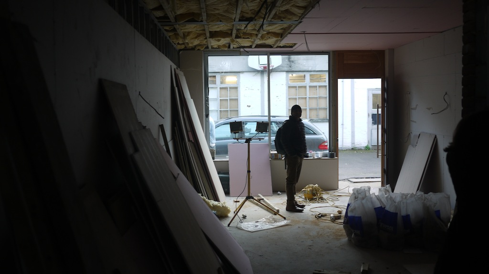
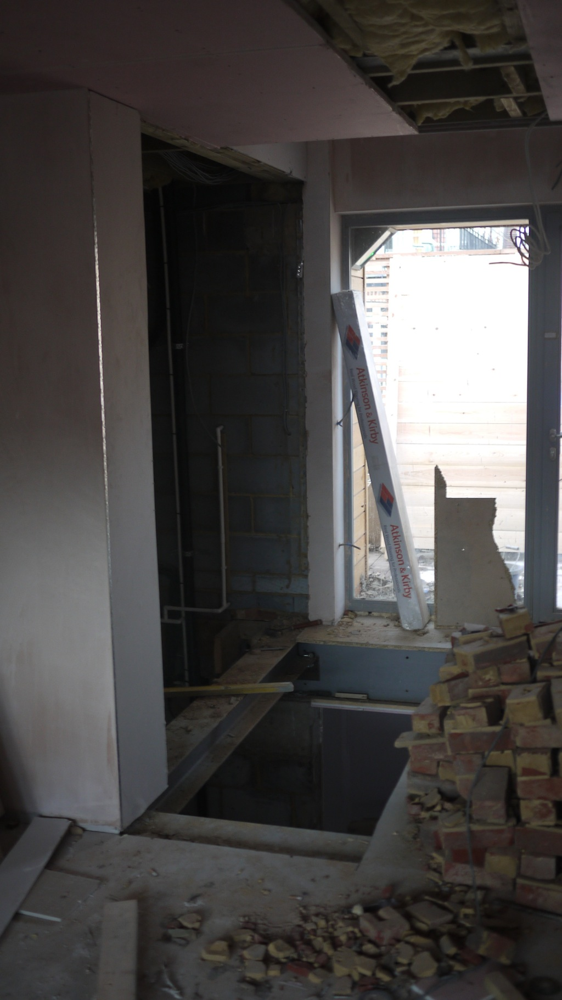
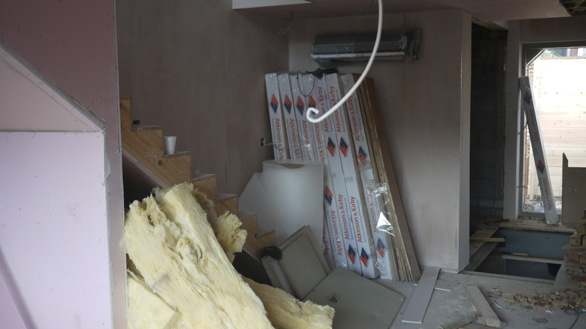
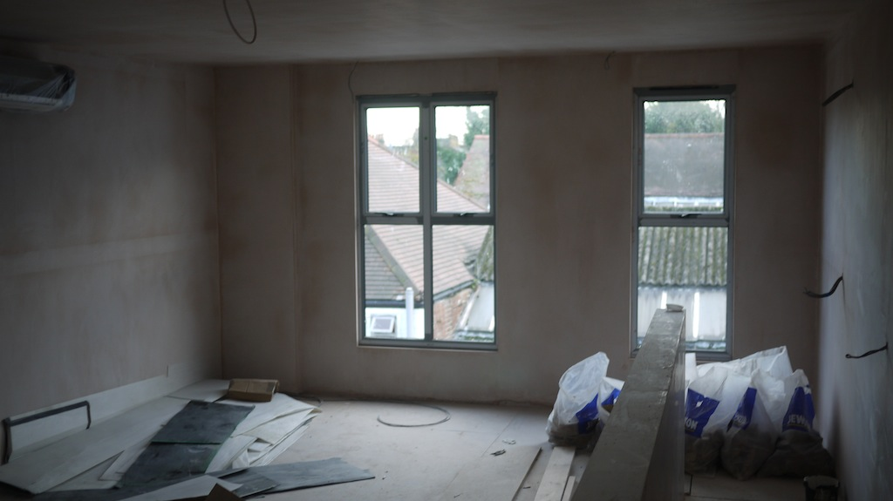

_Originally [published on the Server Density
blog](https://blog.serverdensity.com/building-our-london-office-part-1/)._

We’re in the process of setting up a London office. Currently [our
team](http://www.boxedice.com/#aboutUs) works remotely from home, which works
well for engineering but we thought it might be more difficult as we [start to
hire more design, marketing and accounts
people](http://www.boxedice.com/#careers). Nobody is being required to work from
the office (although a couple are voluntarily moving to London) and [we’ll
continue to hire](http://www.boxedice.com/#careers) engineering from anywhere in
the world. We’re also getting more requests to meet our customers so having a
fancy office to show off to people as we grow started to be of interest.

Our products start with design and we spend a lot of time making sure things
look good, so we wanted to do the same with the office. As such, we’re going to
be located in a brand new building which has just be built. This gives us the
opportunity to have the interior custom designed to our spec, which is being
done by a professional architect.

Naturally, we’ll be blogging about the process so this is the first in a series
of posts as things progress towards our opening date at the end of Jan 2012.

**Inspiration**

- [Fog Creek’s original
  offices](http://www.joelonsoftware.com/articles/BionicOffice.html) and [photos](https://picasaweb.google.com/spolsky/FogCreekSNewOffice) of
  the [new office](http://www.joelonsoftware.com/items/2008/12/29.html) they
  moved into a few years ago. I visited their offices for lunch with their
  sysadmin team so was able to get a first hand tour of how they’ve done
  things. We won’t be going for individual developer offices but the overall
  philosophy of spending (investing) in a good office setup is something we’re
  applying too.
- [eConversions open plan
  offices](http://www.econversions.co.uk/careers/#reason6) and in
  particular, [good quality desks and
  chairs](http://www.econversions.co.uk/careers/#reason8). I used to work at
  eConversions and helped influence many of the office choices back then,
  learning what works and what doesn’t.
- [37signals’s office](https://37signals.com/office)

Of course, these companies are all big and extremely profitable so we can’t copy
everything. We’re still a small startup and despite some excellent growth, we
can’t yet justify [spending $10,000 on a coffee
machine](https://blog.fogcreek.com/the-price-of-dev-happiness-part-two/)! That
makes the challenge even greater – how to create an amazing office on a much
lower budget. It also has to been eco-friendly.

## Exterior

The building is across 3 floors and split up into several units. We’ll be in 2
units across 3 floors. It’s located near [Turnham Green Tube
station](https://maps.google.co.uk/maps?f=q&source=s_q&hl=en&geocode=&aq=&sll=51.492005,-0.260818&sspn=0.013133,0.027659&vpsrc=0&ie=UTF8&hq=turnham+green+underground&hnear=&t=m&z=16&cid=15039041216811616902&iwloc=A) in [Chiswick,
West London](https://en.wikipedia.org/wiki/Chiswick). This is a nice quiet area
out of the centre with easy transport links on the
London [Underground](https://www.tfl.gov.uk/modalpages/2625.aspx) and [Overground](https://www.tfl.gov.uk/corporate/projectsandschemes/15359.aspx).
Nobody likes rushing into Central London, squashed up against other commuters.
So when people are heading into work in the morning, we’ll be heading out to
West London and vice versa in the evening. But it’s not too quiet with plenty of
excellent restaurants and shops on Chiswick High Street. It’s also just a few
miles from Heathrow Airport.

## Interior blueprints

The ground floor was originally intended to be self contained with the first and
second (mezzanine) floors connected via a stairwell. We’re going to be occupying
all 3 floors so are putting in a spiral staircase between the ground and first
floors.

The main entrance to the office will be through the first floor. This will
provide a welcome area with a meeting table and chairs. The second and ground
floors will then be working areas which will provide a nice separation to allow
for quieter design/development to happen on the second floor and nosier accounts
and marketing activity to take place on the ground floor, along with a kitchen.
The first floor also has a separated office which can be used ad-hoc.

There are toilets on both the ground and first floors and the first floor is
accessible by an outside lift as well as the spiral staircase.

## Infrastructure components

10/100 ethernet is very 1990s so we’re installing Cat6 Gigabit Ethernet cabling
throughout the office. The internet line will terminate on the ground floor in a
cabinet at the back, with trunk lines running up to a dedicated switch on each
level. Cabling will run through the walls to various ports, usually alongside
power outlets. At the desk areas, an in-floor box will provide connectivity and
power to each workstation.

Everyone loves the weather in the UK. Random weeks of extreme heat in the summer
and snow storms throughout the winter. This means we need to maintain a constant
temperature so computer equipment doesn’t overheat and everyone is comfortable
working without needing to run fans and heaters throughout the place. As such,
air conditioning is built into each floor designed to provide flow throughout
the entire floor from a single unit. This reduces cost and makes sure nobody is
sitting directly under an ice box.

Electricity and plumbing is pretty standard but we have been discussing [instant
hot water taps](https://en.wikipedia.org/wiki/Instant_hot_water_dispenser) to
avoid the need for wasting energy through kettle boiling, however the real world
energy efficiency of these has to be carefully measured so you’re not keeping
water constantly hot unnecessarily.

## Photos

