_Originally [published on the Server Density
blog](https://blog.serverdensity.com/building-our-london-office-part-2/)._

At the end of last year, [I introduced the construction of our new office in
London](https://davidmytton.blog/building-the-server-density-london-office-part-1/).
Over a month later and significant progress has been made. The first few weeks
always seem like not much is being done but that is when the core foundations
are built – the structure, flooring, electrics, plumbing and everything else
that gets hidden away. With that now almost completed, we’re almost ready for
perhaps the most exciting bit – kitting everything out!

I visited the office last week – the first and second floors are mostly
completed with flooring just being finished and the whole interior plastered.
The electrics were completed towards the end of last week and this week we’ll
see the internal dividers finished, decorating completed with the walls and
ceiling painted, the spiral staircase fitted, internet connected, kitchen
plumbed in and the initial arrival of furniture.

We’ve ordered some extremely nice custom desks, Herman Miller chairs, a great
meeting table and more Herman Miller chairs. Plus some massive beanbags already
sitting at my home, ready to be transported. The next, and final post in this
series will go into more detail about the choices behind these. We’ve spent a
lot of time deciding upon the right work environment. If you’re spending a
significant portion of your time in one place, it has to be comfortable and
enjoyable!

We’re expecting to move in properly in 2 weeks!

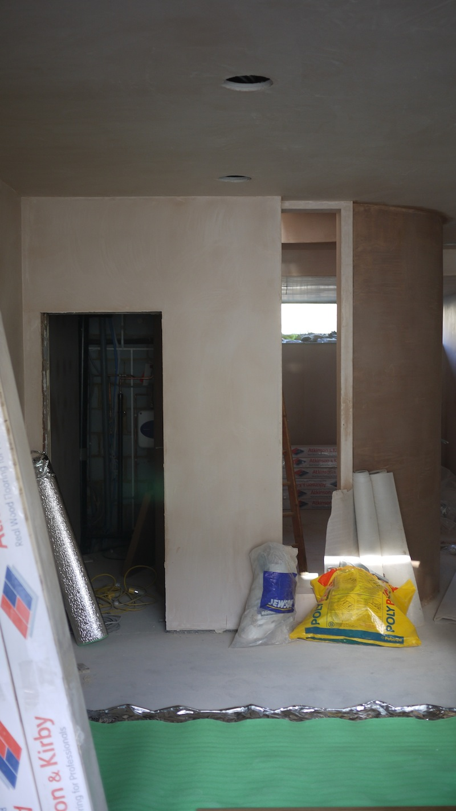

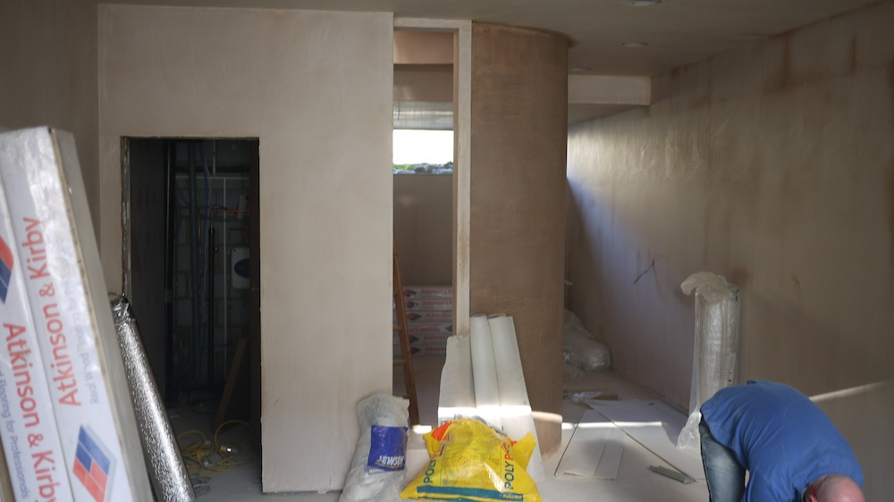

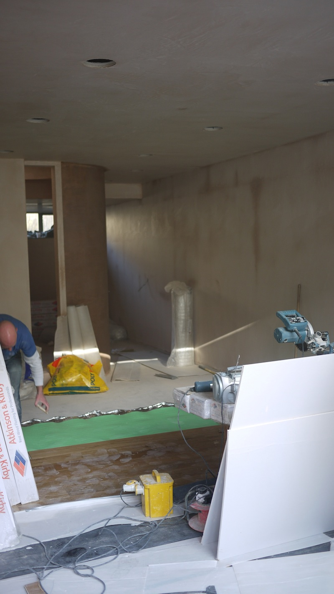

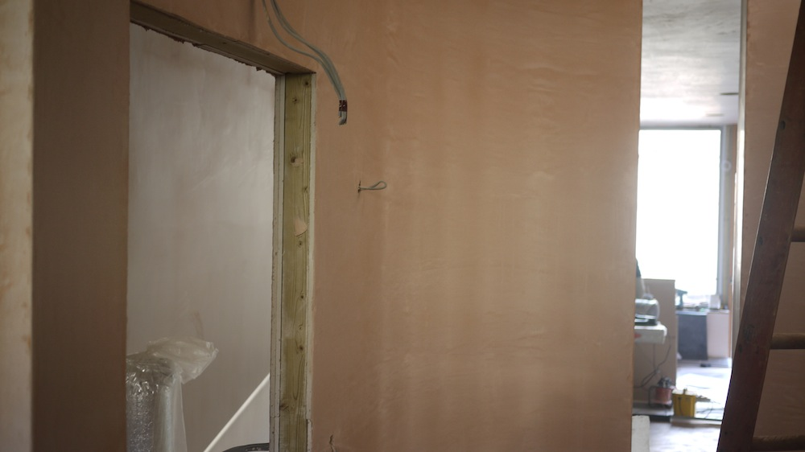

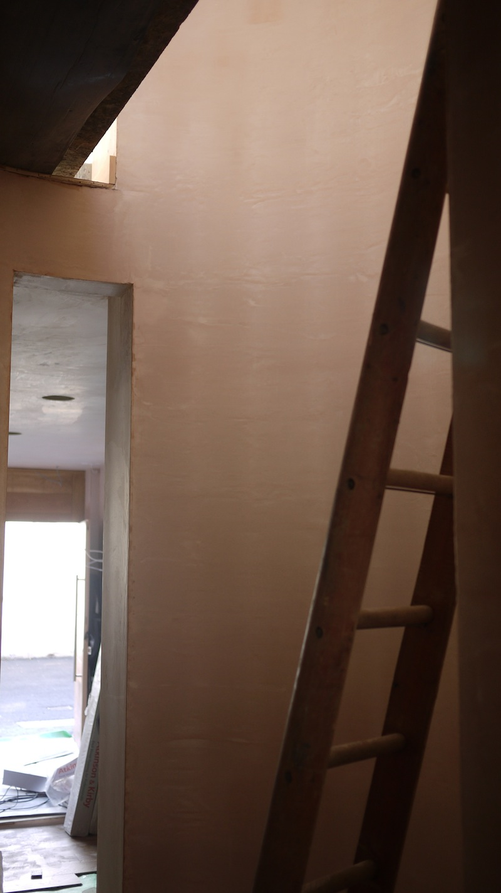

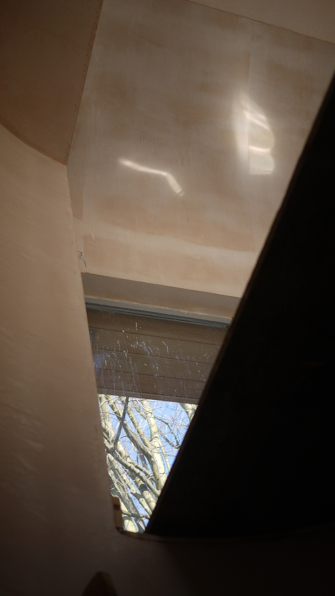

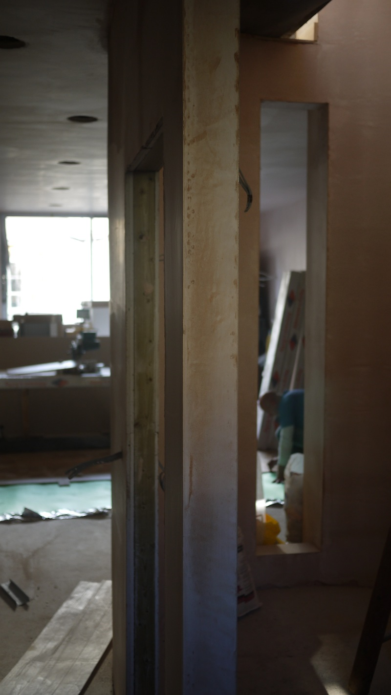

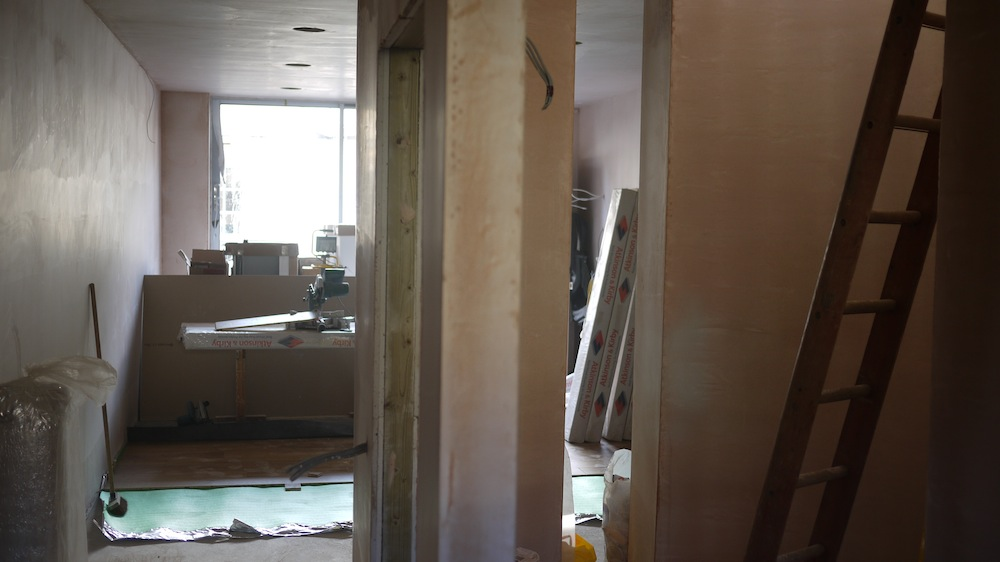

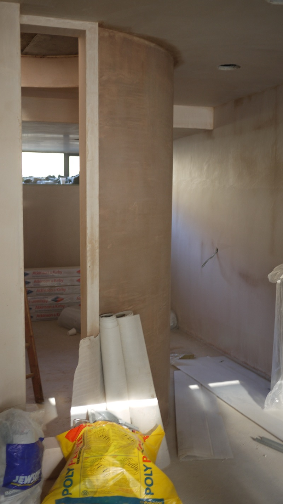

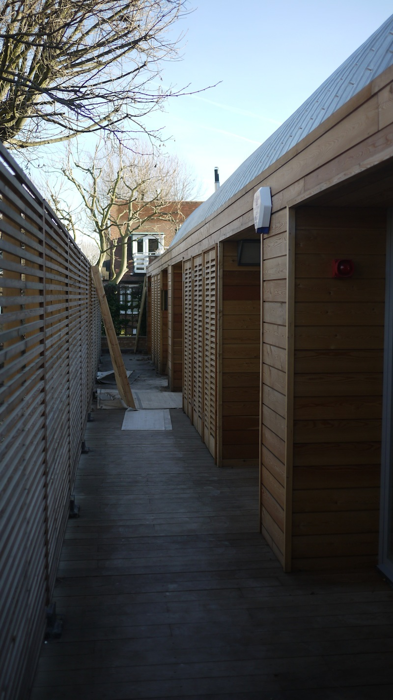

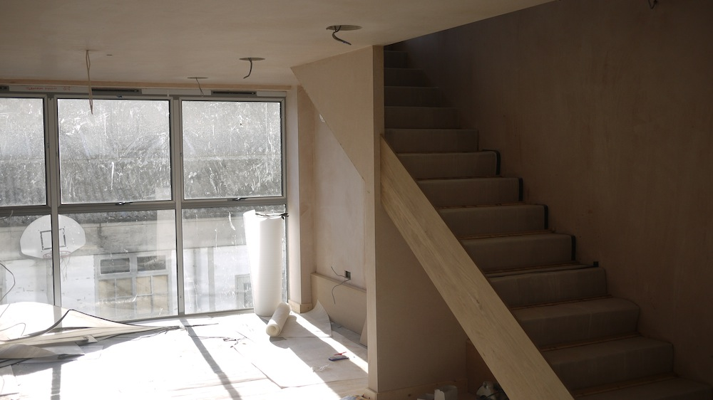

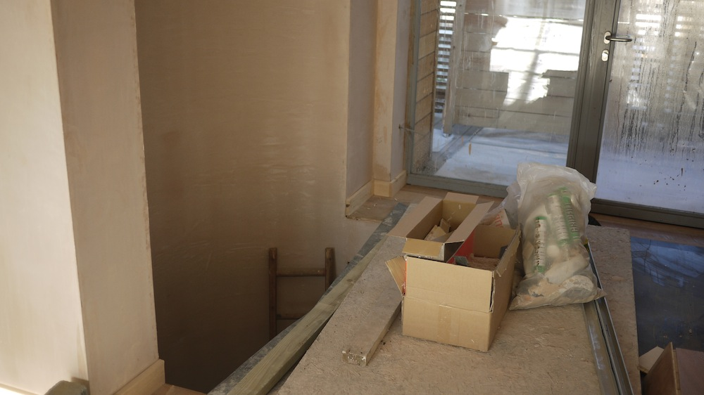

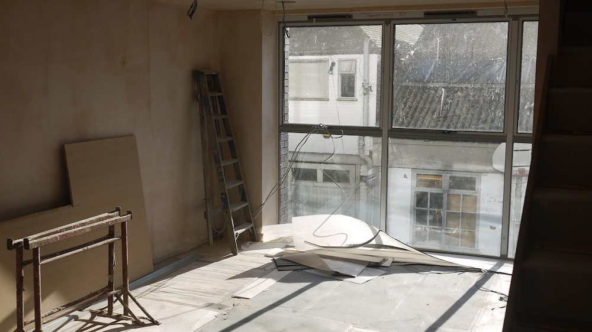

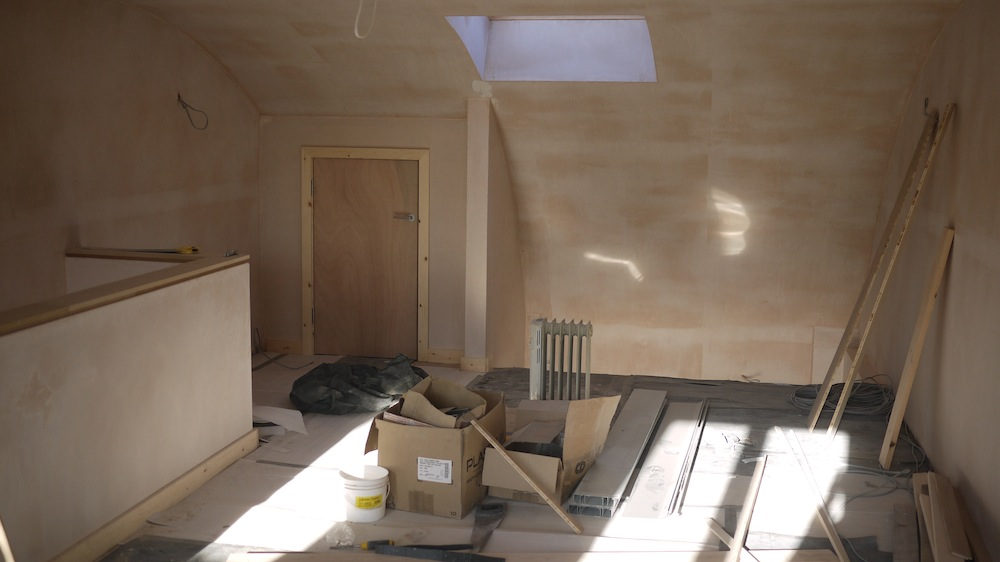
