_Originally [published on the Server Density
blog](https://blog.serverdensity.com/building-our-london-office-part-3/)._

[Last month we were nearing
completion](https://davidmytton.blog/building-the-server-density-london-office-part-2/) of
the Server Density London office which was [started in December
2011](https://davidmytton.blog/building-the-server-density-london-office-part-1/) and
I’m pleased to say we’ll be moving in this coming week, just a week behind the
original schedule!

On Friday I spent the afternoon setting up the internet and receiving delivery
of our workstation desks and chairs. This is the final “building” post where
I’ll go into detail about the last bits and pieces – internet, furniture,
lighting and the spiral staircase. There will likely be a followup post once
we’ve settled in and everything is finished!

## Internet and networking

We have our first internet connectivity provided by a BT DSL landline connecting
into the ground floor. This goes into a [Draytek Vigor2830 ADSL2/2+ Firewall
Router](http://www.draytek.co.uk/products/vigor2830.html) which provides
features like VPN, firewall, gigabit ports, QoS, various graphs and metrics to
help us track down any bandwidth hoggers and standard router functionality like
NAT, DHCP, etc. We went for the non-wifi version so it can hide away in the
cabinet and we can locate multiple wireless routers where we wanted, without
being impaired by walls and doors. Importantly it supports multiple WANs – these
can be DSL, cable and it even has a USB port to allow for 3G modems. This means
as we grow we can buy more connections from different providers to give us
combined speed and redundancy because if the internet goes down we can’t do any
work!

Currently we only have a wireless network through an Apple Airport Express but
over the next few days the internet gigabit network will be wired up. All the
cables are in the walls so the electricians will be connecting the wall ports to
L6J CAT6 panels. These all terminate at a patch panel in a cabinet on the ground
and second floors, with a trunk down the height of the building to the ground
floor. The patch panels then connect to switches (still to be purchased but
probably Netgear giving power over ethernet and VoIP priority) which all end at
the Draytek router.

Throughout the building there are connectivity points on the walls, combined
with mains electricity. There are also under-floor panels which are flush with
the floor when closed but have small slots which open to allow plugs (power and
gigabit network) to hide inside the panel, avoiding any cable mess and tripping
hazards.

## Furniture

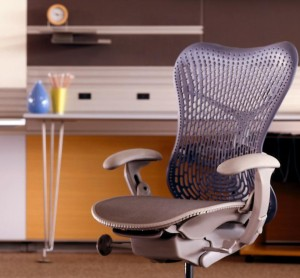

> A quality chair may be one of the smartest investments you can make as a
> software developer – [Jeff
> Atwood](http://www.codinghorror.com/blog/2008/07/investing-in-a-quality-programming-chair.html)

Several years ago I decided to buy a good chair and spent some time researching
the options. I ended up purchasing a [Herman Miller Mirra
chair](http://www.hermanmiller.co.uk/Mirra.aspx), [based on Jeff’s
recommendation](http://www.codinghorror.com/blog/2008/07/investing-in-a-quality-programming-chair.html) and
it is perhaps the best chair in the world. It’s extremely adjustable, very
comfortable and made of quality material. Plus it’s 96% recyclable. I was so
impressed that it is now a standard purchase alongside computer equipment
whenever a new employee joins us (our remote employees have them at home). So we
naturally decided to buy them for the office.

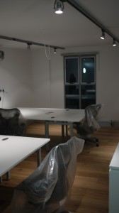

Desks are equally important so we had some custom configured desks created:
“Goal post beam desking, 1500W x 750D, white top with silver frame square edge
in light grey, two person desks back to back”. The specification required
sufficient depth for a monitor, keyboard, mouse and laptop with room to push
everything back for drawing and design work. We also needed proper cable
management to keep things clutter free and the desks should connect together in
a shared “island” whilst still offering privacy. They should also be easy to
reconfigure if we needed to add more in the future.

We almost never have meetings but if we wanted to work together, conduct board
meetings and have lunch, we wanted a nice meeting table and comfortable chairs.
I’ve sat through many lectures, meetings and talks with horribly uncomfortable
seating so again we looked towards Herman Miller to provide us with slightly
cheaper seating but with no loss of comfort. To that end we spent quite some
time trying all the chairs down at the [Herman Miller Design Centre in
London](http://www.hermanmiller.co.uk/contact.aspx).

We chose 6 [Setu chairs](http://www.hermanmiller.co.uk/Setu.aspx) (93%
recyclable) with arms, four star base on glides, mango mesh (adds a bit of
colour), graphite frame and semi polished base to go with an oval meeting table,
2000W x 1000D, finished in white melamine with chamfered edge and 4 single
polished legs.

## Lighting

Whether you’re working during the day or at night, eye strain is always a
concern not only from the glare of the monitor but also the ambient lighting. We
wanted to avoid the need for individual desk lamps which clutter the workspace
and have variable success at providing the right level of lighting not only for
the user but the people around them. Nobody wants an interrogation light in
their face. If we could provide the right lighting from the side walls and
ceiling, we could spend more money on getting that right – balancing energy
efficiency, lighting levels and colour – rather than splashing out on expensive
lights for everyone individually.

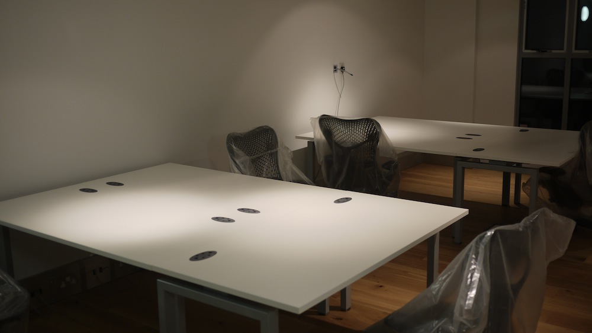

We involved one of the best lighting engineers in London and as such, we have
several different types of lighting throughout the office – pure white wall
lights to help you see where you’re going (up and down the stairs for example),
overhead reflective, cream white fluorescent lighting and adjustable spot lights
for providing just the right amount of illumination to each desk. The idea is
that if you’re working late and there’s nobody else around, you can turn off
most of the lights but still get the environment you need at your desk. The
softer, fluorescent illumination makes it less of a harsh, sterile environment.

## Spiral staircase

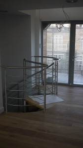

Originally the ground floor was designed as a separate unit but we wanted space
to expand, so decided to knock a hole through the first floor and put in a
spiral staircase so you can get between areas easily. Spiral staircases can be
hit and miss so we had an Italian design firm create one from scratch for
us, [based on an existing case
study](http://www.id-staircases.com/europa-bespoke-contemporary-spiral-staircase-commercial-case-study-from-id-staircases) combining
traditional European Oak with brushed stainless steel.

This is contained within a separate section to separate it from the ground floor
office so as not to disturb anyone when you’re heading down to the kitchen
(which is also on the ground floor).

The second floor has a “balcony” which allows you to see up from the first floor
but mainly provides additional natural lighting so we also commissioned the same
firm to product a balustrade to match the staircase. Unfortunately, due to the
weather across Europe this last week it has been delayed on the Italian border
and we can’t get the building approved without it, hence the delay on moving in!
Instead, a temporary barrier will be put in so we can start using the office
without fear of falling.

## And that’s it

It’s been an interesting journey working on giving the company a physical
presence to match our focus on design, usability and quality. As with anything,
we expect to make tweaks as we start real world use but the amount of time,
effort and thought that has gone into the building so far will really pay off to
impress visitors but mainly provide an awesome workplace for [anyone who wants
to join us in London](http://www.boxedice.com/#careers)!

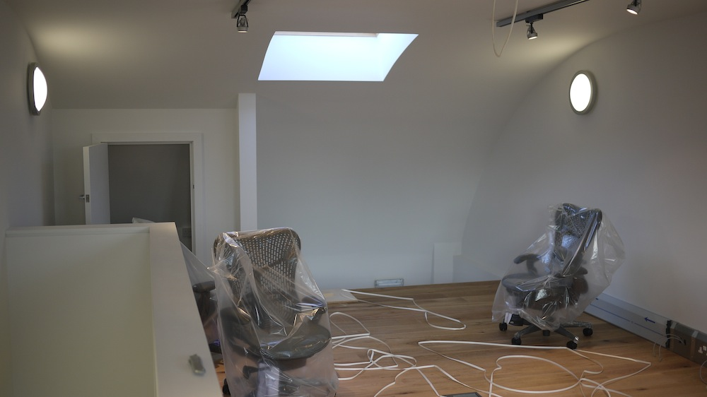

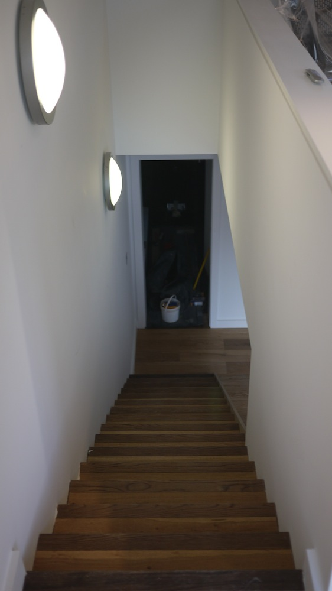

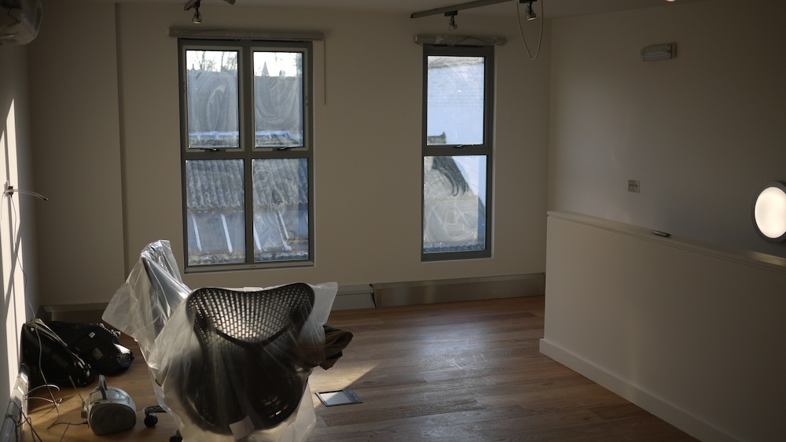

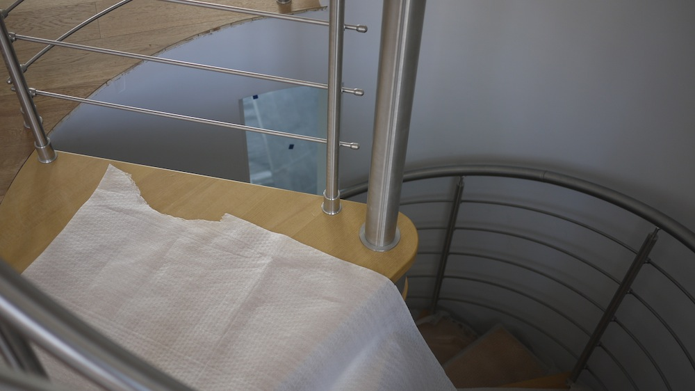

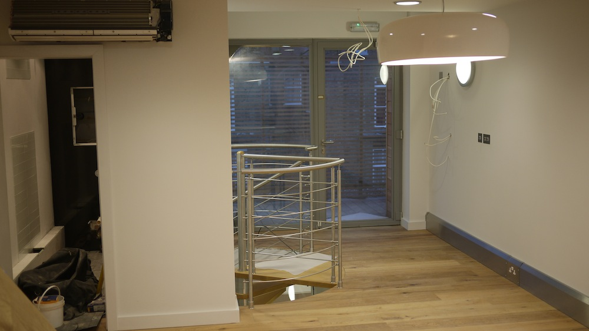

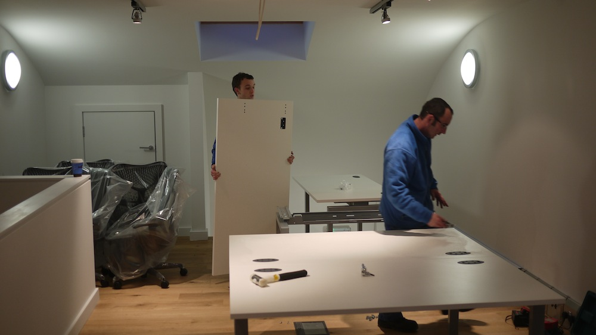

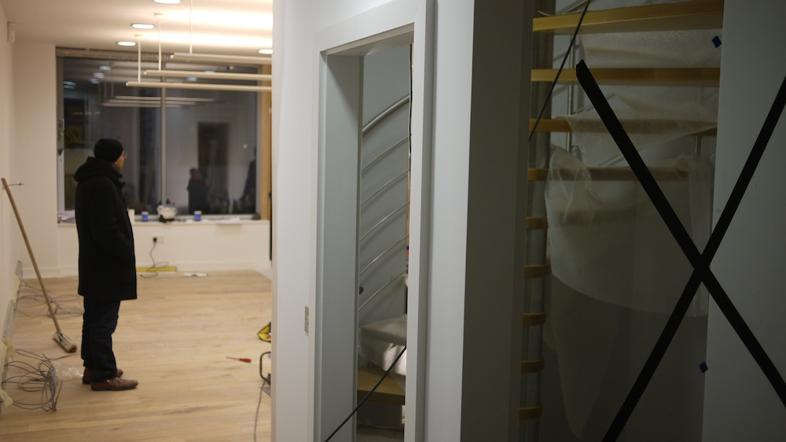

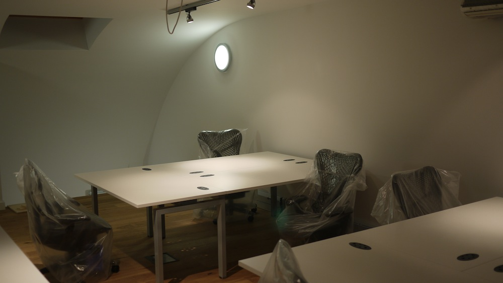
