_Originally [published on the Server Density
blog](https://blog.serverdensity.com/building-our-office-network/)._

In February we moved into [our new London
office](https://blog.serverdensity.com/office/) we started building in December
last year. As a tech startup, one of the most important things is a good network
and fast internet connectivity. It’s easy to upgrade internet speed as we grow
so we can start with a lower cost option but the internal network needs to be
considered before it’s all wired up. Rewiring an entire office in the future
would be a massive pain!

So we went straight for Cat6 gigabit ethernet. We briefly considered fibre but
decided that would be too expensive and overkill because of the total office
capacity and that the actual internet speed would be limited by the WAN
connection, which is unlikely to be fast enough any time soon. We’re not running
a data centre so 1Gbps is fast enough.

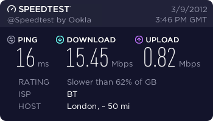

[As mentioned in the final part of our first
series](https://blog.serverdensity.com/2012/02/05/building-our-london-office-part-3/),
our first internet connection is supplied by BT. This is a standard ADSL
connection rated to up to 20MB. In real world tests we get 15.5Mbps downloads
and 0.82Mbps upload. It also includes an SLA so any faults are guaranteed to be
fixed within 24 hours.

ADSL is provided through a normal phone line which goes directly into
our [Draytek Vigor2830 ADSL2/2+ Firewall
Router](http://www.draytek.co.uk/products/vigor2830.html). This connects into a
24 port [Netgear
GS724TP](http://www.netgear.co.uk/business/products/switches/smart-switches/gs724tp.aspx) switch
on the ground floor. These switches provider power over ethernet, 10/100/1000
switching and VoIP
priority. 

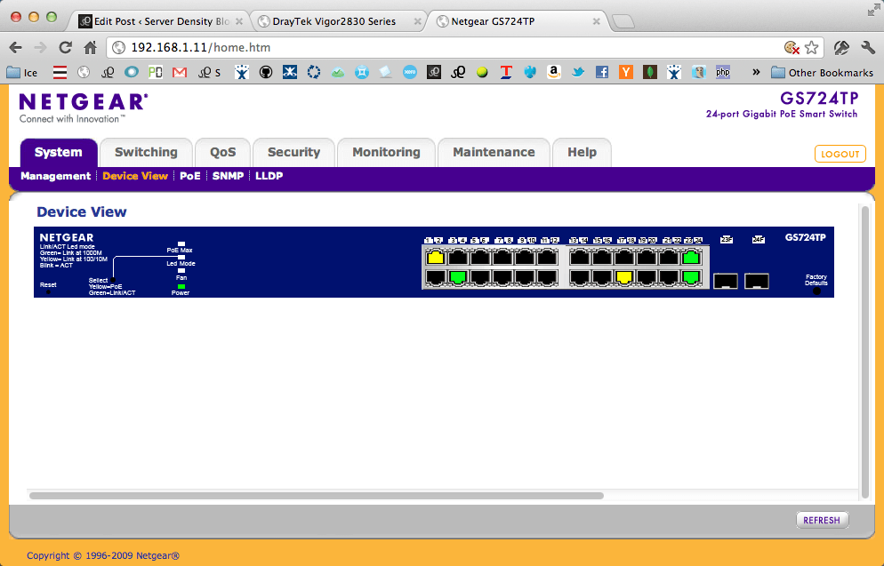

Netgear Switch Control Panel – my old cinema display has no gigabit network port
so I’m connected via a USB ethernet port, which is 10/100 only. The Airport
Express is also 10/100. These show in yellow and the green ports are the trunk
1Gbps ports.

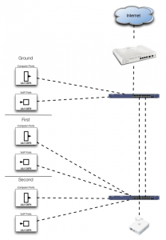

Every desk has x2 L6J CAT6 ports – 1 for a computer and 1 for a VoIP phone which
are wired through trunking to a termination point in a cupboard. The ground
floor has its own cupboard and the first and second floors all terminate in a
cupboard on the second floor. Each cupboard therefore has a patch panel which
acts as the connection point to the switch.

The floors are connected by two trunk cables which are independent and correctly
shielded and spaced from power cables to prevent interference. This connects the
ground foor switch to the second floor switch.

Currently we’re only using the first and second floor so have a simple Apple
Airport Express plugged in on the second floor, providing 802.11n (2.4Ghz) in
bridge mode. However, because every floor has network ports in addition to the
desk ports, we can position one or more wireless routers throughout the building
to cover all floors. This is better than having wifi built into the DSL router
hidden in a cupboard on the ground floor.

Currently the Draytek router provides DHCP to the entire office but we can
segment the switches so that different floors can have different networks for
further security and access to different services. Roadmap for expansion
includes providing network backup for all our Macs (probably via a Time
Capsule), a guest wifi network to separate the networks for visitors and
additional internet providers for additional combined speed and redundancy.

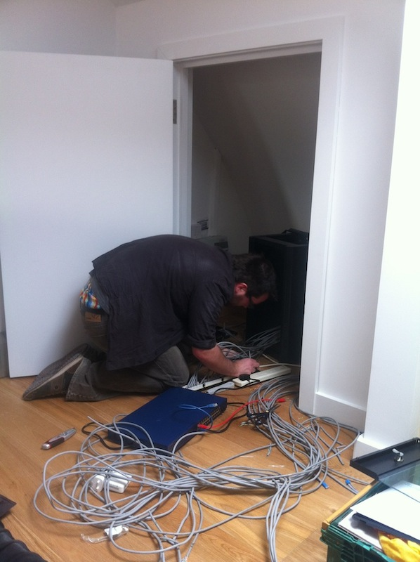

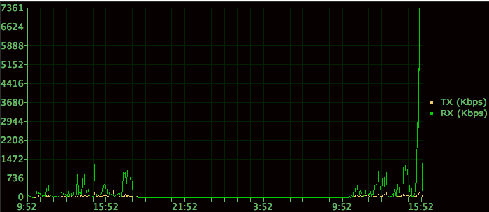

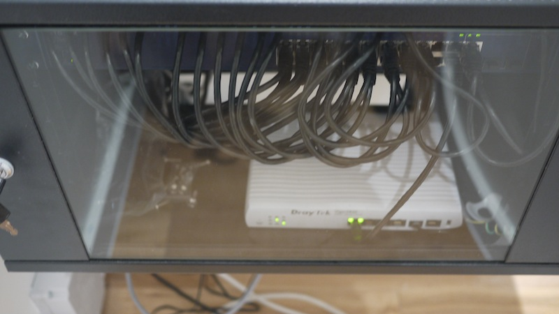

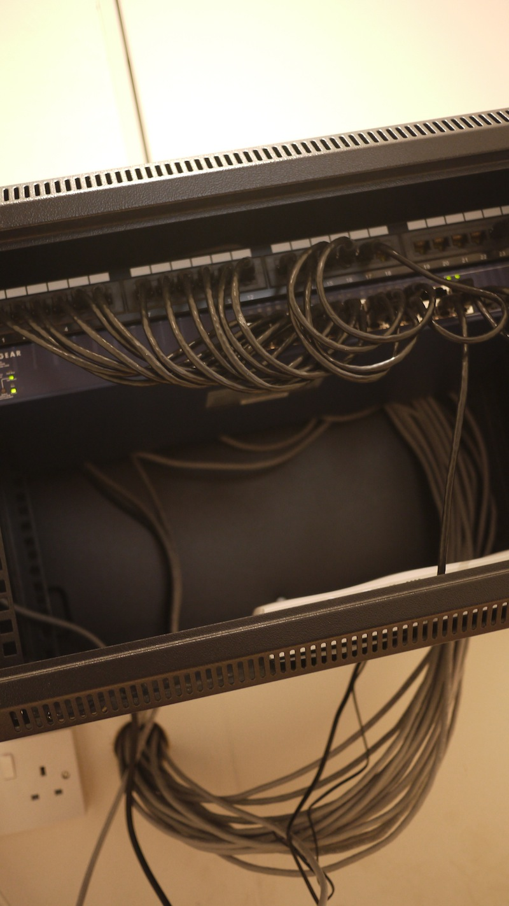

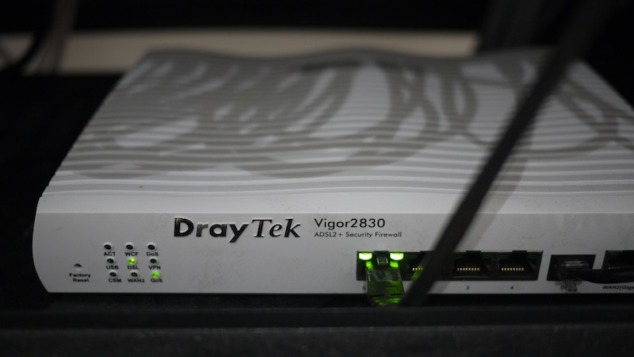

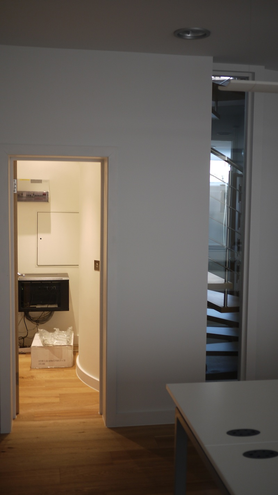

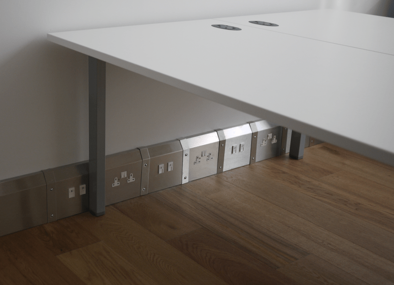

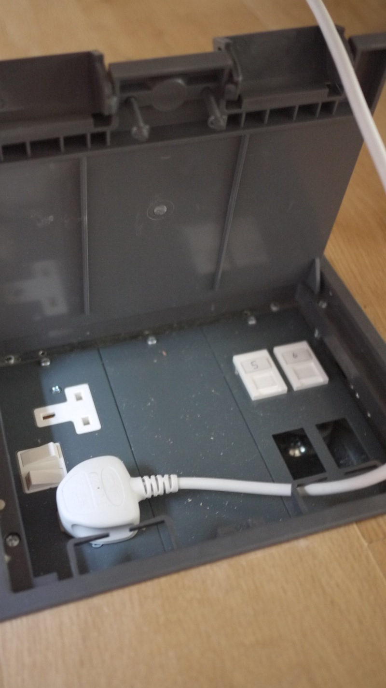

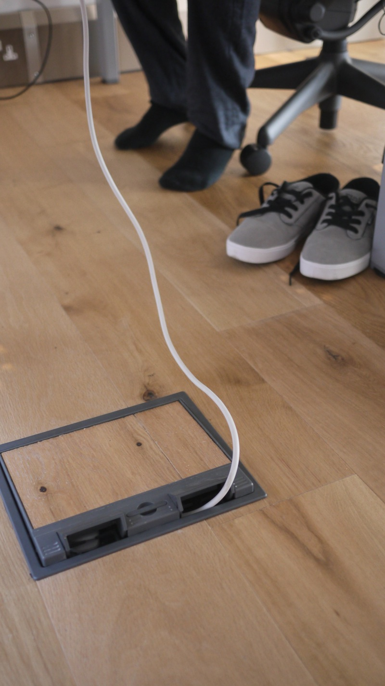
