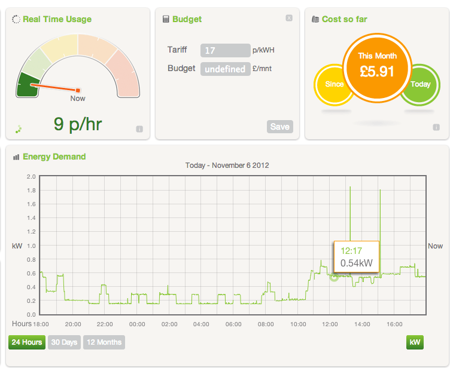
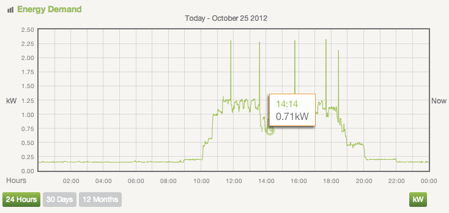

_Originally [published on the Server Density
blog](https://blog.serverdensity.com/monitoring-office-energy-usage/)._

It’s been a year since we started [construction of our London
office](https://davidmytton.blog/building-the-server-density-london-office-part-1/),
which we moved into in February this year. One of the design goals was to
optimise energy usage which we implemented [through our choice of lighting and
heating](https://davidmytton.blog/building-the-server-density-london-office-part-3/).
We wanted to see the impact of that, so we recently started monitoring our
electricity usage.

After some research, we started using an Efergy wireless electricity monitor.
This simply requires you to set up a measuring device onto one of the cables
from your meter and it then transmits the real time usage to a monitoring device
you can set up somewhere. They clip onto the outside of the wiring so there’s no
danger or electrician required. Input your supplier cost per unit and it then
gives you a live cost per hour output.

That’s great for “what’s happening now?” but it doesn’t record data over time.
For that we use [Efergy
Engage](http://www.efergy.com/index.php/default/products-uk-1/energy-gateways-1/engage-hub-uk.html) where
you buy another device which taps into the wireless signals from the measuring
devices and reports them over the web to a hosted service which graphs your
usage.

From this we can see the patterns when people arrive in the office, when lunch
starts (we all eat the same time) and when things like the microwave are in use.
Everyone has a Macbook + Cinema Display and from the data it looks like each
person uses 0.20kWH, which costs about £0.03 per hour. This is with a single
overhead spotlight per desk and no air con (it’s winter now), which is quite a
bit more expensive.

As soon as we started measuring and checking out the graphs, we realised we were
using a lot of power out of working hours. Thinking about what could be running,
we realised that our network switches remain running 24/7. So we bought
some [simple
timers](https://www.amazon.co.uk/Mercury-Timer-Switch/dp/B000LAY9BA/) which turn
everything on at 8am and switch things off at 9pm. That saves almost half the
day of electricity usage where no packets need routing!

As we build up more data on the system, we’ll be able to see how things change
throughout the year and with the weather. There are also plans to try and track
down that last 0.20kWH that’s being used throughout the night…possibly the
router (which has to stay running for the data to be reported!).

