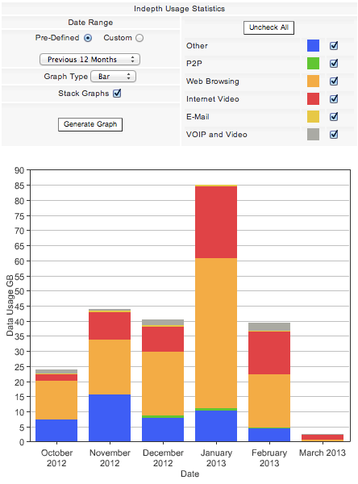
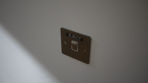
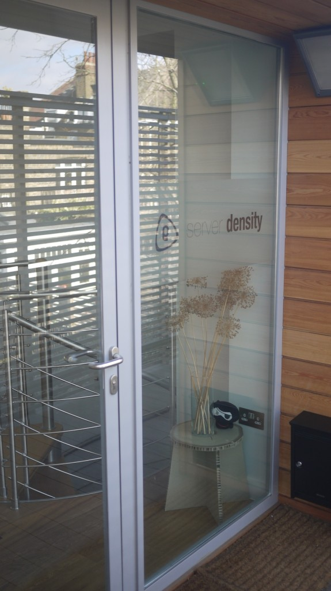
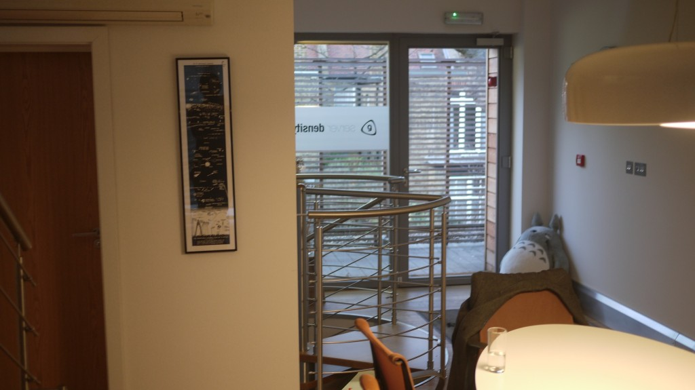
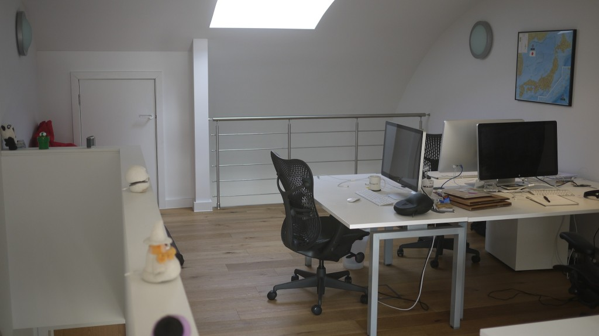
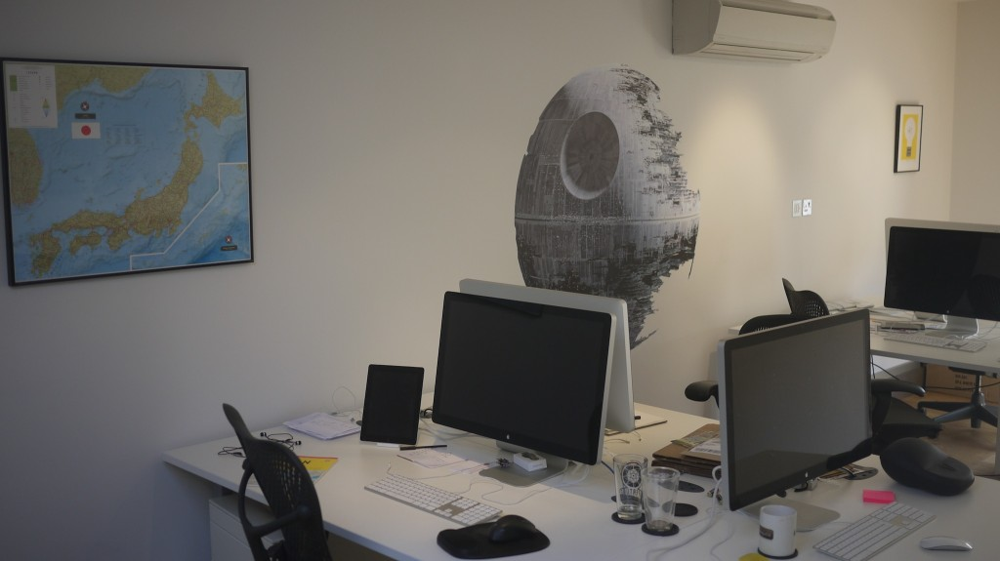
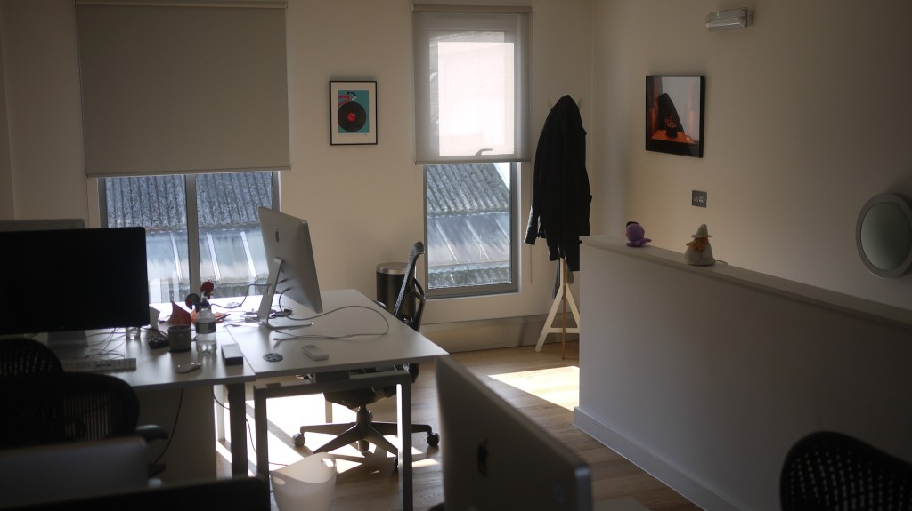
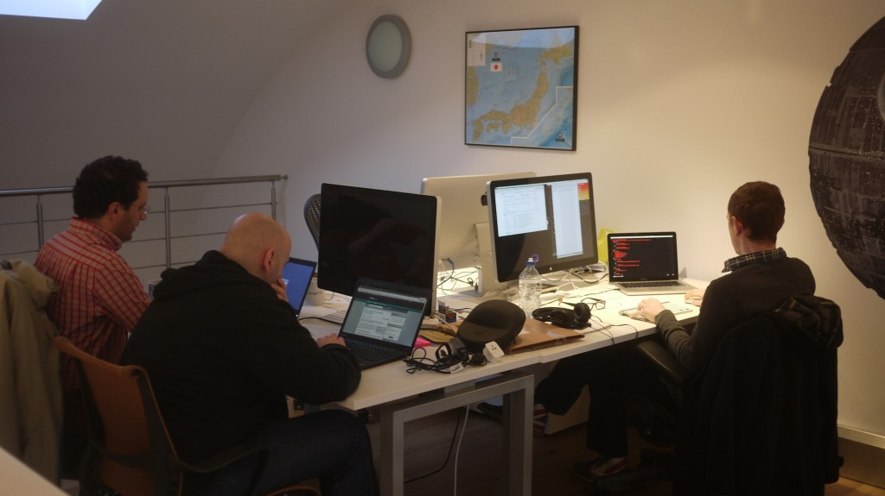
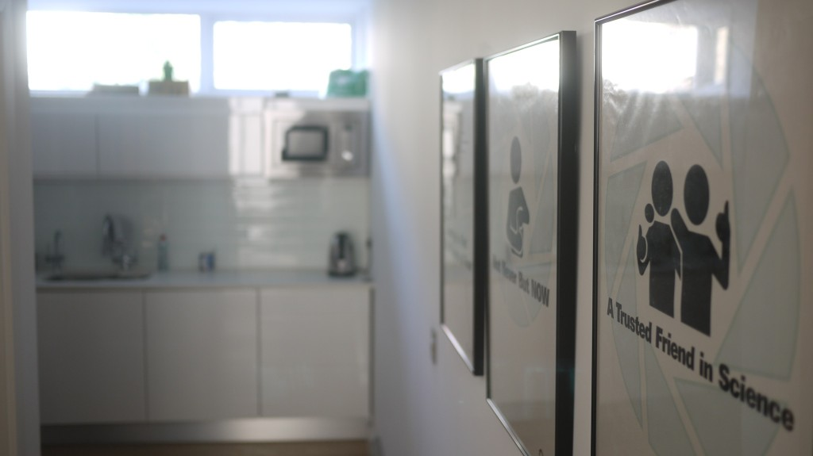
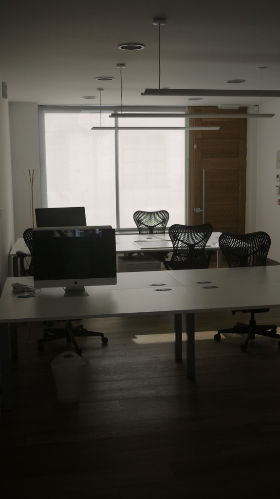

_Originally [published on the Server Density
blog](https://blog.serverdensity.com/building-our-london-office-1-year-later/)._

In February 2012 we moved into our custom built [Server
Density](https://www.serverdensity.com/) office in London, UK. Having [started
construction in November
2011](https://davidmytton.blog/building-the-server-density-london-office-part-1/),
we designed and fitted out a 3 story office for our London based design and
marketing team, with our engineers remaining remote around Europe. Now we’ve
been there for a year, I thought I’d provide some more photos and a writeup of
some of the changes we’ve made based around what we’ve learnt.

## More internet

With initially just 4 people working in the office full time, an 8MB ADSL
connection from BT was sufficient. However, as we’ve added more office based
employees and especially when we have our regular days with the whole team in
the office, there was a noticeable slowdown.

I specifically chose a [Draytek Vigor2830 ADSL2/2+ Firewall
Router](http://www.draytek.co.uk/products/vigor2830.html) to allow us to add
additional connectivity and we did this with a 50MB fibre connection
from [Eclipse Internet](https://www.eclipse.net.uk/). The router balances
traffic across the connections automatically and applies QoS to prioritise
important traffic e.g. VoIP and web traffic vs large downloads (such as the iOS
SDK!).

This also gives us some redundancy as the ADSL and fibre networks are separate
(at certain points, they still share exchange and curb to building
infrastructure). The next step would be to upgrade the BT connection for
additional speed and a leased line for redundancy. Unfortunately leased line
pricing is expensive – from £300/m for 1MB.

## The Sun is annoying

The Sun causes problems with glare, particularly for designers. We spent a lot
of time thinking through the lighting in the office but even with that, having
windows complicates things! We had to replace blinds a couple of times so we
could balance blocking out all light with allowing some natural light in to
provide a nice working environment. The blinds we chose have opacity options so
we were able to buy matching blinds but adjust the opacity on a per window
basis.

## Cover the walls

The first 6 months we had nothing on the walls which was very modern and
minimalist but not very interesting. So asked for suggestions on Google+ and the
team all posted ideas for different pictures and things to go on the walls.

We now have [a giant death star](https://www.thinkgeek.com/product/d314/), [a
map of
Japan](https://www.amazon.co.uk/Japan-Wall-Map-First-Edition/dp/4805309547/),
limited
edition [cycling](http://shop.rebeccajkaye.com/product/pedal-power-limited-edition-screen-print) [prints](http://shop.rebeccajkaye.com/product/track-cyclist-limited-edition-screen-print), [XKCD](https://store-xkcd-com.myshopify.com/collections/posters) and [Portal
posters](http://store.valvesoftware.com/index.php?t=3&g=6) lining the walls.
These have come from the whole team so help expressing the company culture and
interests.

Some of [these switch
stickers](https://store-xkcd-com.myshopify.com/products/switch-and-button-stickers) also
appeared around the place.

## Eating lunch together

Being a design and engineering company, the office is very quiet during the day
– people are in the zone and listening to music on headphones. We’re all
constantly in chat and using Google+ but it’s easy not to talk to anyone in real
life during the day. As such, every day everyone in the office has lunch between
1.30pm – 2.30pm where we sit at our conference table away from computers and
talk. Sometimes this is about work, discussing ideas and thinking through
problems but often it’s unstructured – cool things on Hacker News, science or
other random topics!

## Recycling

Although we spent a lot of time thinking about the most energy efficient way to
build the office in terms of heating, lighting and building materials, for some
reason the London Borough Council don’t provide recycling to business premises.
We have had to pay a commercial company to provide bags and collect our
recycling, which is quite a large volume given that modern packaging is quite
good at being easily recyclable.

## Things get messy, quickly

Even though we’re essentially paperless, there are still things that need to be
out on desks and/or stored. Glasses, mugs, notepads, mobile test devices
(iPhones, iPads, Android phones), keys, medication, food, etc. We purchased a
few under desk cabinets and coat hangers to keep things tidy.

We have a cleaner come once a week to do normal things like vacuum, tidy up,
dust things, etc. Now we have quite a few people, once a week is not quite often
enough but twice a week is too much. Cleaning is also disruptive and we
experimented with early morning and late night schedules (weekend didn’t fit in
with the cleaner’s schedule). Most of us arrive in the office around 10.30 –
11am and leave by 8pm so the cleaner comes around 9pm.

## Power usage

We were able to optimise the office power consumption by [switching off hidden
equipment on
timers](https://blog.serverdensity.com/monitoring-office-energy-usage/) –
network routers/switches aren’t used for most of the day so they get turned off
on timers.

Batteries are also a surprising requirement. Wireless mice and keyboards run out
of power very quickly and at inconvenient times!

## Overall

Adding an office to an initially remote company has worked very well. All our
infrastructure is already in place to work anywhere so there’s no feeling of
those working from home being isolated from those in the office. [We use
Google+](https://blog.serverdensity.com/using-google-for-technical-discussions/) and
HipChat extensively and so get the benefits of being able to hire the best
engineers anywhere in the world at the same time as having all designers in the
same location, where they work together best.

