_Originally [published on the Server Density
blog](https://blog.serverdensity.com/new-custom-built-office-in-west-london/)
and not written by me, but archived here for history._

We previously wrote a series of popular articles about our [custom designed
office](https://blog.serverdensity.com/building-our-london-office-part-1/) in
Chiswick, West London. It’s been a while since those were published, and a lot
has happened in the meantime. Most notably, **we have moved.**

Our [previous
office](https://blog.serverdensity.com/building-our-london-office-part-1/) was
fantastic, it had a ‘loft like’ appeal and was perfect for our size at the time.
At the end of 2014 though, it was time to move to bigger and better things,
which is exactly what we did.

## Where did we go?

Being a paperless company means that moving office is less disruptive than it
might have been, couple that with our remote working policies and the new office
being *literally* a stones throw away – you can see why we were in better shape
than most for the move.

Oh and yes I did mean ‘literally’, here’s a diagram to illustrate that point.

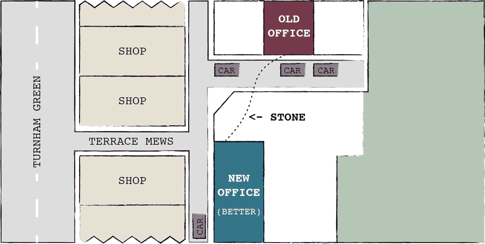

We didn’t move for a change of scenery, we moved to accommodate our growing team
(a lot of whom wanted to start working from the office).

## Why Chiswick?

Chiswick isn’t the obvious choice for the majority of tech companies setting up
shop in London – that title goes to the infamous silicone roundabout in East
London.

Chiswick is on *the West side*, and we’re located just a few minutes walk from
Turnham Green Station. Rushing into Central London can be painful, and we didn’t
want to spend our mornings squashed into someone else’s armpit. Instead we chose
a lovely quiet area just out of centre with great transport links on the London
Underground and Overground. The picture below was taken in one of the
parks during our [first photoshoot last
year](https://blog.serverdensity.com/photography-tech-startups/).

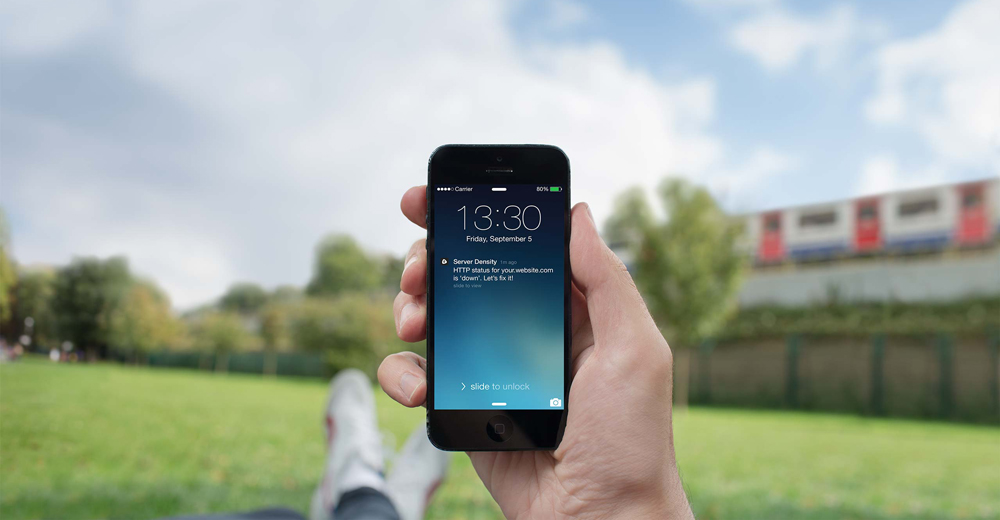

Chiswick is also busy enough to boast a number of excellent restaurants and
shops and is just a few miles from Heathrow Airport – so close in fact, that one
of our team commutes from Germany every week and it takes him just 2 hours door
to door.

## History of the building

Today our office looks worthy of [Startup
Land](https://www.startupland.com/) with countless Apple logos, Star Wars
references and techies in DuckDuckGo tee’s. Though, it hasn’t always been this
cool open plan office:

In many respects it used to be the opposite of the cloud, SaaS landscape we’re
so familiar with today. The building actually dates back to 1906 and there’s a
lovely little story behind the building that’s interesting enough to share.

August Gern Sr relocated to UK from France in the mid 1860’s, he set up a
factory behind royal crescent in London (very fancy), in which he became famous
for designing and manufacturing Organs – one of which was to [St John the
Baptist Church](http://www.stjohnthebaptisthollandroad.co.uk/theorgan/) in
Holland Road.

He died in 1907, and his son (also called August Gern) bought the land to build
a single story building and carry out woodworking for organs; this dates the
building back to 1906.

It was then sold in 1915 to the Allwright family and the era of the Compton
Organ works began. They built electric organs, the most famous of which is
housed in the famous Leister Square cinema. The building ceased being an
official ‘Organ Works’ in the mid 1920’s when they moved to a bigger premises in
Acton.

From then it became a printing works, bookbinding, and finally a furniture
making workshop. Until one of our investors bought it as a renovation project in 2014.

## Renovation of the building

Recounting the history of the building gives you a better indication of how
difficult the restoration project was; not just because of the buildings
heritage, but also because of its location. London councils are very strict and
notoriously hard to please, thankfully their vision aligned with our
architects. Enter Lyn Niblock-Aziz – our architect.

Lyn didn’t want to alter the heritage of the building if it could be avoided, so
the majority of original brickwork, roofing and structure was restored and
preserved wherever possible. *If it ain’t broke, don’t fix it.*

## Environmental considerations

The building was renovated more than rebuilt, and it needed to adhere to the
strict rules and building regulations for office units. This process started
with Green Tomato Energy, who assessed the heat loss from the existing
structure; and made recommendations on how best to insulate and heat the
building in an Eco friendly way.

After weighing up both the cost and aesthetic considerations, our architect Lyn
decided to insulate all of the external walls internally; maximise the
insulation between existing ground floor joists; and add a layer of insulation
above the existing roof structure and beneath new and salvaged slates. All of
the original windows and roof lights were also replaced with new double glazed
units.

Good builders are hard to find, we chose DGS Construction who had previous
experience refurbishing listed buildings and were keen to work with us on *green
issues*.

They brought a wealth of practical knowledge to the project and some good
carpenters that did wonders with the roof. Amazingly most of the original
structural timbers and sarking boards (whilst coated in a layer of coal dust)
were in sound condition and will hopefully last another 100 years after a bit of
a structural upgrade and a coating of fire retardant.

## The blueprints

Blueprints not only look cool, they are great for getting a good look at spaces.
Here’s ours:

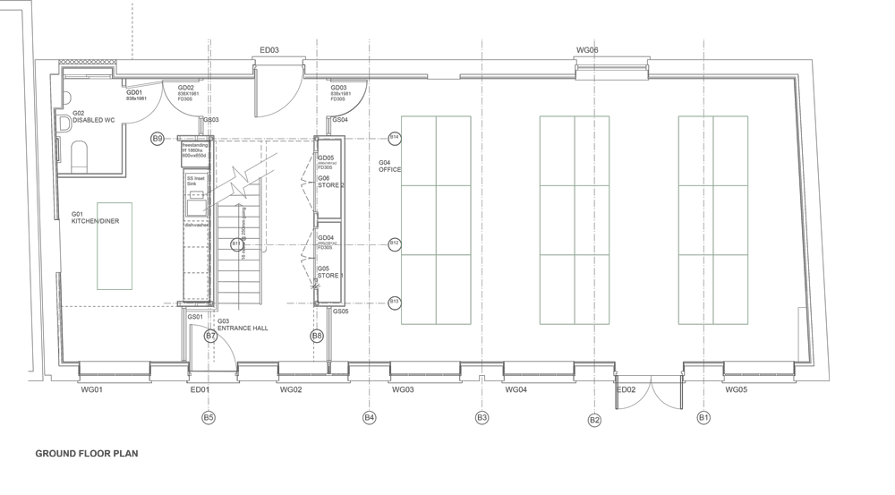

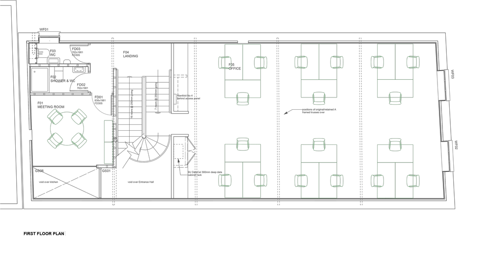

## Then and now

So without further ado, here is what you’ve been waiting for… Pictures.

### Outside of office

Renovating the exterior of the office was a lengthy process as a considerable
section of the roof has to be retiled, and skylights had to be fitted.

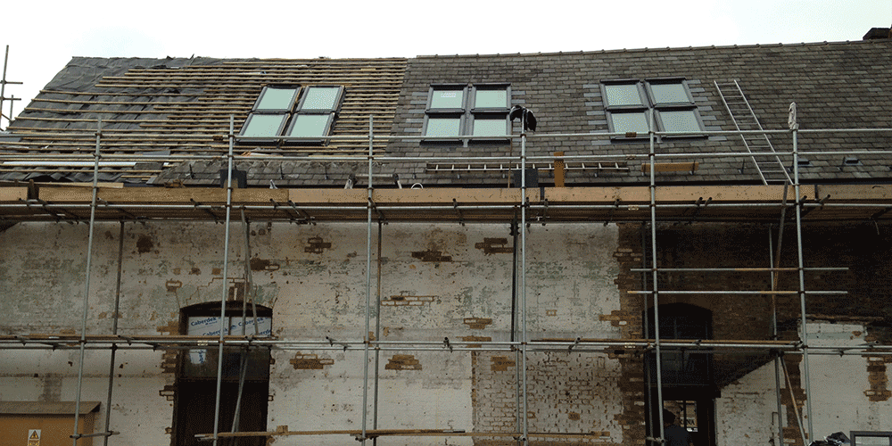

### Stairs

The stairs for The Organ Works were custom designed for the building by a
company in Bologne, Italy.

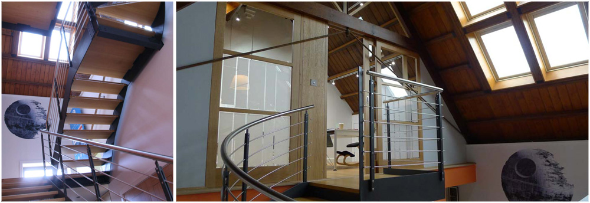

### Ground Floor

This is where we host our parties, take calls on beanbags, or look longingly at
the table wishing we had a net and some ping pong paddles.

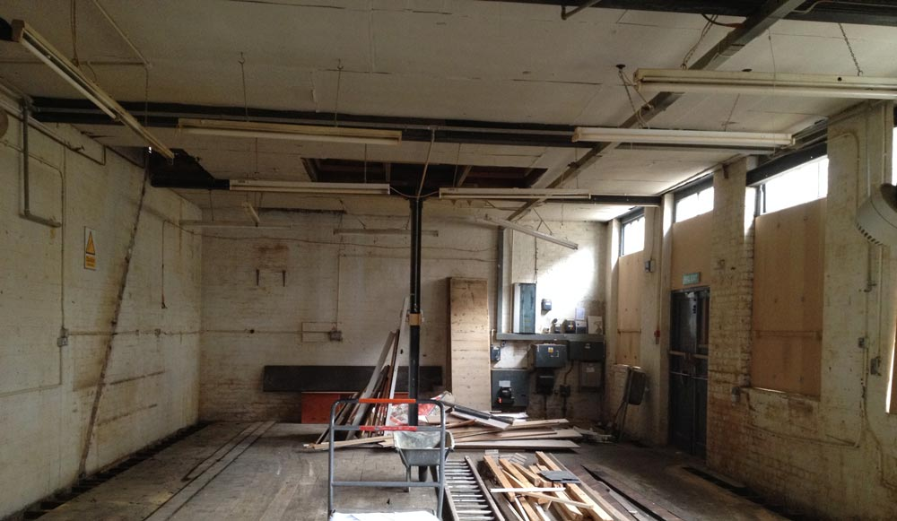

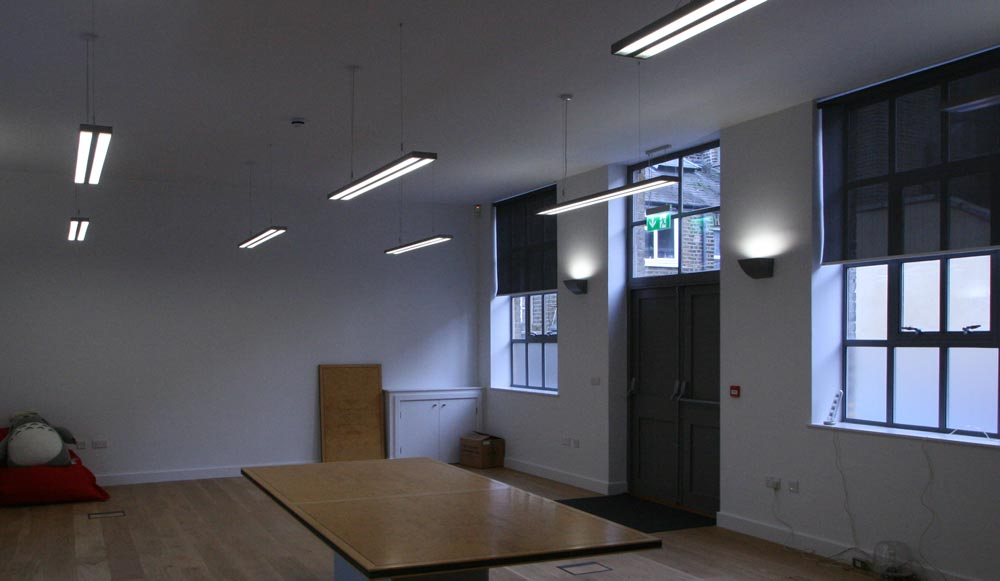

### First Floor

This is where we all work – well most of us. High ceilings, remote controlled
skylights and Apple computers. What more could you ask for?

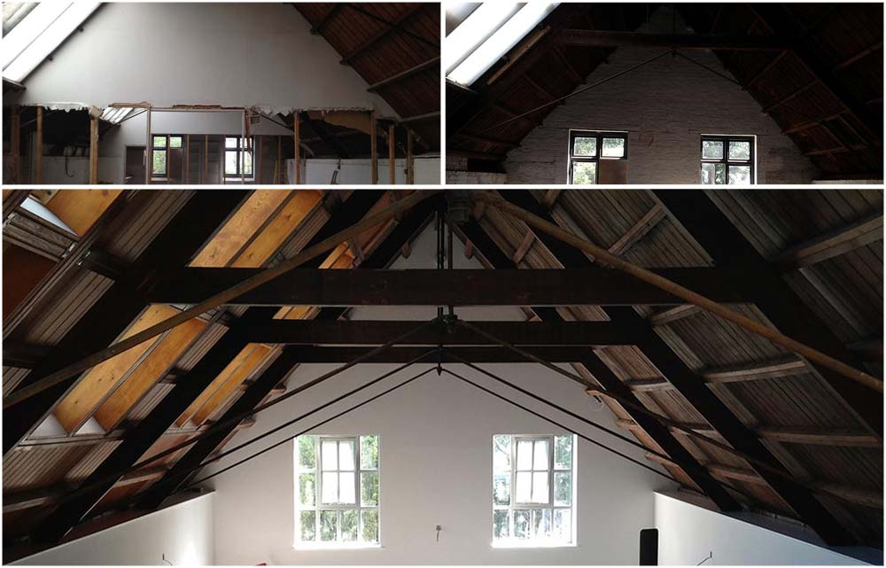

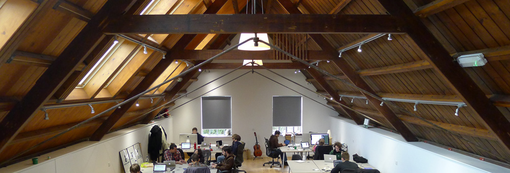

### Top Office

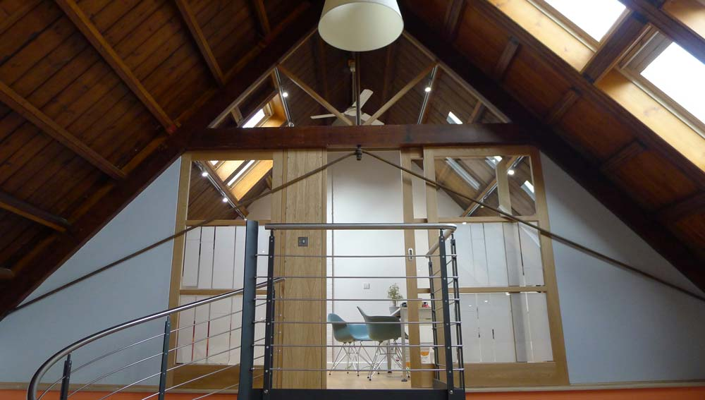

## Furniture

New furniture and fittings were selected to compliment the simple functional
style of the building. They also helped to meet the current desires for
sustainability and low energy use.

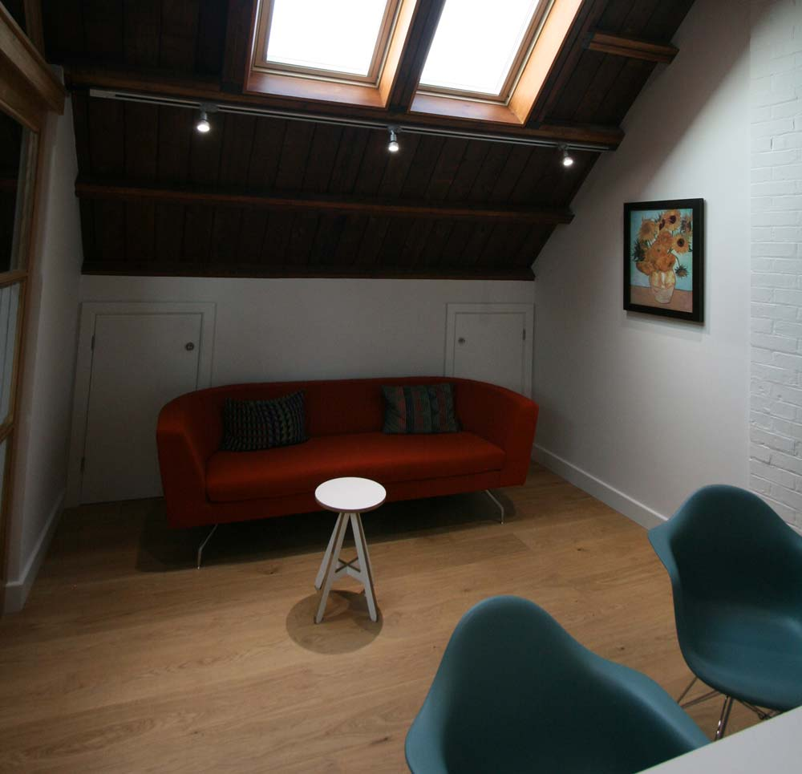

## What about the Internet?

As an internet company, we need to have a very reliable service that has no
trouble whether there’s 1 or 30 people in the office. We’ve been [a customer of
Andrews & Arnold](http://aaisp.com/broadband-office1.html) for several years now
and so switched our connectivity over to the new office. They provide top notch
technical support, [constant quality
monitoring](http://aaisp.com/kb-broadband-cqm.html), IPv6 and [uncensored access
to the internet](http://aa.net.uk/kb-broadband-realinternet.html).

The entire building is wired with GB ethernet connected to a switch on each
floor. This connects up to the [Firebrick
router](http://www.firebrick.co.uk/products_2700.php) which is custom designed
and assembled in the UK by A&A themselves! This plugs into dual FTTC lines
offering both redundancy and capacity through line bonding. A 3G modem is
plugged into the Firebrick to give us emergency backup connectivity.

Wifi is provided using a [UniFi access
point](https://www.ubnt.com/unifi/unifi-ap/), giving us high performance
wireless networking that covers the entire building.

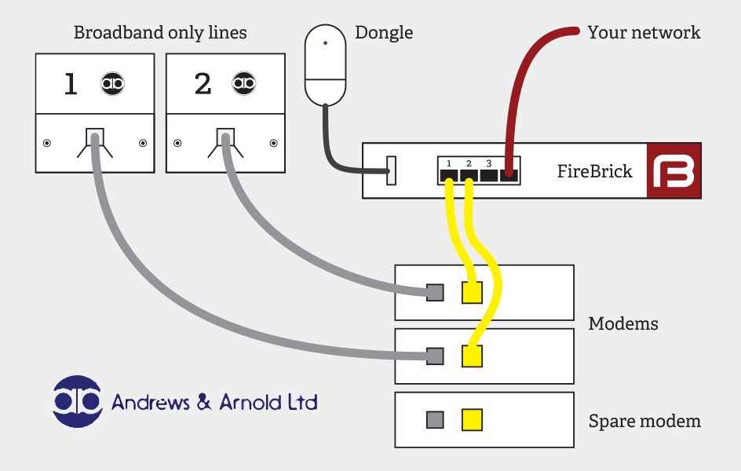

## Final thoughts

What a lucky bunch we are to have such an incredible space to call ‘work’. It’s
frustrating how normal living spaces become. They’re so dazzling to begin with
and then you just get used to your new (more glamorous) way of working. I’ve
heard the same of some friends working at Google: amazing offices, slides, free
lunches – yet still it becomes unquestionably normal.

What a shame. I suppose the phrase “you don’t know what you’ve got ’till it’s
gone” is true of office spaces as well. Another great reason to stick with
Server Density I suppose!
