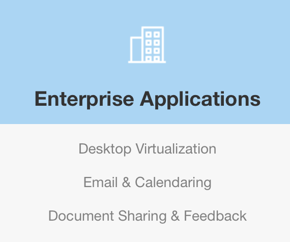

It’s become accepted that there are 3 main cloud providers: Amazon, Microsoft
and Google. From those, it’s further accepted that Amazon are the leader, [by an
order of
magnitude](https://www.techrepublic.com/article/aws-now-10x-the-size-of-its-competitors-is-the-cloud-arms-race-over/).

It’s also commonly thought that cloud infrastructure is a low margin business
and this one reason is why Amazon is doing so well.

Ecommerce is notorious for low margins and since Amazon typically
reports [profit margins in the -1 to
2%](https://ycharts.com/companies/AMZN/profit_margin), it makes sense for them
to use their expertise to create innovative cloud products through extreme
efficiency. Everyone knows the [cloud pricing
wars](http://techcrunch.com/2014/10/02/nobody-can-win-the-cloud-pricing-wars/) of
recent years.

This is very different from the model Google is used to. The majority of its
revenue comes from advertising, which is a high margin business
([20–30%](https://ycharts.com/companies/GOOG/profit_margin)). So, why is Google
in the cloud business? They are always trying new experimental businesses,
searching for the next new model to provide security as advertising becomes more
competitive ([Facebook](https://stratechery.com/2015/facebook-reckoning/)).
Amazon is demonstrating huge revenues from cloud, but assumed at such a low
margin, is this really the next big thing for Google?

")

Google certainly seems to be serious about its cloud platform — it continues
to [release new
products](https://googlecloudplatform.blogspot.se/2015/10/Google-Cloud-Security-Scanner-is-now-Generally-Available.html), [hire
big
names](https://www.zdnet.com/article/former-red-hat-executive-brian-stevens-lands-at-google/#!) and [tout
its benefits over
competitors](https://googlecloudplatform.blogspot.se/2015/09/Google-Cloud-Platform-delivers-the-industrys-best-technical-and-differentiated-features.html) — but
why is it going after a notoriously low margin industry?

## The spare capacity myth

There’s [a common
myth](http://www.networkworld.com/article/2891297/cloud-computing/the-myth-about-how-amazon-s-web-service-started-just-won-t-die.html) that
AWS was started as a way to sell off spare capacity, but that’s not actually
true. AWS [officially launched in 2006 with its queuing service,
SQS](http://aws.typepad.com/aws/2004/11/amazon_simple_q.html), as the first
product after [a proposal was pitched to Jeff
Bezos](http://blog.b3k.us/2009/01/25/ec2-origins.html). It wasn’t until 2010
that [Amazon.com had fully moved to
AWS](http://www.slideshare.net/AmazonWebServices/2011-aws-tour-australia-closing-keynote-how-amazoncom-migrated-to-aws-by-jon-jenkins).

In contrast, in most cases Google Cloud releases productised versions of systems
that already exist inside Google, and are used for Google products. GCP is the
sharing of the expertise already built internally, and Google themselves are the
biggest user of these technologies. It may not be “spare capacity” per se
(perhaps with exception of [preemptible
VMs](https://cloud.google.com/preemptible-vms/)?), but it does mean Google can
benefit from selling productised versions of tools already used internally. This
turns each one into revenue generating products rather than just being part of
the cost of running Google.

## Organising the world’s information

[Google’s mission statement](https://www.google.com/about/company/) is to
organise the world’s information. What better way to do that than by providing
the raw infrastructure services that data is stored on?

[Google’s Bigtable](https://en.wikipedia.org/wiki/BigTable) paper claims to have
started the NoSQL revolution ([and is now a GCP
product](https://cloud.google.com/bigtable/)). Of course, data is not the same
as information but by providing database products, Google could claim to be
furthering that mission, especially when [Amazon is already claiming a $1bn run
rate just from its database
products](http://techcrunch.com/2015/10/07/amazons-aws-is-now-a-7-3b-business-as-it-passes-1m-active-enterprise-customers/).

## Your IT department

The portfolio of products offered by Amazon Web Services is huge. Their goal is
to remove the undifferentiated heavy lifting by providing all your
infrastructure as a service, so you can focus on running your primary business.
This ranges from compute to email delivery and from storage to databases. More
recent releases include hosting email, virtual desktops and document
collaboration. AWS want to be your IT department — they started with the raw
infrastructure like compute and storage but have moved into the software
products used by everyone in the company: email, documents, BI. No doubt they’re
just getting started here.

Those enterprise products are key because it’s also what Google Apps is, albeit
Google’s GMail, Calendar, Docs, Spreadsheets and Slides products are
significantly more advanced.

Amazon now [claims 1 million AWS
customers](https://www.wired.com/2015/01/amazon-says-one-million-customers-actively-use-cloud-services/) but
Google [claims over 5
million](https://www.cnet.com/news/revamped-google-for-work-puts-new-spin-on-enterprise/) “Google
for Work” customers. They’re already inside companies providing corporate IT
systems so stepping in to replace key infrastructure pieces like compute,
storage, long term data archiving, databases, etc makes sense. Indeed, it’s the
opposite approach Amazon have taken.

Why is IT spending an interesting market? [Because it’s worth
$trillions](https://www.gartner.com/doc/3139327).

## What if it wasn’t actually low margin?

Commodity products tend to be low margin and [there’s an
argument](http://us10.campaign-archive1.com/?u=5dfb7b5de8e42c2633c06b3a8&id=83448858a4) to
say that compute, storage and networking are mostly undifferentiated, low margin
commodities.

But SaaS is not.

SaaS is high margin, low unit-cost, and built on top of those low margin
infrastructure services.

It’s a lot easier to compare EC2 and Google Cloud Storage pricing to running it
yourself. It’s much harder to compare costs of running a database or endpoint
security service, especially when the costs from cloud providers grow linearly
whereas your own on-prem costs don’t do well when faced with sudden scaling.

Notice what the majority of the new announcements are now from Google and
Amazon — SaaS.

Providing all the underlying infrastructure like compute and networking is a
prerequisite to building the portfolio of IT services, so when you come to need
some other service, it’s more convenient to get it from the same vendor as your
other IT systems. It’s almost like those really cheap, loss leader products
supermarkets sell to get you to purchase other, higher margin products.

And so if we are to believe [Urs
Hölzle](https://www.wired.com/2014/03/urs-google-story/) that cloud can be their
biggest business, we have to believe that cloud is really a high margin
business. The other reasons above are interesting to discuss, but why would they
want to replace a high margin profit generation business with one that generates
none at all?

Interestingly, [Andy
Jassy](http://techcrunch.com/2013/11/13/jeff-bezos-believes-aws-could-be-amazons-biggest-business/) has
said the same thing about AWS revenues. Amazon has shown no real interest in
making a profit, so far. Perhaps this is where AWS comes in? [They’ve already
announced their operating profit margin of around
17%](http://us10.campaign-archive1.com/?u=5dfb7b5de8e42c2633c06b3a8&id=83448858a4) and
I’d bet most of that comes from SaaS style products. This is much closer to what
Google is used to, and makes cloud a much more compelling line of business to be
in.
