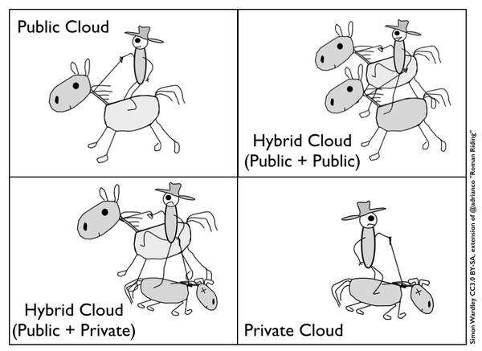

The end game for the big public cloud providers (AWS, Azure, Google) is **100%
pure public cloud**. Their goal is to completely take over all on-premise
software and infrastructure deployments.

So why do we continue to hear “the future is hybrid cloud”, combining the best
of on-premise with the best of public cloud? Let’s examine some of the
arguments.

## Myth 1: Key components can be kept on-prem in a more secure environment, alongside public cloud usage

**Premise**: keep key databases/intellectual property/secret sauce/competitive
advantage on premise whilst using public cloud for everything else.

**Reasons/rebuttals**:

1. _You are able to provide better physical security in your own facility or a
   colo facility provided by a generic data centre provider than the public
   cloud provider._  
   You may be impressed by that data centre tour with the key card access and
   mantrap doors but what about staff vetting, 3rd party audits, staff access
   control, storage media destruction, change management, security training,
   and regular penetration testing? [These are all standard practice at
   AWS](https://www.youtube.com/watch?v=rei30obkaBc).
2. _You are able to provide better software level security for all endpoints,
   including monitoring and incident response for infrastructure level
   components than the public cloud provider._  
   [Google has a team of over 500 security
   experts](https://cloud.google.com/security/whitepaper) constantly working on
   vulnerability management, response, research, monitoring and mitigation. How
   many do you have in your security team?
3. _The connection between your public cloud environment and your on-prem
   environment is immune to attacks._  
   [Multiple](https://www.theregister.co.uk/2015/10/19/nsa_crypto_breaking_theory/) [vulnerabilities](https://www.theregister.co.uk/2015/05/20/logjam_johns_hopkins_cryptoboffin_ids_next_branded_bug/) in [VPN](https://arstechnica.com/security/2015/10/backdoor-infecting-cisco-vpns-steals-customers-network-passwords/) software
   means that direct connect product you’re using to hook up your on-prem
   environment to the public cloud may well be the easiest way in.
4. _You care less about the environment hosted in the public cloud because you
   necessarily expect lower security there._  
   [Even meta data has
   value](https://www.zdnet.com/article/can-snowden-finally-kill-the-harmless-metadata-myth/#!),
   so what kind of data are you putting into the public cloud that doesn’t
   matter if it gets stolen?
5. _Any security breach in the public cloud will not affect your on-premise
   environment._  
   If the public cloud provider suffers a breach then any attacker can use your
   direct link into your on-prem environment. And if it’s your own
   config/software that is breached, are you sure that vulnerability doesn’t
   exist on-prem too?

The real response to each of the above reasons should be: why should we invest
in this when we can rely on the public cloud experts to get this right for us?
It’s core to their business, should it be core to ours?

There are very few businesses who should be making such investment in security,
and even the ones who you might think should be spending on security (e.g.
banks), [have](http://www.esecurityplanet.com/network-security/hsbc-acknowledges-data-breach.html) [poor](https://krebsonsecurity.com/2015/10/at-experian-security-attrition-amid-acquisitions/) [track](http://www.computerweekly.com/news/4500255699/Dow-Jones-denies-it-was-target-of-insider-trading-hack?) records.

Using a public cloud provider means you can leverage all their investment in
security all the way up the stack so you can focus on your own application code.
And even at that level, we’re [starting](https://aws.amazon.com/inspector/) to
see [security
products](https://googlecloudplatform.blogspot.co.uk/2015/10/Google-Cloud-Security-Scanner-is-now-Generally-Available.html) come
out.

## Myth 2: Run your usual/average load on-prem and leverage cloud elasticity for on-demand/peak/unusual workloads

**Premise**: run your usual workload using static, on-prem hardware which can
“burst” to a public cloud provider when you need to handle spikes, perform
processing or cope with unusual load requirements.

**Reasons/rebuttals**:

1. _You know your “average” workload, and that will not change_  
   Buying hardware to support your baseline workload means you need to fully
   understand not only your current workload, but also estimate and plan for
   any changes (growth and shrinkage) that might happen years into the future.
   This is because cost savings from capital expenditure usually come from
   spreading the cost over multiple years.
2. _The on-premise environment will remain competitive when it comes to cost
   and efficiency of public cloud_  
   Your own hardware will age and you will need regular refreshes to remain
   efficient and cost effective in-line with public cloud instance type
   upgrades and price improvements. It is possible to argue commodity
   on-premise hardware is cheaper right now, but will that remain true into the
   future required by the assumption above?
3. _You’re running a common platform across all environments_  
   This means running a “lowest common denominator” because any supporting
   services you’re using on-premise may be unavailable on the public cloud.
   Equally, any public cloud specific services will be unavailable on-premise
   unless you are using them using a direct connect as part of your normal
   workload (and if so, why?). As such, you will need to be running and
   managing your own platform, either written yourself or as an open
   source/enterprise product (see below).
4. _You have an auto scaling management platform_  
   This requires writing a lot of code to manage instance lifecycle both
   on-prem and in the public cloud. It needs to decide when to launch new
   capacity and shift traffic back and forth as appropriate, as well as
   shutting down instances when it’s done. Either you write this yourself (at
   huge development expense) or you use a software platform (perhaps an open
   source product such as Apache Mesos or an expensive enterprise product such
   as Rightscale). Both approaches mean (re)architecting your application in a
   particular way.
5. _There is a good quality, low latency connection between your on-prem
   environment and the public cloud_  
   All the public cloud providers now offer direct connect to the big colo/data
   centre providers and/or into your own facility. However, you need to be in
   close proximity to get the best latency and deal with your own link
   security, encryption, reliability and failover.

Bursting into the cloud remains a great theory but the operational complexity of
maintaining multiple environments with the software capability to scale across
both means this is actually more difficult than it seems.

Why put all your effort into building your own platform when you can make use of
auto scaling APIs and instance spot pricing markets from the public cloud
providers?

## Myth 3: Running your own hardware gives you more flexibility and control over the components, server utilisation and server design

**Premise**: You can design more efficient and and cost effective server
clusters by knowing your precise workloads and buying the right hardware. Server
utilisation will be improved.

**Reasons/rebuttals**:

1. _You can get better utilisation by controlling your own hardware_  
   Cloud providers achieve 65% utilisation vs 15% for the average on-premise
   deployment. This is through using a reduced number of servers but also with
   benefits driven by the economies of scale from the large public providers
   ([AWS
   reports](https://aws.amazon.com/blogs/aws/cloud-computing-server-utilization-the-environment/) their
   customers us 84% less power, and utilize a 28% cleaner power mix, for a
   total reduction in carbon emissions of 88% from using the AWS Cloud instead
   of operating their own data centers). When choosing a data centre provider
   you usually have no choice over the energy offerings whereas [Google is 100%
   carbon neutral](https://www.google.com/green/bigpicture/) and [AWS has
   several carbon neutral
   zones](https://aws.amazon.com/about-aws/sustainable-energy/), with
   commitments to continue improving over time.
2. _You have more flexibility over component choice_  
   There may have been specific use cases in the past that require certain
   hardware but the range of instance options for public cloud providers has
   expanded significantly over the years. Whether that is [buying specific
   storage throughput](https://aws.amazon.com/ebs/details/), ability to [trade
   off availability against
   cost](https://cloud.google.com/storage/docs/durable-reduced-availability),
   specific hardware acceleration or even [selecting the specific CPU
   architecture](https://azure.microsoft.com/en-us/pricing/details/virtual-machines/),
   the public cloud providers now have it covered. Not only do you get a range
   to choose from but you also benefit from their supply chain management and
   purchasing power, so [events like the flooding in
   Thailand](http://www.datacenterknowledge.com/archives/2015/10/08/thailand-floods-taught-aws-hardware-team-supply-chain-management/) don’t
   affect your ability to obtain parts.
3. _You can do workload scheduling better_  
   Scheduling is a software problem. It is now just starting to be addressed in
   open source projects like Apache Mesos but efficient routing around
   failures, instance upgrades and utilisation optimisation has been part of
   cloud provider products for a long time. Google has been running containers
   to achieve this goal for almost 10 years, and is productising this through
   Kubernetes and Container Engine, as well as their live migration
   functionality. Other cloud products like DynamoDB and Azure Placement groups
   offer specific capacity and reliability guarantees, dealing with failover
   and balancing workloads behind the scenes. These are typically check box
   configurations, vs building your own custom logic or running complex
   software yourself.

When the benefit you attempt to derive comes from either economies of scale
(e.g. access to component supply chains) or software intelligence (e.g.
placement of workloads across compute clusters), chances are that Amazon, Google
and/or Azure are able to do this too, better, faster and cheaper. And not just
now, with continual improvements into the future.

Again, why do this yourself? Do you really need to be trying to source the best
quality, lowest cost disk drives? Do you really need a specific piece of
hardware? Can you write better algorithms to schedule your containers than the
Google engineers who invented modern container architecture?

## Hybrid is just a transition

But what about direct connect or integration with and support of VMWare
and Openstack? Doesn’t that mean the cloud providers support hybrid?

No. These are all just strategic plays by the public cloud providers to get
inside your environment, and start the ball rolling towards 100% public cloud.
They’re a necessary evil.

Google said it themselves [when they announced sponsorship of
Openstack](https://googlecloudplatform.blogspot.co.uk/2015/01/VMware-to-make-Google-Cloud-Platform-available-to-its-customers.html):

> The first is a move towards the hybrid cloud. Few enterprises can move their
> entire infrastructure to the public cloud. For most, hybrid deployments will
> be the norm and OpenStack is emerging as a standard for the on-premises
> component of these deployments.

Re-read this with [my
additions](http://us10.campaign-archive1.com/?u=5dfb7b5de8e42c2633c06b3a8&id=578876abd2):

> The first is a move towards the hybrid cloud. Few enterprises can move their
> entire infrastructure to the public cloud **yet**. For most, hybrid
> deployments will be the norm and OpenStack is emerging as an
> **initial** standard for the on-premises component of these deployments.

And they’re not just supporting OpenStack, they’re helping specifically with
their open source orchestration tool, Kubernetes. Google isn’t being subtle
about this. From their announcement:

> We believe that the intersection of these trends is important to businesses
> everywhere. By joining forces with the OpenStack Foundation we hope to add
> container-native patterns to the toolbelt of enterprise developers, and
> improve*\*\*\_interoperability between public and private clouds*\*\**.”* (emphasis
> mine).

Amazon and Azure are no different. VPNs, [data import
devices](https://aws.amazon.com/importexport/) and [gateway
products](https://azure.microsoft.com/en-us/services/service-bus/) all point in
one direction. And with the dismissal of reasons for
hybrid, [all](http://www.infoworld.com/article/2824508/cloud-computing/ges-head-of-it-were-going-all-in-with-the-public-cloud.html) [smart](https://aws.amazon.com/solutions/case-studies/nasa-jpl-curiosity/) infrastructure
is [moving to the
cloud](https://www.zdnet.com/article/ge-capital-one-give-aws-the-rub-at-reinvent/).
Hybrid is just the means to an end.
