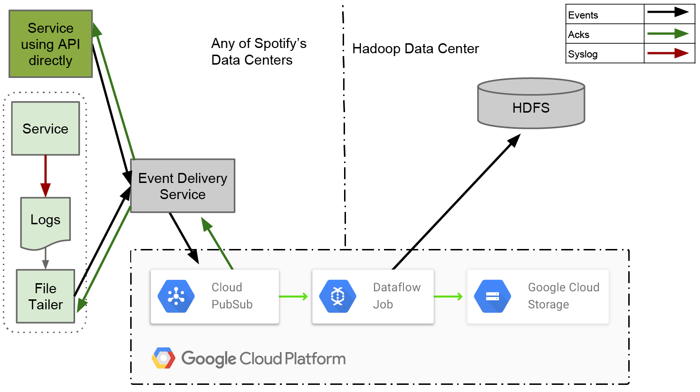

Two weeks ago, [Spotify
announced](https://googlecloudplatform.blogspot.co.uk/2016/02/Spotify-chooses-Google-Cloud-Platform-to-power-data-infrastructure.html) it
was migrating from its own datacentres to Google Cloud Platform.

This is a huge win from Google because Spotify is the first major service
running at huge scale that is deploying across many of its cloud products (and
talking about it). [We all know that Snapchat has been running on Google for a
while](https://gigaom.com/2013/05/07/snapchats-act-of-faith-in-building-on-google-compute-engine/),
but since it is primarily on App Engine, Google needed a credible use case for
its other services. Now it has one. This is similar to AWS’s Netflix.

Spotify is gradually revealing the numbers behind its decision to move to the
cloud, further strengthening the case for “why Google?”. However, they are
missing a major evaluation criteria: cost.

Thankfully, Google’s pricing is very transparent and simple to work with, so we
can use Spotify’s blog posts to calculate some list pricing for what Spotify
might be paying Google.

## Event Delivery

So far, event delivery is the only service we have real numbers for. Spotify
was [previously using
Kafka](https://labs.spotify.com/2016/02/25/spotifys-event-delivery-the-road-to-the-cloud-part-i/) in
its own data centres but has [decided to move to Google
Pub/Sub](https://labs.spotify.com/2016/03/03/spotifys-event-delivery-the-road-to-the-cloud-part-ii/).

### Google pricing

[Google’s Pub/Sub pricing](https://cloud.google.com/pubsub/pricing) is based on
3 key variables:

- Operations. Every API call is an operation and one “event” will consume at
  least 3 API calls: publish, push/pull to the consumer and an acknowledge.
  This assumes the message is 64KB or less.
- Networking. If you are using Pub/Sub within a single region then there’s no
  networking cost, but if there’s communication to another region then you pay
  the standard networking fees.
- Storage. Messages are stored until acknowledged, [which can be for up to 7
  days](https://cloud.google.com/pubsub/quotas).

### Spotify’s numbers

[Based on Spotify’s blog
post](https://labs.spotify.com/2016/03/03/spotifys-event-delivery-the-road-to-the-cloud-part-ii/),
we can extract the following numbers:

- Operations. Spotify’s average production workload is 700,000 events per
  second. During their test, they used a number of 2,000,000 events per second
  to stress the system and allow for future growth, but it’s fairer to use
  their actual quoted production workload figures.
- Networking. Spotify’s test was in a single zone so the networking costs are
  $0. However, if we assume they deploy across multiple regions (as they
  should for proper failover/disaster recovery) then the ingress is free but
  the push call to a consumer in the other region will incurr fees. Spotify
  noted a sustained 1Gbps of traffic for 2,000,000 events per second, or 0.125
  GB per second. If all those messages have a single separate-region consumer,
  that means 0.0000000625 GB per message. With regional egress at $0.08 per GB
  (just simplifying on the best pricing tier) that’s $0.000000005 per message.
- Storage. This is harder to calculate because Spotify saw around 20 sec of
  end to end latency, making it difficult to know how much storage is used.
  This would also change depending on maintenance, downtime, consumer latency,
  etc. For simplicity we’ll just assume there was zero storage.

## How much Spotify is paying Google for Pub/Sub

Taking the above calculations, we can come to the following conclusions:

### Operations

- 700,000 events per second = 1,874,880,000,000 events per month
- = 5,624,640,000,000 API calls per month (3 API calls per event)
- = $300 for the first 1,750,000,000 API calls
- = $0.05 per 1,000,000 API calls after that
- = (5,624,640,000,000–1,750,000,000) = 5,622,890,000,000
- = (5,622,890,000,000/1,000,000) = 5,622,890
- = 5,622,890 \* $0.05
- = $281,144.50 per month

### Networking

$0 if all within a single region but if we assume 1 secondary region consumer:

- 1,874,880,000,000 messages \* 0.0000000625 GB
- = 117,180 GBP
- = 117,180 \* $0.08
- = $9,374.40

This would change if there were multiple consumers across multiple regions
because Pub/Sub automatically balances across all consumers. E.g. you could have
1 consumer in the “source” region and 1 in the secondary region, and so you
might only pay for half of the messages to be consumed in that secondary region.

### Total Cost

$281,144.50 + $9,374.40

= $290,518.90/month

## Is Spotify really paying $290,518/month?

Of course, for such a high profile customer and for the priviledge of a case
study, we can assume Spotify has some heavy discounts. Cost is important but
using public cloud and especially managed services like pub/sub, the biggest
benefit is in ease of deployment and not having to manage/scale everything.

Also remember that this is just one part of Spotify’s product. There’s all the
other Google products that we have still to learn about — BigQuery, Dataflow,
Compute Engine and in particular, the networking costs for streaming all their
media. I wonder if they will run their own CDN like Netflix does, or if they’re
buying that from Google too.

It’ll be interesting to see how all the other components add up!
