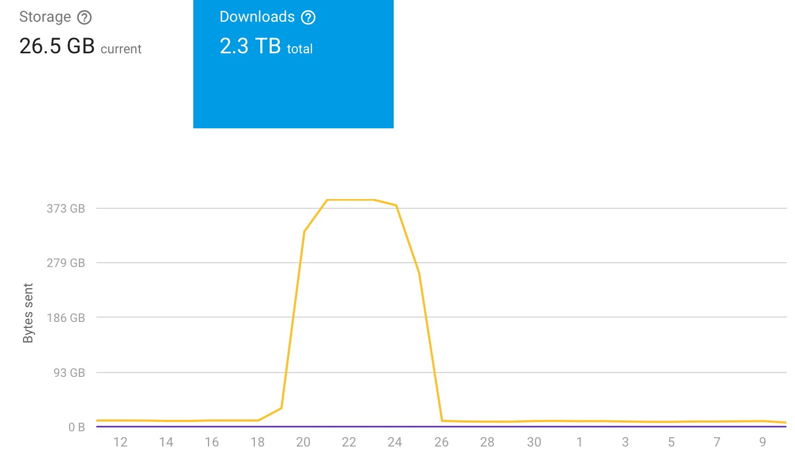
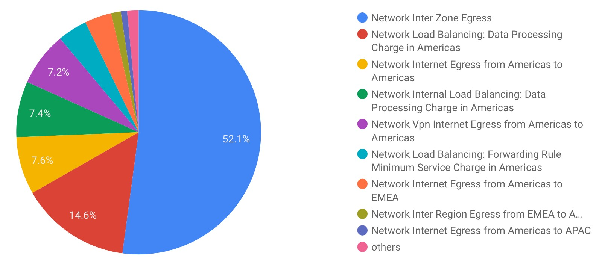

At [Server Density](https://www.serverdensity.com/), we just completed a 9 month
project to migrate all our workloads from Softlayer to Google Cloud
Platform. [This started with a single service using Cloud
Bigtable](https://blog.serverdensity.com/time-series-data-opentsdb-bigtable/) for
large scale storage of time series monitoring data and culminated with our
entire product now running on GCP.

The move went smoothly and we’re very happy to be on Google Cloud. Although they
have fewer products compared to the market leader (AWS) we think that Google
Cloud products are better designed, the pricing models are easier to work with
and there are regular releases of innovative new features e.g. [the recent
Andromeda networking
improvements](https://cloudplatform.googleblog.com/2017/11/Andromeda-2-1-reduces-GCPs-intra-zone-latency-by-40-percent.html).

That said, now the migration has completed we are reviewing our costs to ensure
that we have a well optimised deployment. This is about finding savings that
make a difference to the monthly bill as opposed to a few 10’s of $ here and
there. Doing so has revealed some interesting “features” of how cloud
infrastructure is billed.

## Cost can be difficult to predict

This should be obvious but it can catch you out if you are coming from a legacy
hosting provider where you contract for specific servers and services, thereby
having a fixed bill each month. This contrasts with the pay as you go model of
cloud whereby you’re paying for actual usage.

This approach initially appears more efficient because you are only incurring
fees when the services are consumed but it necessarily leaves you open to
unexpected cost spikes if something unexpected happens.

Of course this flexibility is by design but it highlights the importance of
closely monitoring your daily spend with reports, visualizations, budgets and
alerts. If you stop paying attention, an unexpected change in patterns of usage
can blow through your budgets early on in the month.

Some examples where this can become tricky:

- **Misuse of services.** Long term storage like AWS Glacier and Google
  Coldline storage give you incredibly low fees but only if you don’t access
  the data for certain time periods. Making a mistake here can easily cost you
  a lot.
- **Unusual traffic spikes.** Hosting resources using serverless functions or
  static hosting such as Firebase means less management overhead but if you
  suddenly get an abusive bot crawling your site or a bug in code which causes
  request loops, those per request fees can spiral out of control.
- **Provisioned capacity being too low.** This is especially tricky with
  databases where i/o depends on provisioning the right disks or capacity for
  the service. Changes to code or even database upgrades can change the
  previously expected workload patterns. Having to understand this for
  DynamoDB and AWS Redshift was one of the reasons we decided against using
  them. Cloud Bigtable has linear scalability with a fixed number of writes
  per node.

## Inter-zone networking costs are very high

The biggest surprise here comes form inter-zone costs. Designing proper
architectures on cloud requires you to use multiple zones and regions to ensure
redundancy and reliability. When a zone goes down, you need to be able to handle
that through load balancing and database replication.

When you run your own networks or if you come from a provider like Softlayer
which doesn’t charge for transfer on its internal network, you get used to being
able to do “unlimited” amounts of traffic (subject to port speed limitations).
Moving to a pay as you go model for all networking can introduce surprisingly
high costs, particularly for noisy components like [Apache
Kafka/Storm/Zookeeper](https://blog.serverdensity.com/server-alerts-a-step-by-step-look-behind-the-scenes/).

Both Google and AWS charge $0.01 per GB for inter-zone networking, a cost which
has remained the same forever. Nothing is free, of course, so it’s reasonable to
expect to pay something, but this seemingly small cost can become unreasonably
high. I’d go so far as to call it a tax on good cloud architecture.

## You have to search for the discounts

One of my favourite things about Google Cloud is you get the first level
of [sustained usage discounts
automatically](https://cloud.google.com/compute/docs/sustained-use-discounts).
This is such a contrast to the convoluted reserved instances model AWS provides
and means we just don’t have to think about capacity planning to get good
prices.

There are other discounts available though and if you know what your usage is
going to be for at least the next year, [committed usage
discounts](https://cloud.google.com/compute/docs/instances/signing-up-committed-use-discounts) can
give you even better pricing with 1 or 3 year contracts. These are very simply
based on committed CPU and memory, purchased on a per project level (I’d like to
see this extended to whole billing accounts).

But there are other discounts available that are somewhat “hidden”. For
example, [Google has interconnect deals with a number of
CDNs](https://cloud.google.com/interconnect/docs/how-to/cdn-interconnect). If
you use a partner CDN then you can get special egress pricing from Google to the
CDN. However, this is not available automatically — you must apply for the
discount and have it enabled on your account.

The billing reporting isn’t granular enough to make that clear when examining
how egress fees are building up so it’s quite easy to assume you get that
automatically just by virtue of using a CDN. That seems like a reasonable
assumption given sustained discounts are automatic and the documentation doesn’t
mention the process for applying them.

## Cost optimisation as a full time job?

Many of the choices/settings above are one time changes and should be considered
as part of the initial deployment of new projects and services. However, given
the pace new features and improvements are rolled out, you could quite easily
miss something if you stop paying attention. For example, Google released
committed usage discounts some time after sustained usage discounts and if
you’re not keeping an eye on their blog or newsletters, you may be paying more
than you need to.

All the cloud providers offer detailed billing analysis and we export our
billing data into BigQuery and [have built DataStudio
reports](https://medium.com/google-cloud/analyze-your-google-cloud-platform-bills-w-bigquery-data-studio-7c9ebeb31b56) which
provide a very visual way of examining usage. It’s crucial to build reports and
review them regularly, and as you scale up and use more and more services,
there’s an argument to be made that this increasingly needs someone full time
looking for savings and optimisations.

")

The salary of that person would of course dictate how feasible this is but the
work involved in keeping up to date with release notes, new pricing options, how
you’re using cloud resources and spotting areas to save can take up a lot of
time. Even more so with complex (but flexible) purchasing options like AWS
offers. Modelling AWS reservations at scale sounds like it would require some
deep financial engineering experience!

All the cloud providers give proactive suggestions about where you can reduce
spend (e.g. AWS Trusted Advisor) but they are incentivized to make you spend
more! Right now all the data is there for you to analyze but you have to do most
of the work yourself.

This is an obvious use case for machine learning. I suspect we’ll start to see
more and more intelligent, automated recommendations from cloud providers [like
the Google sizing
recommendations](https://cloud.google.com/compute/docs/instances/apply-sizing-recommendations-for-instances).
But until then, optimising pricing is a crucial job that must be done by humans.
