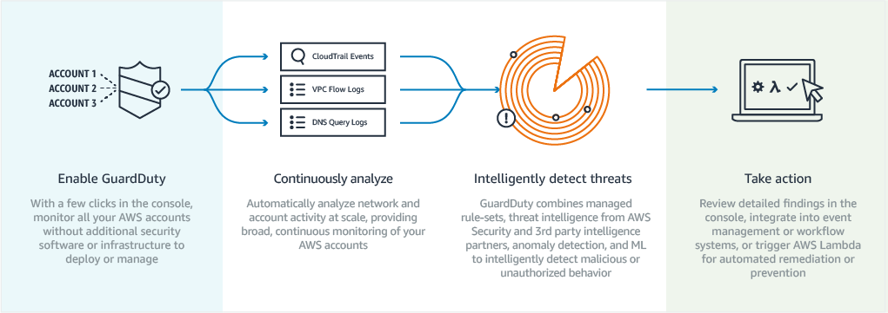

At ReInvent last week, Amazon
announced [GuardDuty](https://aws.amazon.com/guardduty/), which provides
“intelligent threat detection and continuous monitoring” for your AWS workloads.
With one click, you can enable real time analysis of events, network activity
and DNS logs and begin to benefit from early detection of threats. It even has
the capability to automate responses with Lambda triggers.

The product idea itself isn’t particularly new — indeed, it actually integrates
into third party services to incorporate their own threat intelligence rulesets.
What is new is the scale at which the service operates, and how that allows it
to legitimately use the term “intelligent”.

The scale and sophistication of modern cloud environments means that it is
impossible for humans to monitor everything. You can’t possibly build useful
dashboards or set up the right alerts for every possible problem. The volume of
system failures tracked by typical ops teams are nothing when it comes to the
number of events within the environment, many of which will be considered
“security events”.

One of the big challenges in security is dealing with emerging threats.
Practices change regularly and the discovery of “zero day” bugs means that your
systems can become compromised before you even knew a vulnerability existed.

To me, this seems like an area where machine learning technologies really can be
useful to ops teams. Building up a picture of “normal” traffic patterns,
spotting unusual behaviour and correlating malicious activites across accounts
all contributes to improving detection accuracy. Indeed, that is precisely what
GuardDuty does:

> GuardDuty offers advanced detections using machine learning and anomaly
> detection to identify previously difficult to find threats, such as unusual
> patterns of API calls or malicious IAM user behavior.

When it comes to machine learning, Amazon has a major advantage that acts as a
significant barrier to entry — data. The scale that AWS operates at means that
it has so much data to inform the models, it becomes almost impossible for
anyone else to develop competing products.

Except Google and Microsoft.

As each of the three cloud providers get bigger, they are also able to increase
the size of their machine learning dataset, which becomes a competitive moat.
Perhaps not against each other, but certaintly against startups where we
typically see innovative products develop first.

For now this is good for customers because, just like in past price wars,
Amazon, Google and Microsoft can invest the huge sums required to compete. They
also all operate at significant scale so have the traffic to input into their
models. But it does mean that building machine learning driven infrastructure
products is going to be harder and harder, simply because most startups don’t
have the data to develop models that are as accurate.

For the last few years, “machine learning” has been a startup buzzword that
helped with fund raising and closing customers. It may have even provided some
novel product features. That time is over.

More established “startups” [like Cloudflare, who already have
scale](https://blog.cloudflare.com/the-new-ddos-landscape/), will grow their
advantage. At my own company, [Server Density](https://www.serverdensity.com/),
we have 8 years of monitoring data we’re starting to do interesting things with.
Machine learning powered functionality is now just another feature considered
standard, even as it becomes more and more difficult to get enough data to build
accurate models.

Reasons of startup differentiation for will now need to be found elsewhere and
as the big three develop more security products from their data advantage, is it
even possible for new security startups to compete? It might never have been so
cheap to start a company, but it’s never been so expensive to scale it.
