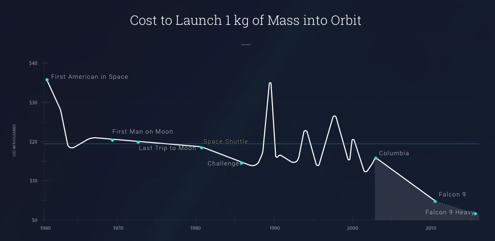

Since [I joined Seedcamp as an EIR back in
March](https://twitter.com/seedcamp/status/975694976771338241), I’ve been
considering where the biggest opportunities are for startups.

These are the areas where I think we’re still in the early stages of the
industry or technology, or need some real innovation to drive better outcomes.

They’re also the areas where I think the overall opportunity is the biggest.
This isn’t to say other areas aren’t interesting, I think these have the biggest
potential to create companies that can positively affect large numbers of
people.

If I was starting a new company, this is where I’d be looking.

## 1. Cyber security

Even before [Server Density was acquired by
StackPath](https://www.stackpath.com/press-kit/press-releases/stackpath-and-server-density-merge-may-2018), [I
thought that security was becoming a huge
issue](https://davidmytton.blog/were-still-in-v1-0-of-the-cyber-security-industry/),
both commercially and within the public sector.

Everything is online and with more and more devices getting direct internet
access – both tiny devices in the home and critical industrial systems – the
attack surface is expanding rapidly. Technology is advancing quickly and
security is not being properly considered.

Having sufficient scale to be able to make real time decisions based on analysis
of data will be the key to the success of future security products. This will
give Amazon, Google and Microsoft significant advantages because they already
see massive volumes of traffic, and make it harder for new startups to establish
themselves.

Technology gets all the coverage but human aspects of security are just as
important. [Most people still don’t take even the most basic of
precautions](https://davidmytton.blog/cyber-security-leaving-the-door-unlocked/) like
using password managers and 2 factor authentication.

The market today has too many companies making too many marketing-driven claims
without really delivering a coherent set of products, at scale. It will be
interesting to see what [Alphabet’s
Chronicle](https://techcrunch.com/2018/01/24/alphabet-launches-new-cybersecurity-company-chronicle-out-of-its-x-moonshot-factory/?guccounter=1) comes
up with. And of course I’m very excited by the things we’re building at
StackPath.

## 2. Space

Elon Musk and SpaceX get all the press coverage for their amazing rocket
launches but this is just the beginning. This [graph from Founders
Fund](https://foundersfund.com/the-future/#/space-still-the-final-frontier-3) tells
you everything you need to know about the opportunity in space technology:

I think we’re in the 1980s equivalent of the internet era: SpaceX’s rocket
technology is analogous to the building the first network backbone cables and
the likes
of [Spire](https://spire.com/), [Planet](https://www.planet.com/) and [Astranis](https://www.astranis.com/) are
like the early applications built on the Windows/Microsoft platforms.

The reduction in cost of launching payloads will have the same effect as
increasing the speed and decreasing the cost of internet access – a huge market
opportunity for a wide range of applications. This begins with near-Earth
satellites but will eventually broaden out into the rest of the solar system.
The Google/Facebook/Amazon equivalents in space have yet to be created.

## 3. Healthcare

Every country has their own system, which makes it difficult to create a
healthcare company at global scale. That said, out of these three areas the
ability to create a positive outcome for the user is the most immediate and
direct.

The problems within healthcare are somewhat obvious. Healthcare today tends to
focus mostly on reactive rather than proactive and preventative. Lifestyle
improvements mean that the demographic is moving towards longer life but with
more chronic conditions. And the current approach to funding healthcare is very
inefficient and probably unsustainable in the future (in the UK, and very, very
expensive in the US).

Just like with cybersecurity, innovative use of the increasing amount of data
collected by our devices seems like the area to focus on. Unfortunately, the
time to market is significantly longer because regulation adds a barrier for
diagnostics and medical devices. Patient safety is crucial but there has to be
balance with also allowing new developments.

I would like to see the controlled loosening of regulation like has been done in
the financial services sector in the UK. The result has been an explosion of
startups and London dominating in FinTech. Can it do the same for medical
technology, too?
