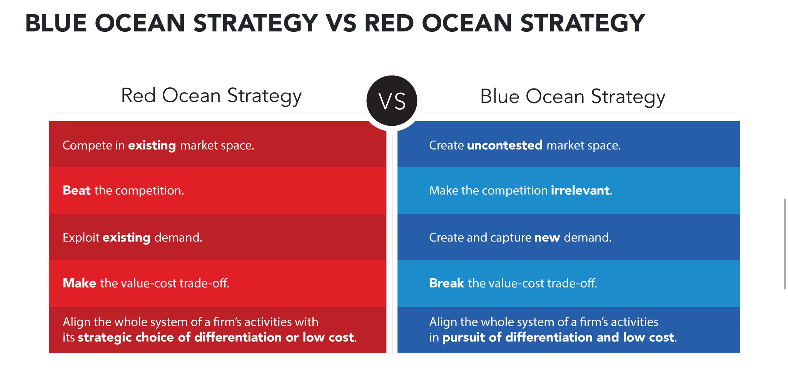

The cliché revolutionary startup idea comes to the founders in a moment of
inspiration and/or frustration about how the world could be a better place. The
idea is fully formed through a moment of brilliance, an initial version is built
and everything is amazing. That’s how you create a startup, right?

Of course there are successful businesses which start this way. [The huge
survivorship
bias](https://www.bloomberg.com/news/articles/2014-08-11/success-stories-how-survivorship-bias-tricks-entrepreneurs) in
startup lore ensures those are the ones which get the most attention. But is it
wise to embark on a journey that averages 12 years ([to
IPO](https://www.svb.com/blogs/bob-blee/harvesting-a-decade-of-innovation-will-ipo-trends-continue-in-2019))
based purely on a random idea and luck? How do you know whether that innovative
idea is actually one worth spending time on?

Competition is the basis for the modern economy. When there are more options and
sufficient information to compare and evaluate them, choice is a good thing. The
same applies to choosing a startup business idea.

My company, Server Density, started in 2009 from a frustration with the state of
the server monitoring products available at the time. I started it as a project
to learn Python and it accidentally became a business after people started using
the online beta.

Whilst that project worked out in the end ([through
acquisition](https://davidmytton.blog/3-lessons-from-9-years-of-startups/)), in
my next venture I want to take a much more deliberate approach to considering
multiple ideas and evaluating them against more objective criteria. There are so
many factors which determine the outcome but I want to be much more deliberate
in how I decide what to invest the next decade in.

There is much to be said for spending time researching before diving into a new
business. But not too much! There’s nothing more tedious than talking to someone
who *wants* to be a founder – at some point you just have to get going. If you
want to be a founder, found a company!

Here are some of the tools and models I have been exploring which can help
evaluate ideas. None of these will give you a simple yes/no answer, but combined
they will help compare multiple ideas and come to a conclusion.

These all help with the idea itself. This is necessary, but not sufficient.
Finding the right team and (if appropriate) the right investors is outside the
scope of this article.

## Human perspectives

In [The Limits to Growth: A Report for the Club of Rome’s Project on the
Predicament of Mankind](https://www.goodreads.com/review/show/2808796011) there
is a chart which illustrates how people think. This is a good way to visualise
where your idea fits on the spectrum of overall impact.

")

When evaluating ideas, you need to have a view on the type of business you want
to create. There is no right or wrong position on this chart but where it fits
will determine whether it is suitable for investors, whether it is focused on
profit or growth (and over what timeframe), and how you define the overall
mission.

It is perfectly reasonable to want to create a small business that will generate
a nice income for you just as it is perfectly reasonable to want to start a $bn
company that can IPO in 7-12 years, solving a massive global problem.

Or something in-between.

You just have to be decide that upfront, otherwise things get confusing.

I feel like most startups tend to tackle ideas towards the bottom left section.
I would like to see more aiming for the top right, especially those that go
after investor funding! Some good places for inspiration for those types of
startups are the [Founders Fund
Manifesto](https://foundersfund.com/the-future/) and the [Breakthrough Energy
Ventures Landscape](http://www.b-t.energy/landscape/).

[This is a great talk about the allocation of attention to real
problems](https://www.youtube.com/watch?v=JGzjXu5pqAg) and how to think about
where you (should) spend your time. Ignore the fact it’s at an AI conference –
it has almost nothing to do with AI!

## Market Attractiveness Matrix

This is a fairly simple way to analyse how easy it will be to scale sales – do
your customers obviously need the product? Ideally you want your idea to be in
the top right quadrant.

")

If your target audience lives within a revenue centre and/or the product can
actually accelerate revenue (directly or indirectly), the sale will be
significantly easier than something which either increases costs or is a “nice
to have” cost reduction.

Of course, vitamins themselves are still a massive ([mostly
bogus](https://sciencebasedmedicine.org/category/herbs-supplements/)) market,
but if your idea is placed on the left, sales and marketing are going to be
particularly difficult. Why not just avoid those types of business in the first
place?

## Zero to One

Only really relevant if you are aiming for the upper right section of the Human
Perspectives chart, this is [Peter Thiel’s famous
framework](https://www.goodreads.com/book/show/18050143-zero-to-one) for how to
evaluate startup ideas.

His general thesis is that the most successful businesses all have significant
competitive (monopoly) advantages (moats) and are not just incremental
improvements.

We are in an era where it is incredibly cheap to start a new company but [very
expensive to scale
one](https://davidmytton.blog/you-cant-build-a-saas-company-in-2018-without-significant-funding/),
which means there will almost always be some competition. It is a red flag if
someone says they have no competitors. The Zero to One framework is a good way
to think through what your real differentiators are and whether you have a
sustainable competitive advantage that can’t be easily copied.

The key questions to ask:

1. **The Engineering Question** Can you create breakthrough technology instead
   of incremental improvements?
2. **The Timing Question** Is now the right time to start your particular
   business?
3. **The Monopoly Question** Are you starting with a big share of a small
   market?
4. **The People Question** Do you have the right team?
5. **The Distribution Question** Do you have a way to not just create but
   deliver your product?
6. **The Durability Question** Will your market position be defensible 10 and 20
   years into the future?
7. **The Secret Question** Have you identified a unique opportunity that others
   don’t see?

Ideally you will have all of these, and have a particularly good answer for 4
and 5. People think that “the secret” is the most important but I’ve found that
question 5 thinking about distribution (i.e. the go-to-market plan) is often
ignored and question 1, technology/engineering, gets too much focus.

## Job to Be Done

This is the framework I’ve learned about most recently. [Originally from Anthony
Ulwick](https://jobs-to-be-done-book.com/), it was popularised by Clayton
Christensen. His most famous work is Disruption Theory, however, I think the Job
to Be Done theory is more useful when it comes to evaluating new ideas.

This theory is described in the book [Competing Against
Luck](https://www.goodreads.com/review/show/2901410980) but is unfortunately not
as a concise as the above frameworks:

> To summarize, the key features of our definition are: A job is the progress
> that an individual seeks in a given circumstance. Successful innovations
> enable a customer’s desired progress, resolve struggles, and fulfill unmet
> aspirations. They perform jobs that formerly had only inadequate or
> nonexistent solutions. Jobs are never simply about the functional—they have
> important social and emotional dimensions, which can be even more powerful
> than functional ones. Because jobs occur in the flow of daily life, the
> circumstance is central to their definition and becomes the essential unit of
> innovation work—not customer characteristics, product attributes, new
> technology, or trends. Jobs to Be Done are ongoing and recurring. They’re
> seldom discrete “events.”
>
> ...
>
> When we deconstruct coherent customer episodes into binary bits, such as
> “male/female,” “large company/small company,” “new customer/existing
> customer,” we destroy meaning in the process. Jobs Theory doesn’t care whether
> a customer is between the ages of forty and forty-five and what flavor choice
> they made that day. Jobs Theory is not primarily focused on “who” did
> something, or “what” they did—but on “why.” Understanding jobs is about
> clustering insights into a coherent picture, rather than segmenting down to
> finer and finer slices.

I like this approach because it follows [my thoughts around the importance of
having a company
mission](https://davidmytton.blog/communication-inside-startups-what-and-how/) that
everyone understands and is working towards.

Christensen suggests thinking about the job to be done by imagining you are
filming a documentary about the customer that needs to answer some key
questions:

1. **What progress is that person trying to achieve?** What are the functional,
   social, and emotional dimensions of the desired progress?
2. **What are the circumstances of the struggle?** Who, when, where, while doing
   what?
3. **What obstacles are getting in the way of the person making that progress?**
4. **Are consumers making do with imperfect solutions through some kind of
   compensating behavior?** Are they buying and using a product that
   imperfectly performs the job? Are they cobbling together a workaround
   solution involving multiple products? Are they doing nothing to solve their
   dilemma at all?
5. **How would they define what “quality” means for a better solution, and what
   tradeoffs are they willing to make?**

It is also important to consider what the tradeoff the customer has to
make. **What has to be fired for my solution to be hired?** What are the forces
compelling change and what are those opposing change?

Storyboarding is mentioned as a good way to picture how the customer will think
about this:

> The moments of struggle, nagging tradeoffs, imperfect experiences, and
> frustrations in peoples’ lives—those are the what you’re looking for. You’re
> looking for recurring episodes in which consumers seek progress but are
> thwarted by the limitations of available solutions. You’re looking for
> surprises, unexpected behaviors, compensating habits, and unusual product
> uses. The how—and this is a place where many marketers trip up—are
> ground-level, granular, extended narratives with a sample size of one.
> Remember, the insights that lead to successful new products look more like a
> story than a statistic. They’re rich and complex. Ultimately, you want to
> cluster together stories to see if there are similar patterns, rather than
> break down individual interviews into categories.

The job to be done should also differentiate between the circumstances of when
the customer buys the product vs when it is actually used – both are crucial,
and there is often too much focus on the former. The entire experience is
critical for success.

I often see product ideas that start with a technology and try and find an
application for it (e.g. everything to do with blockchain). A clear Job to Be
Done makes the company mission obvious. How it is solved becomes an
implementation detail with the entire company built around that job and the
customer experience of “solving” it.

The book ends with some good examples of how to properly define the job to be
done:

> First, if you or a colleague describes a Job to Be Done in adjectives and
> adverbs, it is not a valid job. It might describe an experience that a
> customer needs to have in order to do the job, but it is not a job, as we have
> defined it here. For example, “convenience” is not a Job to Be Done. It might
> be an experience that might cause a customer to choose your product rather
> than a competitor’s product, but it is not a job. A well-defined Job to Be
> Done is expressed in verbs and nouns—such as, “I need to ‘write’ books
> verbally, obviating the need to type or edit by hand.” In contrast, the
> sentence “We should aspire to be more honest” is a noble goal, but it’s not a
> job.
>
> Second, defining a job at the right level of abstraction is critical to
> ensuring that the theory is useful. This can be more art than science, but
> there is a good rule of thumb: if the architecture of the system or product
> can only be met by products within the same product class, the concept of the
> Job to Be Done does not apply. If only products in the same class can solve
> the problem, you’re not uncovering a job. A couple of examples: “I need to
> have a chocolate milk shake that is in a twelve-ounce disposable container” is
> not a job. The possible candidates that I could hire to do this are all in the
> milk shake product category. I could call this a need or a preference—but it
> isn’t a job. We need to go up another level of abstraction in order to
> discover the job. “I need something that will keep me occupied with what’s
> happening on the road while I drive. And also, I’d like this to fill me up so
> that I’m not hungry during a 10:00 a.m. meeting. I could hire a banana,
> doughnuts, bagels, Snickers, or a coffee to do this job.” The candidates to do
> the job are all from different product categories; and our rule of thumb is
> that this is the right level of abstraction.

## Others

[Blue Ocean Strategy](https://www.blueoceanstrategy.com/) is one that keeps
coming up. I heard about it a while ago but it always sounded like it was
created by an “enterprise solutions consultant”. Having heard about it from
multiple well-regarded sources, the book is now on my to-read list!

Originally [a
paper](https://academic.oup.com/icc/article-abstract/11/2/289/709155) and [now a
book](https://www.goodreads.com/book/show/2681763-the-red-queen-among-organizations),
“The Red Queen in organizational creation and development” is a theory about
competitiveness:

> We synthesize organization learning theory and organizational ecology to
> predict systematic patterns in the founding and growth of organizations over
> time. Our central argument is that competition triggers organizational
> learning, which in turn intensifies competition that again triggers an
> adaptive response. We model this self‐exciting dynamic—sometimes referred to
> as the ‘Red Queen’ in general evolutionary theory—to explain organizational
> founding and growth rates among the thousands of retail banks that have
> operated in Illinois at any time from 1900–1993. We find strong evidence that
> Red Queen evolution led some organizations to grow quickly and to place strong
> competitive pressure on rivals. Red Queen evolution also helped establish
> barriers to entry. However, this same evolutionary process appears to make
> organizations more susceptible to ‘competency traps’, ultimately slowing their
> growth rates and inviting new market entry. Organizations confronted by a
> widely varying distribution of competitors grow more slowly and are more
> likely to face new entrants.

It is also on my to-read list, so I have no particular comments yet.
