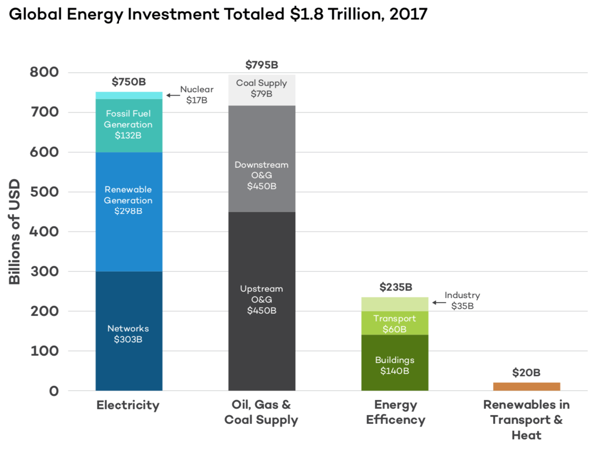

The startup investment cycle takes time. The [average time to IPO is 12
years](https://www.svb.com/blogs/bob-blee/harvesting-a-decade-of-innovation-will-ipo-trends-continue-in-2019) which
means that just as with scientific research, the investment lags the results by
a long time.

[Contrary to populist
belief](https://www.ft.com/content/b8a36a08-6112-11e9-b285-3acd5d43599e), this
also shows that investors are able to think about the long term, not just
thinking about short term returns. Indeed, [long term value
investing](https://www.ft.com/content/18ca9e28-bce1-11e8-8274-55b72926558f) is
where the most consistent returns are, and venture capital is [where you can
find the largest
outcomes](https://www.wsj.com/articles/uber-jackpot-inside-one-of-the-greatest-startup-investments-of-all-time-11557496421).

The startup advantage is agility and flexibility. Modern approaches to build and
deploying software means that innovative ideas can rapidly reach customers.

The problem is that whilst “moving fast” might work for a consumer mobile app or
a backoffice SaaS product, the cleantech sector tends to involve highly
regulated, capital intensive, mission critical infrastructure.

> Key features of energy systems, however, impede accelerated innovation. Energy
> is a highly capitalized commodity business, with complex supply chains and
> established customer bases, providing essential services at all levels of
> society. These features lead to systems with considerable inertia, focus on
> reliability and safety, aversion to risk, extensive regulation, and complex
> politics.
>
> <cite>[Advancing the Landscape of Clean Energy Innovation, February
> 2019](http://www.b-t.energy/wp-content/uploads/2019/02/Report_-Advancing-the-Landscape-of-Clean-Energy-Innovation_2019.pdf)</cite>

Mistakes cause national impact, often leading to inquiries
and [possible](https://www.ft.com/content/49d94586-bb47-11e9-b350-db00d509634e) or [actual](https://www.latimes.com/business/la-fi-puc-fine-20150409-story.html) fines.

This presents problems for startups trying to break into the industry as well as
scale-ups looking to grow innovative technologies. A lot of effort has to be
spent ensuring technologies work properly and can be maintained safely. The
longer it takes to deploy and prove a technology, the more risk there is for the
startup.

Unlike a software startup which can build and release their product with a
single in-house team, cleantech often requires the commercialisation of academic
and scientific innovation. Like biotech research, it can be a long road to
productising an academic discovery and the initial phases tend not to attract
private sector investment.

")

Startups can find a very important role in the cleantech sector, but they are
not the only player, and typically participate at a later stage.

So what happens once a startup is ready to get going?

### How much is being invested in cleantech?

[Crunchbase](https://www.crunchbase.com/) lists 2,044 companies that categorise
themselves either as CleanTech or Clean Energy, 95% of which are classified as
“active”.

From that list, **$49.9bn has been invested across 2,694 funding rounds**. The
average total funding is $53m although the median is $3m. However, that includes
some large utilities such as [Gas
Natural](https://www.crunchbase.com/organization/gas-natural) – I would question
whether they deserve the label “cleantech”.

Of the 288 companies that have exited, the valuation at IPO totals $10bn and M&A
exits total $66.1bn. This means **of $49.9bn invested into cleantech, investors
have returned $76.1bn**.

#### Compared to other sectors

Using the data from Crunchbase to compare companies by category, cleantech comes
second from bottom in total amount of investment and bottom in terms of number
of companies.

#### Excluding exits

If you exclude the IPO and M&A exits from the Crunchbase data, the numbers
reduce significantly to 478 companies and a total of **$10.4bn invested across
1,160 funding rounds**. The average total investment is $26m with a median of
$1.7m. 92% of those are still “active”.

#### Does cleantech require larger investments?

Given the high barriers to entry, it would be reasonable to guess that cleantech
would be similar to the biotech profile, particularly when it comes to the
amounts invested.

This is proven by the numbers: **$53m is the average total investment across
cleantech** companies, with only financial services averaging more at $56m.
However, there are some large outliers which push that average up and the
cleantech median is much lower at $3.2m compared to biotech at $6.5m.

The data shows that more money is needed to bring cleantech and biotech
technologies to market when compared with the other categories. There are fewer
cleantech companies but they raise more money than e-commerce, advertising and
education, and about the same as health care. Financial services and biotech
tend to raise more, with biotech raising significantly more.

_Stats based on Crunchbase categories of all companies as of 2019–08–26.
Companies can have multiple categories applied to their profiles._

### What are the cleantech investment trends?

Peaking in the 2012–2015 period, the overall number of startups founded has been
on a downward trend for the past few years.

**On average, 52 cleantech companies are founded each year**, but that is tiny
compared to e-commerce which has seen an average of 988 companies founded per
year since 2004.

**The peak years for cleantech were 2009, 2010 and 2011 with 73, 70 and 71
companies being founded respectively**. The category needs to be plotted by
itself because it is so small relative to the others.

Despite this negative trend of companies being founded, the numbers closing
investment is actually increasing. More companies have raised funding over the
past few years.

This suggests that companies in cleantech might need more time to reach a point
where they can raise funding, possibly due to the long product development
times.

_Stats based on Crunchbase categories grouped by date as of 2019–08–26.
Companies can have multiple categories applied to their profiles. In the
cleantech funding total graphs, [Bloom
Energy](https://www.crunchbase.com/organization/bloom-energy) was removed from
the 2004 stats because of its $825m outlier funding round._

### Cleantech funding outliers

Every sector has its funding outliers — those that raise huge rounds. We’ve seen
the recent IPOs of the likes of Uber (raised $24bn) and WeWork (raised $12bn),
but what are the equivalents in cleantech?

Going back to 2004, there are a number of cleantech outliers who have raised
large rounds.

- **[Bloom
  Energy](https://www.crunchbase.com/organization/bloom-energy) (raised
  $825m)** — founded in 2001, $1.6bn IPO 2018. Provides on-site power
  generation systems that can use a wide variety of inputs to generate
  electricity.
- [**Sonnen (raised
  $169m)**](https://www.crunchbase.com/organization/sonnenbatterie)— founded
  in 2010, acquired 2019. Intelligent lithium based energy storage
- **[Infinia](https://www.crunchbase.com/organization/infinia) (raised
  $147m)** — founded in 1985, acquired 2013 through bankruptcy proceedings. A
  solar energy tech company.
- **[Ice
  Energy](https://www.crunchbase.com/organization/ice-energy-inc) (raised
  $132m)** — founded in 2003. Utility-scale distributed energy resources and
  storage technologies for clean energy.
- **[Motiv Power
  Systems](https://www.crunchbase.com/organization/motive-power-system) (raised
  $77m)** — founded in 2009. Electric powered intelligent chassis & software
  solutions for cost effective, reliable, class 4–7 commercial vehicles.

### Where is the cleantech opportunity?

Energy has a huge focus because of the massive opportunity not just in emerging
markets like China and India, but because of the expected growth in demand
everywhere.

$1.8 trillion was invested into the energy sector in 2017 but the International
Energy Agency estimates $2.8 trillion is needed each year to meet demand.

But energy is just one subsector.

Cleantech Group run [an annual list of the top 100 cleantech
companies](https://www.cleantech.com/the-global-cleantech-100/) across multiple
categories. For 2019 (looking at companies that raised funding up to Dec 2018),
their Cleantech 100 companies raised over $14bn with an average investment of
$37m.

They include categories such as Agriculture & Food ($1.9bn), Energy & Power
($1.8bn), Industrial & Manufacturing ($951m), Materials & Chemicals ($247m),
Resources & Environment ($767m) and Transportation & Logistics ($8.37bn). This
is a much broader definition than used by Crunchbase above e.g. they include
taxi-on-demand company, Lyft, which shows that [there are many ways that
startups can help tackle climate
change](https://medium.com/swlh/how-startups-can-help-combat-climate-change-8e1f797c988e).

### Who is investing in cleantech?

There are investors on the lookout for these kinds of opportunities and funds
specifically focused on the sector, some of which have only been announced
recently:

- [Breakthrough Energy Ventures](http://www.b-t.energy/ventures/) — A $1bn
  fund backed by [Jeff Bezos](https://medium.com/u/957a3f99c6e0), Bill Gates,
  Richard Branson, [Vinod Khosla](https://medium.com/u/3dc350c75361),
  and [many others](http://www.b-t.energy/ventures/board-investors/).
- [ETF Partners](https://etfpartners.capital/)
- [Lux Capital](https://www.luxcapital.com/) — A $2.4 billion firm investing
  at any stage from $50,000 to $50 million.
- [Incite Ventures](https://www.incite.org/ventures/)
- [Future Shape](https://www.futureshapellc.com/)
- [Baruch Future Ventures](https://www.baruch.vc/) founded by [Tom
  Baruch](https://medium.com/u/c43bff30f250).
- [Social Impact Capital](https://social-impact-capital.com/)
- [Power House](https://powerhouse.fund/)
- [Ramez Naam](https://medium.com/u/6187c09a5d29)’s [AngelList
  syndicate](https://angel.co/ramez-1/syndicate) (which I am part of).

### What is the cleantech investing outlook?

Climate change and making a positive contribution to improving the environment
is clearly on the political agenda. There are fewer companies being founded but
there are more funding rounds. Of those cleantechs that have been funded, there
have been some very large investments, mostly focused around energy, but the
absolute numbers are still small.

The consensus in 2019 is that the startup ecosystem is efficient and there is a
lot of capital waiting to be deployed. [According to Tom
Tunguz](https://tomtunguz.com/fundraising-environment-2019/):

> For founders who have established product market fit, a panoply of capital
> choices exist. In my view, the fundraising market in 2019 is the strongest
> it’s ever been. Founders have more options than ever.

The data shows that there is less competition for funding and that when funding
is closed, large amounts can be secured from a range of investors.
When [evaluating ideas as a
founder](https://davidmytton.blog/tools-for-evaluating-startup-business-ideas/),
less competition is good, but no competition is a red flag.

Cleantech is not a crowded market and has seen significant exits, but the small
number of companies suggest it is not particularly “easy”. Are founders put off
and focused on other areas with lower risk? With the buzzwords focused elsewhere
and new capital available for investment, now seems like a good time to get
involved.
