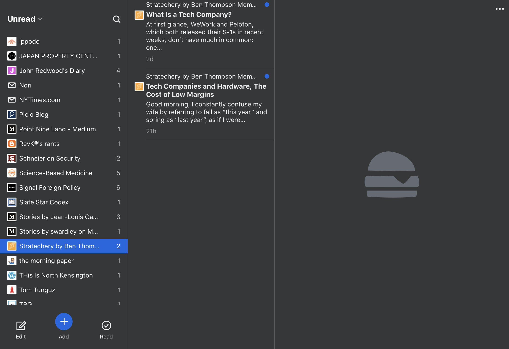

There are two types of news websites:

1. **Type 1: Mass, commodity content** that is trying to cover all the news in
   as close to real time as possible. A high volume of content that usually
   lacks depth or insight, but does keep you informed as things develop.
2. **Type 2: Less frequent, considered analysis**, opinion (and sometimes
   aggregation). Fewer articles that are usually more thoughtfully composed and
   are better researched. You might miss out on what’s happening right now, but
   will eventually read what is important.

I stopped paying direct attention to the news quite some time ago but still
subscribe to several hundred websites and blogs through RSS feeds
in [Feedbin](https://feedbin.com/). Having also all but abandoned social media,
I thought that this would be a good way to stay up to date on a “pull” basis
rather than “push” i.e. checking at my convenience rather than being hooked into
notifications and “breaking news”.

However, I recently found that I was still instinctively clicking through to
Feedbin far too often. Most of the sites I subscribe to publish infrequently but
I subscribe to a enough feeds that it’s guaranteed there will always be
something new. I felt like this was damaging my ability to focus, particularly
with Type 1 content that is constantly streaming in. As such, I have been trying
to reduce my consumption of Type 1 content in favour of Type 2.

This was a simple change to make – remove Type 1 subscriptions and other sites I
didn’t look forward to reading.

The Type 1 sites that I purged included [9to5Mac](https://9to5mac.com/) (similar
to [MacRumors](https://www.macrumors.com/), [Apple
Insider](https://appleinsider.com/), etc) and I am now only paying attention
to [Daring Fireball](https://daringfireball.net/). [Guido
Fawkes](https://order-order.com/) was also removed and I am now getting my
politics update from the daily [Coffee House Shots
podcast](https://www.spectator.co.uk/podcasts/coffee-house-shots-podcast/) and
the [Signal Foreign Policy blog](https://www.gzeromedia.com/signal/). If I hear
about a specific breaking story I want to check, I’ll go to the BBC News – one
of the few remaining organisations with reliable, original news reporting. But
sites which publish more than a couple of times per week are now candidates for
removal.

In addition, I removed Feedbin from my Safari Favourites. Instead of clicking
the icon, I now have to actually type in the URL. Because Feedbin is so quick to
load, clicking the icon had become a reflex; by the time I realised I’d done it,
everything had loaded! Now, typing the URL is a deliberate action that I might
start, but can still stop myself before hitting return.

My feed reading approach now matches how I get news i.e. no news apps, no TV, no
Twitter and only reading the Sunday Times and FT Weekend on a Sunday morning.
The Economist is an alternative I would also recommend because of its
publication schedule every 2 weeks, although I no longer subscribe. For
tech, [Stratechery](https://stratechery.com/) is the best.

The key to Type 2 content is the (in)frequency in which it is published. Does
anyone really need to read 20-30 articles a day?

I still pay attention to Twitter, I just don’t use Twitter to do it. Instead, [I
subscribe to specific people in
Feedbin](https://feedbin.com/blog/2018/01/11/feedbin-is-the-best-way-to-read-twitter/).
I only see their tweets and don’t get distracted by the mess that is the Twitter
feed, replies, trends and ads. Any links are expanded within Feedbin so I don’t
even need to leave the app.

It now takes me 3-4 hours each Sunday to read everything. Not only does this
compress everything and prevent me spreading the distractions throughout the
week, that but the material I am reading is much more considered. Opinions have
had time to be formed and evidence gathered for a more in depth writeup.

Type 1 sites that generate tens of posts a day are just adding to the noise.
There is almost nothing that happens that needs to be reported to me in real
time. Sometimes those sites have some good original content, but then the
aggregators will report it
([example](https://daringfireball.net/linked/2019/04/17/rambo-location)).

So far, this experiment has had the expected effect of allowing me more time to
focus. Just like when I removed all social media apps from my phone and browser
favourites, I’m finding I have tamed the reflex of clicking the Feedbin shortcut
as well.

Introducing just a little inconvenience has actually been a positive. I haven’t
missed anything important and have freed up time I previously wasted on those
unnecessarily verbose Type 1 sites. I now look forward to reading the various
Type 2 sites and blogs I subscribe to in Feedbin each weekend, and have more
time for reading books.

Despite [the rise of content
marketing](https://m.signalvnoise.com/lets-stop-shaking-people-down-for-their-email-addresses/),
long form content is [still
valuable](https://om.co/2019/08/27/some-changes/) and is where [I’m trying to
focus my own writing as well](https://youtu.be/n7wsRIzAvB0). The first step to
improving my reading diet is [removing the
junk](https://www.youtube.com/watch?v=7lECIsRif10).
