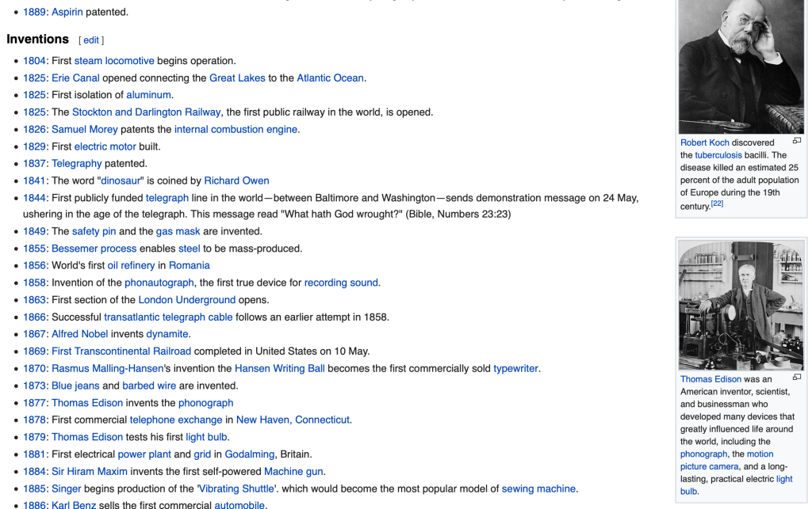
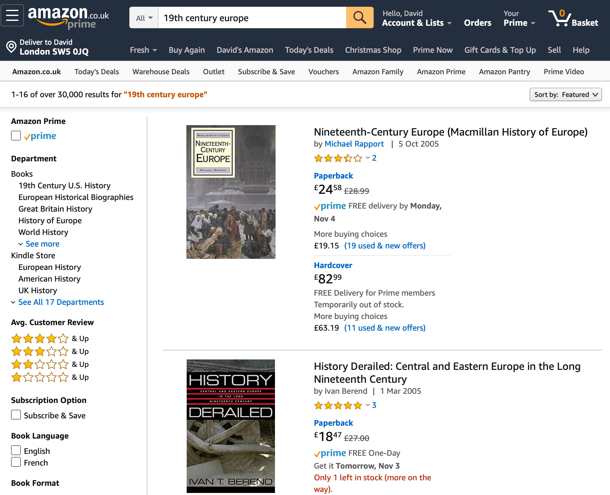

Sometimes you need to quickly learn the core foundations of a new topic.

Perhaps you want to invest in a new company and need to understand the
fundamentals of the market. Maybe you read an interesting report and want to
evaluate its accuracy. Perhaps you want to change career and need to assess
options.

If you have time, taking a full time academic course is a good way to go deep
into a topic, practice and get credentials. However, it is hard to find the time
to do a formal course on a new area. It costs money and full time learning is an
opportunity cost. Can you really give up a job for one or more years to learn?

Reading material is the next best thing, but where to start? Wikipedia is good
if you already know what you’re looking for e.g. you want to check a fact, or
you want a summary of key information. However, it is not useful if you are new
to the topic.

Imagine you wanted to learn about the history of 19th Century Europe. [The
Wikipedia page](https://en.wikipedia.org/wiki/19th_century) gives a summary of
the entire century and lists every major date, war, significant people,
inventions, publications and events. You have to dig into each page to find out
more. Wikipedia is designed to be comprehensive as an encyclopaedia should be.
That’s not particularly useful for beginners though.

What about searching Amazon for books? Amazon.co.uk has 30,000 results starting
with several textbooks. Are they any good? Sorted by relevance, each one has
either no reviews or a maximum of 3. Sort by customer reviews and the first
entry with 62 reviews is [Romantic Outlaws: The Extraordinary Lives of Mary
Wollstonecraft & Mary
Shelley](https://www.amazon.co.uk/Romantic-Outlaws-Extraordinary-Wollstonecraft-Shelley/dp/0812980476).
It may be a great book but how useful is it to inform you about 19th Century
Europe?

YouTube is not much better. The first result is [some random
guy](https://www.youtube.com/watch?v=sWvtr6HYhtU) talking about ’19th century
“Isms” (conservatism, classical liberalism, romanticism, nationalism, socialism,
and feminism)’.

The problem is you don’t know where to look, what to read or what to watch. So
what is the solution?

Academic reading lists.

What do students do before they start on a new course? They follow a short
reading list of material that has been assessed for quality by experts in the
subject – their professors. They are not being asked to get into detail – that
is what taking the course is for – but to get a grounding in the subject.
Background reading is the usual approach.

These lists tend to be published for free on university websites which means
anyone can find high quality reading material for any subject. Just filter by
the reputation of the institution and you have a quick way to find good material
on any topic that has an associated university course.

[19th Century European
history](https://www.imperial.ac.uk/evening-classes/autumn-spring-courses/october-courses-list/europes-19th-century/). [Law](http://www.ox.ac.uk/sites/files/oxford/media_wysiwyg/Introductory_reading_for_Law.pdf). [Environmental
technology](https://www.imperial.ac.uk/environmental-policy/msc/reading-list/).
Or [any undergraduate course offered by
Oxford](http://www.ox.ac.uk/admissions/undergraduate/courses/suggested-reading-and-resources).
All universities list all their subjects online, and many have links to further
resources such as reading lists.

And where there is no university course, the [Very Short Introductions
series](https://global.oup.com/academic/content/series/v/very-short-introductions-vsi/?type=listing&lang=en&cc=gb) offers
both the foundational knowledge and a list of further reading in a single, short
book. You could even [ask a
librarian](https://www.bl.uk/help/reference-enquiry-team).

The internet has made huge volumes of information available to everyone, but
quantity does not mean quality and it is not a good place to start from scratch.
Learning something new requires curated materials and direction from experts.
Only when you know what you’re looking for and how to assess the results does
the internet become valuable.
