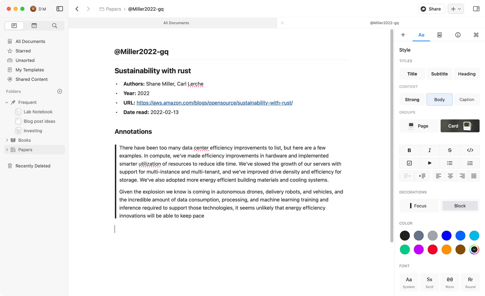
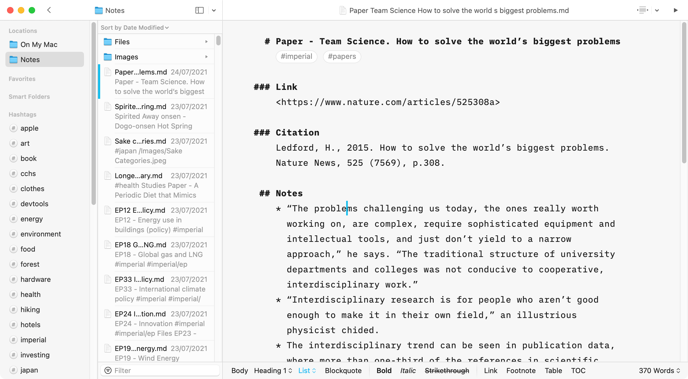
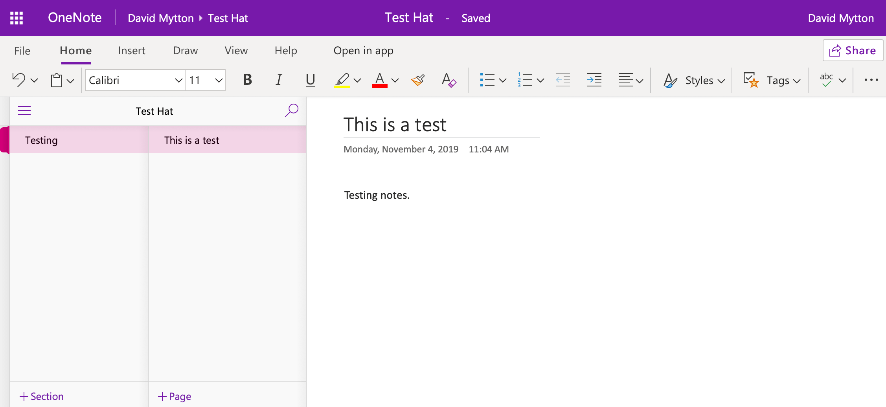
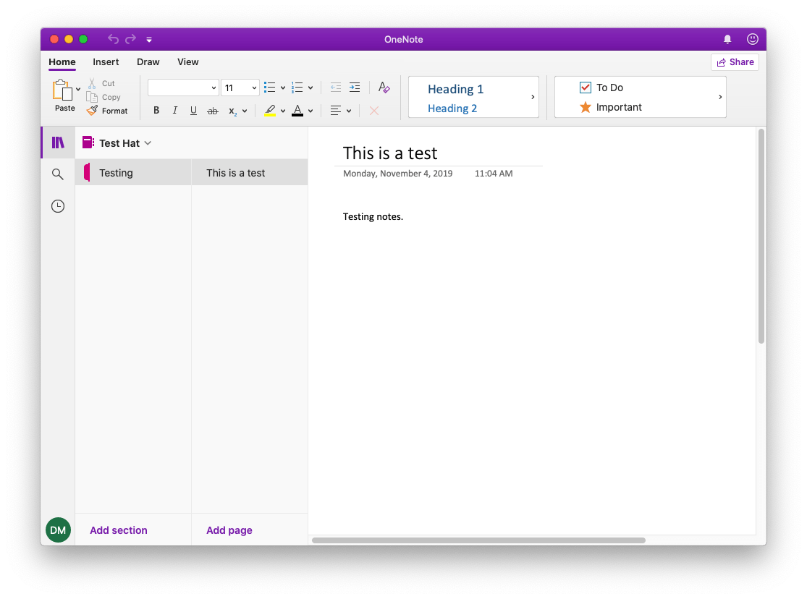

Back in Nov 2019 when I first wrote this blog post, the context for rethinking
my note taking setup was based around growing problems with Apple’s software
quality.

Having enjoyed Apple’s minimalist approach to the new Notes app launched as part
of the 2016 release of iOS 9 and OS X 10.11, and having built up >1k notes
ranging from book highlights to saved web pages to meeting notes to journal
articles, bugs in iOS 13 and macOS 10.15 triggered my search for alternatives.

Apple sorted out a lot of those issues in subsequent releases – sync bugs,
search bugs, crashes – but it was too late. I had already started a search for
an Apple Notes alternative that used Markdown, was cross platform, and allowed
me to control the source files.

This is an updated blog post (Jun 2022) that reviews the last few years of
trying different note taking apps and what I finally ended up switching to.

## tl;dr

The best note taking apps for Mac
are [Craft](https://www.craft.do/), [Obsidian](https://obsidian.md/), [Logseq](https://logseq.com/) and [iA
Writer](https://ia.net/writer). Read on for more details.

## Requirements for a note taking app

### Simplicity + Cross Linking

I want to write my notes in plain text with basic formatting. I’d like to be
able to embed images (files managed by the app), make lists and include headings
to structure the notes. Tables are nice but optional.

This means using [Markdown](https://en.wikipedia.org/wiki/Markdown) formatting
saved to a plain text file. Markdown is a well understood format that has many
apps that can edit and render on any platform. This is the best way to ensure
the files are accessible into the future and can be migrated to different apps
if necessary.

In recent years, the idea of cross-linking, backlinks and wiki-style linking has
become common. This has never been possible in Apple Notes – each note is
independent, and remains so even in the latest release – but products like Roam
Research have made this technique popular. The main benefit is being able to
discover unlinked references to other notes you’d forgotten. The magic is that
it happens automatically when you use the same phrasing or keywords.
Cross-linking between notes is therefore a requirement for me.

### Non-proprietary format

The “new” Apple Notes app moved away from IMAP to iCloud sync. This worked
better (until the bugs started appearing), but is a proprietary database format.
I can’t easily see or edit the individual notes on disk to make backups or
export. They are contained in a SQLite database in `~/Library/Group Containers/group.com.apple.notes` alongside attachments and images organised by
internal note IDs. It’s usually dangerous to meddle with app files like this. In
the latest macOS releases, there are even restrictions on accessing the
directory!

Apple Notes doesn’t have an export option except individual notes as PDFs. The
only way around this is using the [Apple Privacy data
download](https://privacy.apple.com/) service which allows you to export Apple
Notes as HTML with their associated attachments. This is how I was keeping a
backup of all my Apple Notes.

Another advantage of using files on disk is that I can control how they sync.
The app may provide its own sync service, but I want the option to choose
Dropbox, Google Drive, iCloud Drive or some other system. Indeed, for privacy
reasons I have been using [Syncthing connected over a private P2P network using
Tailscale](https://console.dev/articles/private-p2p-encrypted-file-sync-syncthing-tailscale/).
This means most of my files are entirely private and encrypted and can sync very
fast over my local network. There are tradeoffs e.g. no mobile apps or web UI,
but I use OneDrive for those files that I need to share or access elsewhere.
Files on disk can also be backed up independently. I use a combination of Apple
Time Machine and [Arq](https://www.arqbackup.com/).

Having now tried many different note taking apps, being able to test
alternatives is easier if I can drop the existing files in. Markdown handles all
the formatting, so the files themselves must be accessible. This means the app
should just work with plain files on disk.

However, the problem with Markdown is that it is interpreted and rendered
slightly different by each app. The basic formatting is always the same – bold,
headers, lists, etc – but the more advanced functionality, like cross links,
folders, embedded images, all tend to have their own custom implementation. This
makes it a pain to move them between apps because you end up having to refactor
your tags or links.

One solution to this is a container standard
called [TextBundle](https://textbundle.org/). The content is still in Markdown,
but the links and related assets are in their own format. This means you can let
the app implement its own proprietary rendering, storage and sync, but still be
able to get your data out.

> This is where TextBundle comes in. TextBundle brings convenience back – by
> bundling the Markdown text and all referenced images into a single file.
> Supporting applications can just exchange TextBundles without asking for
> additional permissions. Beyond being a simple container, TextBundle includes a
> standard to transfer additional information – to open up new possibilities for
> future integration.

You can then benefit from a better UX and advanced features which would be
difficult to achieve with Markdown alone. Quite a few apps support TextBundle,
including [Craft](https://www.craft.do/) and [Bear](https://bear.app/).

### Regular updates / actively maintained

The problem with Apple software is that their main revenue is generated by
hardware sales and a bundled OS, not any of the apps. This is changing with
Apple TV+ and some iCloud services, but they are primarily there to compliment
the OS. There is no competitive incentive to keep them up to date, add new
features or fix bugs.

The annual update cycle is a legacy from the old days of shipping physical
software. This makes sense for annual iPhone hardware refreshes, but is totally
outdated for shipping software. [Microsoft updates Office every
month](https://docs.microsoft.com/en-us/DeployOffice/overview-of-update-channels-for-office-365-proplus) and [Windows
every 6
months](https://support.microsoft.com/en-us/help/13853/windows-lifecycle-fact-sheet).
How do you report bugs or get support for Apple Notes? You can’t.

My experience with the poor quality of these latest Apple releases has changed
my approach – if I am going to rely on software then I want the developer to be
properly incentivised to maintain it i.e. I need to pay them for it.

For example, this is one reason why I use and pay for 1Password vs using Apple
iCloud Keychain (as well as all the other features 1Password has). It’s also why
I don’t mind the move to subscription business models for software.

### Cross-platform

This is not a requirement, but a “nice to have” if the app I use on macOS also
works on mobile, Linux, the web, etc. I regularly switch between different OSs,
particularly trying out different Linux distros, so I want to be able to work
with my notes on whatever system I’m currently on.

The web is great for this, and is one reason why Electron has become so popular.
The worst Electron apps are slow, buggy, bulky, and have a weird UX that doesn’t
fit the platform. But there are good ones, and they’re getting better. VS Code
is an example of a great Electron app. Microsoft Teams not so much. But it is
possible, and that brings cross-platform support.

## Note taking app reviews

All this means dropping out of the Apple ecosystem, switching my notes to
Markdown and aiming for them to be simple files on disk. I’d like it to be open
source, but if I can manage the files then that matters less. And I want to be
able to pay (or donate).

Ultimately, my goal is to be flexible about the platform I use, selected based
on the best core OS and hardware. I don’t want to be restricted by proprietary
apps and file formats. The Apple Silicon M1 MacBook Air has brought me back to
using macOS as my daily driver OS, but I don’t want to be locked to it.

### The best note taking apps for Mac

Based on reviewing all the apps below, these are the best notes apps for Mac:

1. **[Craft](https://www.craft.do/)**  
   Craft is the best notes app for macOS – it is truly Mac-native and fits into
   the Apple design guidelines perfectly. It is also a very powerful notes tool
   with editing based around blocks of different types – tables, paragraphs,
   lists, images, etc. It supports Markdown includes support for separate
   “external location” notebooks which operates purely on local files for you
   to handle sync yourself. The main downside is it uses its own proprietary
   JSON-based fileformat which goes against my “Markdown only” requirement.
   However, the UX is so good and it has options to export to Markdown,
   TextBundle and others, that I ended up switching from Obsidian.
2. **[Obsidian](https://obsidian.md/)**  
   Hits all my requirements – a simple, Markdown editor that opens files on
   disk, is regularly updated and cross-platform. It is Electron, but has
   become much faster than when I originally tried it back in 2019. The killer
   features are the plugins, [the Kindle Sync
   plugin](https://github.com/hadynz/obsidian-kindle-plugin) in particular.
   This is why it beats Logseq.
3. **[Logseq](https://logseq.com/)**  
   I used Logseq for a long time before switching to Obsidian because of the
   community plugins. It’s a great app that hits all my requirements. The UI is
   more minimalist than Obsidian, but can get messy due to how it parses
   Markdown as blocks in the editor. It’s also open source.
4. [**iA Writer**](https://ia.net/writer)  
   A good native macOS experience with simple, well designed apps for macOS,
   Windows, Android and iOS. However, even though it includes tag parsing,
   quick open/search and working with files on disk, it is mainly designed as a
   tool for writing (in Markdown). It’s amazing for that purpose, and does a
   good job at being a note-taking app, but it’s a bit of a hack. [A recent
   update](https://ia.net/topics/ia-writer-6-now-with-lasers) adds wiki-style
   backlinks and they say they’re going down the route of being a knowledge
   manager. It’ll be interesting to see how it develops.

### Craft

I had been using Obsidian as my primary note-taking app for over 6 months before
I discovered [Craft](https://www.craft.do/). It quickly imported my Markdown
files and as I got into testing it, the high quality UX became apparent. Coming
from the Electron-based Obsidian, the native macOS UI was much more responsive
and completely aligned with the system design. Colours, fonts, shortcuts, tabs
are all consistent with other apps on Mac and the editor works really well.
Content blocks mean you can create structure and add decorations to make things
stand out.

Little touches make the difference – like how search highlights results within
the preview window, or the ability to look into a linked note by hovering, or
sub-notes within notes that you can link from within the text. More examples
include embedded dates link together consistently, daily notes show up on the
in-app calendar, you can auto-create notes from your linked calendar events,
create deeplinks into a note.

All of this comes together for a really great experience on the Mac. They also
have an iOS version which has lots of similar touches optimised for mobile. Plus
a web version! Feature parity is not quite there with the desktop or mobile
apps, but you can access and edit all your notes from any web browser with
basically no real loss of functionality. This includes sharing notes with others
(anyone can view, but they require a free Craft account to edit and
collaborate).

The main downside is that Craft uses its own JSON-based document format. You can
see this when you use an “external space” where the files exist on disk and you
can sync them yourself rather than using Craft’s service (this disables sharing
and the web UI). It almost stopped me from switching, but the ability to easily
export everything to Markdown, TextBundle, PDF or Word reassured me I could get
my data out if needed.

That, and the lack of plugins. This is where Obsidian shines and I am going to
miss the ability to pull in my Kindle highlights automatically
from [Readwise](https://readwise.io/).

### Obsidian

I originally looked at [Obsidian](https://obsidian.md/) back in 2019, but it was
very slow due to being built in Electron. I also didn’t like the way it
implemented tagging. It supported everything I wanted – Markdown editing of
files on disk with backlinks and powerful search, but the performance was the
blocker.

This has now changed. Obsidian have resolved all the performance concerns I had,
and significantly polished the UI to make it much closer to the minimalism of iA
Writer and Logseq. It supports modern features like wiki-style backlinks and
discovery of notes, powerful search and a command palette + quick search.

Obsidian is cross platform and includes an optional paid sync service, which is
useful if you want to use their mobile app. I rarely take notes on mobile so I
don’t need it, instead syncing everything using [Syncthing connected to a
private network using
Tailscale](https://console.dev/articles/private-p2p-encrypted-file-sync-syncthing-tailscale/).

But the killer functionality comes from the community plugins, and [the Kindle
Sync plugin](https://github.com/hadynz/obsidian-kindle-plugin) in particular. [I
read a lot of books](https://davidmytton.blog/reading/) and make highlights /
notes on my Kindle. Until Obsidian, I had a manual workflow of extracting them
using [the Bookcision bookmark](https://readwise.io/bookcision) then pasting
them into a Markdown note. Keeping a copy in my notes allowed me to search and
discover them through backlinks. Now they’re synced automatically and kept up to
date.

I also particularly like Obsidian’s split view – reminds me of tiling window
managers on Linux! – and I use several plugins: [Kindle
Highlights](https://github.com/hadynz/obsidian-kindle-plugin), [Markdown
prettifier](https://github.com/cristianvasquez/obsidian-prettify), [Image
editor](https://github.com/ozntel/oz-image-in-editor-obsidian), [Paste
URL](https://github.com/denolehov/obsidian-url-into-selection) and [System Dark
Mode](https://github.com/kepano/obsidian-system-dark-mode). It even has
vim-mode, which makes manipulating text much faster.

Obsidian is not open source. It’s not a requirement because I have full control
over my data, but I have a philosophical preference for using open source
products that are part of my core workflow. There’s no requirement to pay, or
even sign up for any type of account. But I understand that this is a business,
and I’m happy they offer paid options.

 and notes from an academic paper (right).")

### Logseq

[Logseq](https://logseq.com/) was my first experience of the power of linked and
unlinked references, also known as backlinks. I had been drawn into the concept
by [Roam Research](https://roamresearch.com/), but wanted a note-taking app that
allowed me to control my data as files on disk.

Logseq is an open source alternative to Roam Research. It’s built on web tech as
a local app in Electron. It has more of a minimalist interface than Obsidian,
but the block editor and UX design for linked references can make it feel messy.
It’s also open source.

I like how it is focused on the daily journal style of note-taking (you can also
create independent pages), which links into how it does todo-list management.
You can add a note, set it as a TODO, then mention a date in the future, and
it’ll surface an appropriate in-UI reminder as you get closer to the date. This
works really nicely.

I also like the native Zotero integration. This connects to the Zotero API to
provide in-app search of your reference library, which it can then import as a
new note. It attaches the PDF to the note and has a [built-in reader which can
export highlights directly into the
note](https://logseq.github.io/#/page/pdf%20highlights). [Zotero 6 has a similar
feature](https://www.zotero.org/blog/zotero-6/), but importing into the notes
app is really useful. No other app integrates as well.

I really like Logseq and if you don’t need Kindle Highlight Sync (or other
plugins) – Obsidian’s killer feature – then it is difficult to pick between
them.

### iA Writer

Although not originally designed for note taking, back in 2018 [iA
Writer](https://ia.net/writer) added [support for
`#hashtags`](https://ia.net/writer/blog/write-to-organize) which makes it much
more suitable as a notes app. The subsequent addition of wiki-style backlinks
in [the release of iA Writer 6](https://www.zotero.org/blog/zotero-6/) suggests
they’re thinking more about how it can be used as a note taking or knowledge
management app.

Like Craft, I really like the UI on macOS because it fits in perfectly with the
system design guidelines. It is very lightweight, simple to use and fits all my
criteria for editing files on disk with Markdown. It is minimalist with few
settings, forcing you to focus on the task at hand. There are apps for macOS,
Windows, iOS and Android.

iA Writer does not support attachments and the embedded image support is
limited, which forces you to store those files on disk. Naming becomes important
for binary files like images so they can be properly searched.

Notes are stored on disk so you can use any sync service you like, but there is
official support for services like iCloud Drive and OneDrive. They are plain
text Markdown so I can edit them in any app.

I would like to see the ability to nest tags and helpers for Markdown formatting
e.g. improved image support. This is where iA Writer reveals itself as a tool
for writing, not for note-taking, compared to Craft which has significantly more
advanced features. It’s still a hack to use it for notes. This is fine if you’re
coming from Apple Notes which also has no concept of backlinks, but once you
have tried tools like Obsidian and Logseq it’s difficult to go back.

## Other note taking apps I tried

### VS Code + Markdown extensions

VS Code [supports markdown out of the
box](https://code.visualstudio.com/Docs/languages/markdown), including live
preview, however it is a code editor and not designed for note-taking. There are
two approaches you can take to adapt it to be better for the task.

The first is to use [Dendron](https://www.dendron.so/), an extension
specifically designed to add notes functionality. It supports graph views, daily
journals, backlinks, tags and enhanced Markdown editing. If you want everything
out of the box, this is the extension to go with.

Alternatively, you can install several independent plugins:

- [Markdown All in
  One](https://marketplace.visualstudio.com/items?itemName=yzhang.markdown-all-in-one)
- [markdownlint](https://marketplace.visualstudio.com/items?itemName=DavidAnson.vscode-markdownlint)
- [Nested
  Tags](https://marketplace.visualstudio.com/items?itemName=vscode-nested-tags.vscode-nested-tags)

The final plugin is crucial because it allows organising notes by tag. Of
course, VS Code’s command bar is excellent at search so I could just navigate
files by name (or text search), but it is sometimes useful to be able to see and
view all associated notes in a list.

Unfortunately, the tag format supported by iA Writer – #hashtags – is not part
of the Markdown format. Instead you will need to use the Markdown metadata
format by including tags in a YAML block at the start of each file. The
advantage of using this format is that it is [generally supported by other
Markdown parsers](https://fletcher.github.io/MultiMarkdown-5/metadata.html), so
if I wanted to switch to something new in the future there is a greater chance
of it being supported with no changes.

VS Code does use Electron behind the scenes. However, unlike many Electron apps,
VS Code ties into the native UX of the OS it is running on and has acceptable
performance. This is a rare example of a well-built Electron app, most of which
are slow and buggy.

Ultimately I decided I wanted a separate app that was designed specifically for
the use case, and kept my code editor just for coding. But this could be a good
option if you like living in VS Code!

### Evernote

Years ago this was the first notes app I ever used, however it was notoriously
buggy and I gave up. [The company has been through some challenging
times](https://www.nytimes.com/2019/06/28/business/evernote-what-happened.html).
It still uses a proprietary note format and database which rules it out. I
didn’t bother to try it because of the history of poor quality software.

### OneNote

Included with my Office365 subscription, OneNote has been improving rapidly and
now has a much simpler UI and fast sync. One of the great features is [character
recognition in
images](https://support.office.com/en-us/article/Copy-text-from-pictures-and-file-printouts-using-OCR-in-OneNote-93a70a2f-ebcd-42dc-9f0b-19b09fd775b4),
allowing them to be searched as if they were in plain text.

Notes can only be in a single section or Notebook (like Apple Notes) whereas I
feel that tags are more flexible approach to organising things. OneNote supports
tags but they are hard coded to specific types, which suggests there’s still a
lot of legacy cruft still behind the scenes.

OneNote on the web looks good with the new simplified UI and the Mac app also
works nicely, particularly with dark mode. However, compared to all the other
notes apps it is always slow to launch. I find this lag exists with all
Microsoft apps on Mac – they are very heavyweight.

Using it with Office365 creates the Notebook file in your OneDrive but this is
just a URL file that opens the web UI when you load it. There’s no actual
content in the file which means that OneNote is using a proprietary database
behind the scenes.

Although OneNote is a regularly updated application that works cross-platform
(and has a decent app for iOS as well), the lack of open file format means I
can’t back up the files and extract my data whenever I want. Like Apple Notes,
there is no export functionality. I don’t want to move from Apple’s proprietary
format to Microsoft’s, so this rules it out.

## Worth a mention

- [**Bear**](https://bear.app/) was originally my #1 note taking app before I
  realised the importance of editing the data files on disk. Bear has a great
  native experience on macOS and includes apps for all the important Apple
  platforms. It has a great editor that works in Markdown but is also a live
  preview, so you can use the markup if you want but let it get out the way. My
  main issue is that it uses a proprietary database for storing everything, even
  if you can export to a range of formats, and exporting everything is more of a
  pain than Craft. It also supports the TextBundle format. But if you don’t care
  about that, Bear is a great product.
- [**Typora**](https://typora.io/) was promising because it is a good Markdown
  editor with cross-platform apps that manages files on disk. I particularly
  liked how it managed attachments for notes, creating a .assets folder with the
  same name as the parent note. However, it doesn’t have very advanced file
  management features for the library/list of notes and there’s no support for
  tags or backlinks. It looks good just for Markdown, but then I might as well
  use iA Writer.
- [**Inkdrop**](https://inkdrop.app/) is an app I’ve heard about because of [the
  blogging](https://blog.inkdrop.info/grit-46c57af01d6d) of its main
  (Japan-based) developer. It fits most of my requirements and the UI looks
  great, but uses a proprietary format rather than files on disk. The format is
  JSON and you can [set up your own CouchDB server to run the sync
  services](https://docs.inkdrop.app/manual/synchronizing-in-the-cloud#how-to-set-up-your-own-sync-server),
  but that isn’t something I’m interested in doing.
- [**nvALT**](https://brettterpstra.com/projects/nvalt/) hits all of my
  requirements except tag support, but is quite an old app (and looks it). The
  UI is why I excluded it, but I am keeping an eye
  on [nvUltra](https://nvultra.com/) which is the replacement in beta.
  Unfortunately, it’s been in beta for years, so I’m not sure where development
  is going.
- [**Scrivener**](https://www.literatureandlatte.com/scrivener/overview) might
  be great for complex writing projects but it is far too sophisticated for a
  notes app.
- [**Simplenote**](https://simplenote.com/) is worth a look because they have
  well maintained apps and Markdown editing available for free. I excluded it
  because of the proprietary database format but generally like
  what [Automattic](https://automattic.com/) do, however the apps don’t seem to
  be actively developed as they have not received any major updates for a long
  time.
- [**Standard Notes**](https://standardnotes.org/) looks interesting because it
  pledges [privacy](https://standardnotes.org/privacy) and [longevity](https://standardnotes.org/longevity) with
  how it manages your notes files. It has options to store attachments in
  Dropbox, OneDrive or Google Drive as well as automated backups there, but
  ultimately stores notes in a proprietary format ([even if that format is
  open](https://standardfile.org/) and [you can run your own server because the
  code is open source](https://docs.standardnotes.org/self-hosting.html)). [The
  desktop apps are Electron](https://github.com/standardnotes/desktop) and I
  found them to be very slow and inconsistently designed. A potential option for
  power users but not what I’m looking for.
