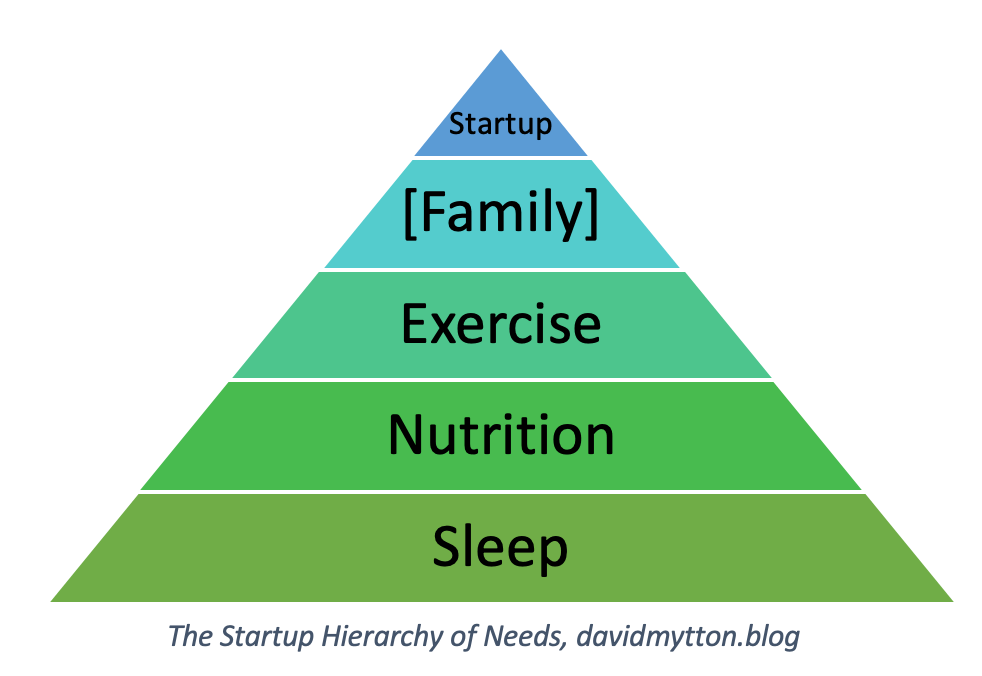

Last week I was on a panel discussion at an
internal [Seedcamp](https://www.seedcamp.com/) “people summit” event to help
their portfolio companies think about their teams. My panel was titled “Employee
Wellbeing and Sustainable Leadership” and I was asked to talk about some of the
experiences I had creating and running
the [HumanOps](https://davidmytton.blog/a-practical-guide-to-humanops-what-it-is-and-how-to-get-started/) community,
a series of events I helped start about [managing the people side of technical
operations](https://www.youtube.com/watch?v=jKwfgtGyrpk).

Within the startup community, there exists a dangerous culture of overwork. This
has been dubbed “hustle porn” and includes minimising sleep, working
excessively, constant travel at unsociable hours, always being available
([usually on chat](https://m.signalvnoise.com/is-group-chat-making-you-sweat/))
and no holidays.

I’m not sure exactly where this non-stop culture has come from because it is the
opposite of what successful CEOs like [Jeff
Bezos](https://medium.com/thrive-global/jeff-bezos-sleep-amazon-19c617c59daa) and [Ariana
Huffington](https://thriveglobal.com/stories/open-letter-elon-musk/) have talked
about, but things are starting to change.

")

The final question on the panel discussion was to give one piece of advice to
help startup founders run their companies more effectively.

No doubt you have heard of [Maslow’s hierarchy of
needs](https://en.wikipedia.org/wiki/Maslow's_hierarchy_of_needs). My answer was
an adaptation of the psychological element of Maslow’s hierarchy to suggest four
core needs that must be satisfied before the startup itself. I certainly didn’t
follow them all myself to begin with – it’s easy to get caught up with the
pressure to deliver, and [survivorship bias is a real
problem](https://xkcd.com/1827/) – but these are crucial to developing a
sustainable work ethic.

## Startup founder hierarchy of needs

These are the core needs that every founder must satisfy, in this priority
order, before they can be effective at their startup.

1. **Sleep** – without good quality, uninterrupted sleep, everything else
   suffers. Bad sleep is linked to poor mental and physical performance.
   Everything else is based on this core foundation. Recommended reading: [Why
   We Sleep](https://www.gatesnotes.com/Books/Why-We-Sleep).
2. **Nutrition** – finding the perfect, evidence based diet remains difficult.
   However, the basic principles are easy – [reduce
   meat](https://www.goodreads.com/book/show/17298300-should-we-eat-meat), eat
   a variety of vegetables and avoid processed foods and sugars, especially in
   liquid form. It is not difficult to buy good quality ingredients to cook at
   home, but travelling does make it more of a challenge. Hotels have
   surprisingly few healthy options and you can quickly get bored with salmon
   every night! Recommended reading: [The Diet
   Myth](https://www.goodreads.com/book/show/25525225-the-diet-myth).
3. **Exercise** – cardio and core strength training make up the third and final
   key physical need. [Sitting is hugely damaging to
   health](https://www.nhs.uk/live-well/exercise/why-sitting-too-much-is-bad-for-us/) and [regular
   exercise a key
   recommendation](https://www.gov.uk/government/publications/physical-activity-guidelines-uk-chief-medical-officers-report) from
   every health advisor. Walking meetings are a good idea which also reduce
   unnecessary participants. When travelling I tried to always pick hotels with
   a pool so I could swim daily, or at least get on a bike in the hotel gym.
4. **Family** (floating) – ideally the best way to look after your family is to
   look after yourself first, but sometimes you have to shift these priorities
   depending on age and need, which is why this is labelled as “floating”!
   Nobody is indispensable and if things break when you have to unexpectedly
   step away from work to deal with an emergency, you have failed as an
   executive. [Hire senior
   people](https://davidmytton.blog/3-lessons-from-9-years-of-startups/) who
   know their brief and delegate key tasks – nothing day-to-day should rely on
   you as the founder. One of the great things of owning your own business is
   flexibility, so if you cannot use that advantage to help family in need,
   what is the point?
5. **The startup** – only once you have satisfied the above four needs can you
   work effectively on your startup.

There are many other things that could be included in the list above. Friends
and social interaction are important, as is [having a calm work
environment](https://m.signalvnoise.com/fuck-hard-work/) and [regular breaks and
holidays](https://davidmytton.blog/3-lessons-from-9-years-of-startups/).

Exceptions are also allowed. Aiming for 100% compliance is unrealistic. There
will be the occasional early flight or late evening conference call. But these
should be rare and saved only for true emergencies or during those few critical
times in the life of a startup such as an M&A transaction.

However, these are the foundations everything is built on. If you focus on these
four needs then not only will you increase your chances of success, you will
enjoy the journey as well.
