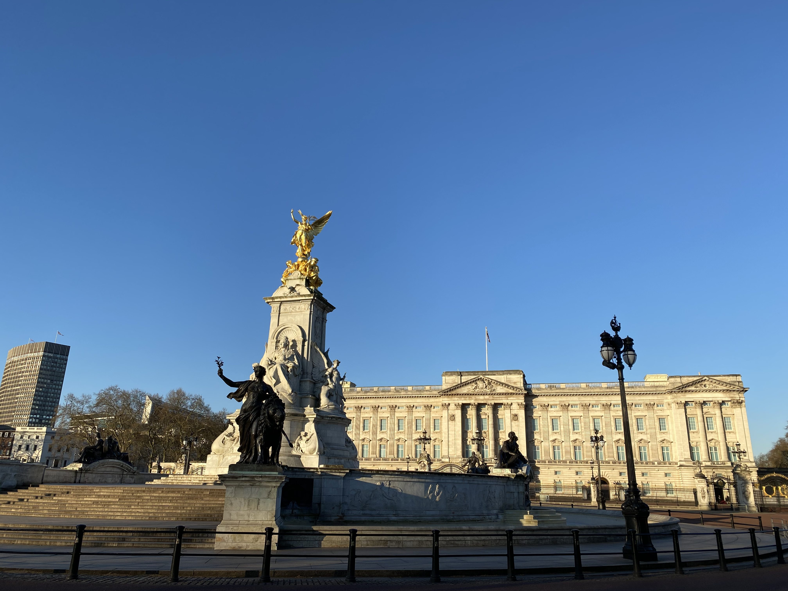
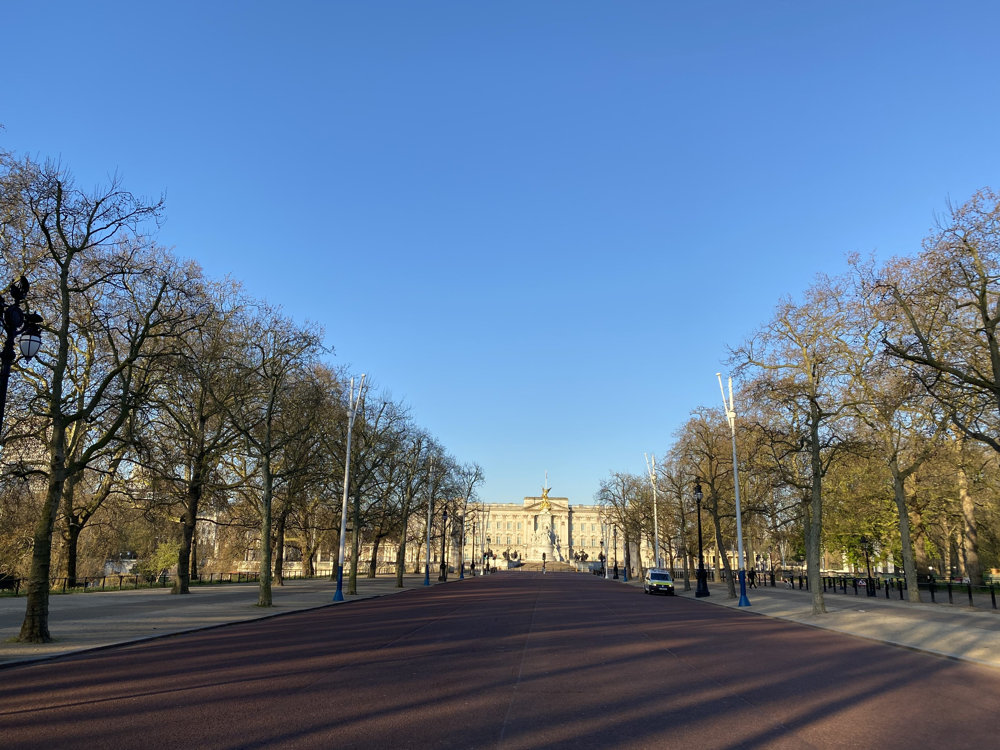
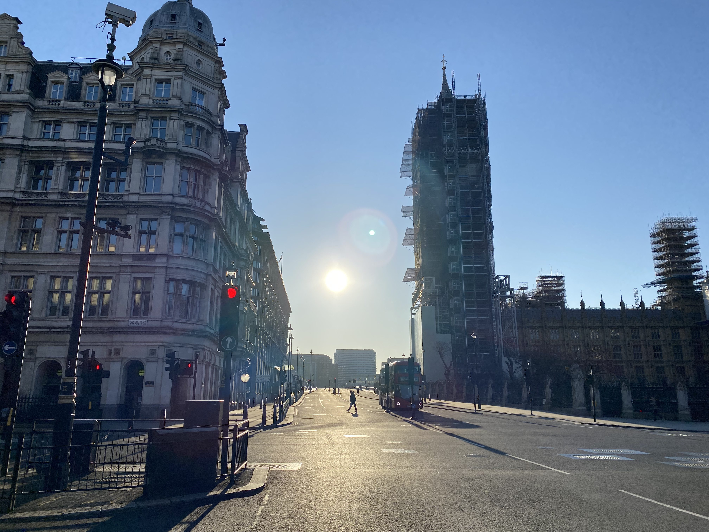
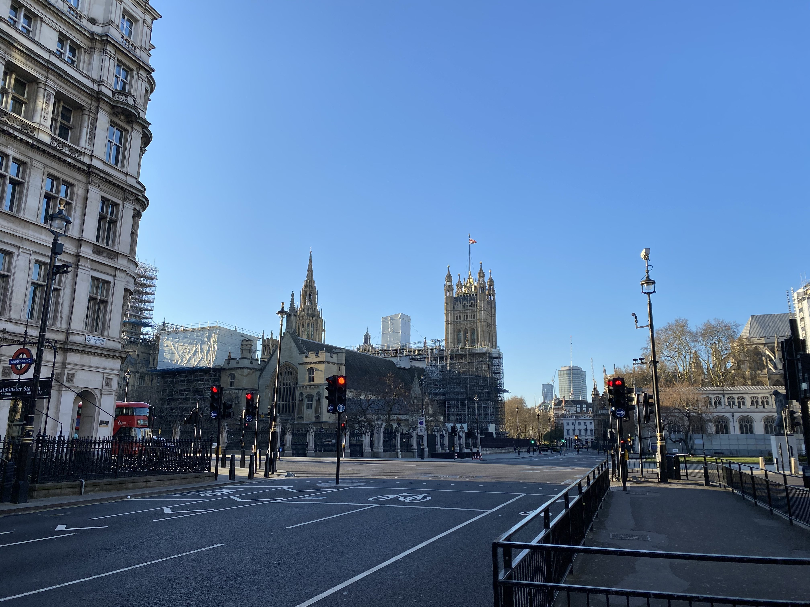
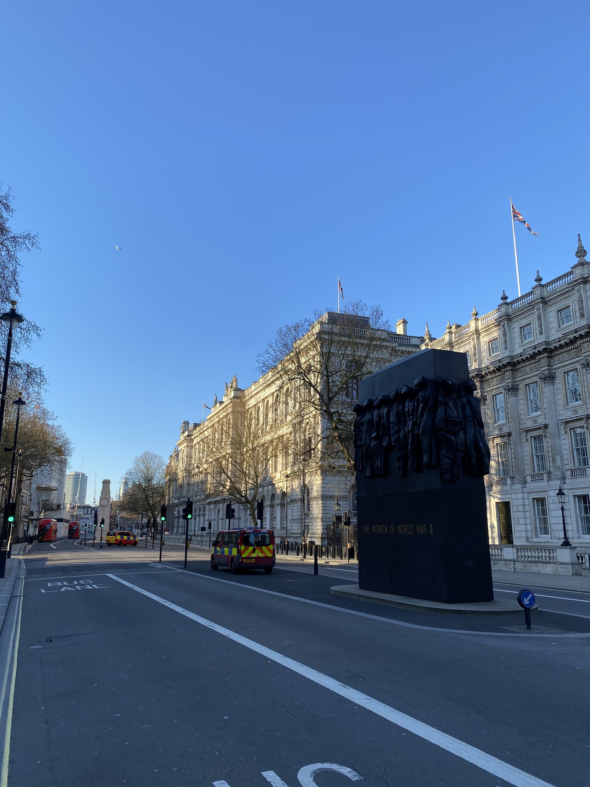
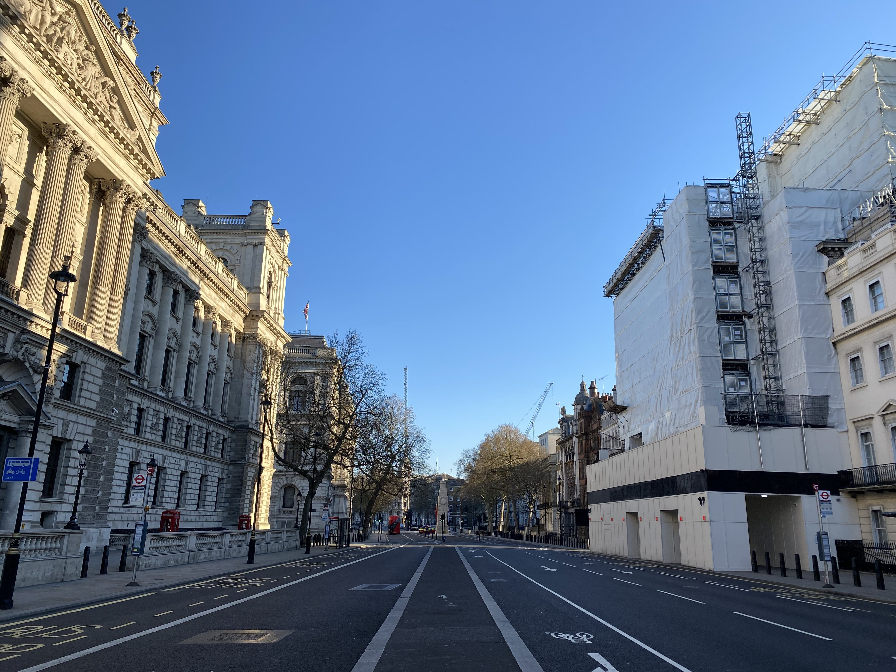
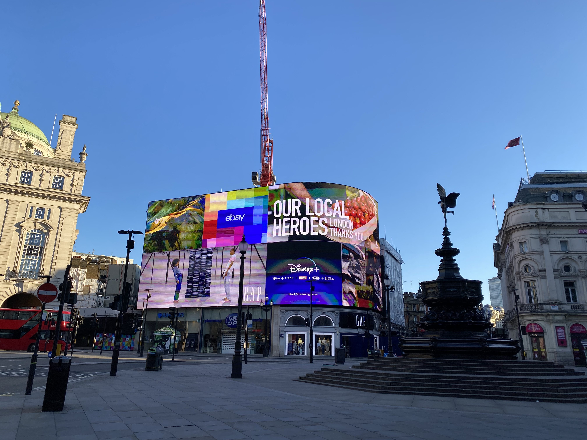
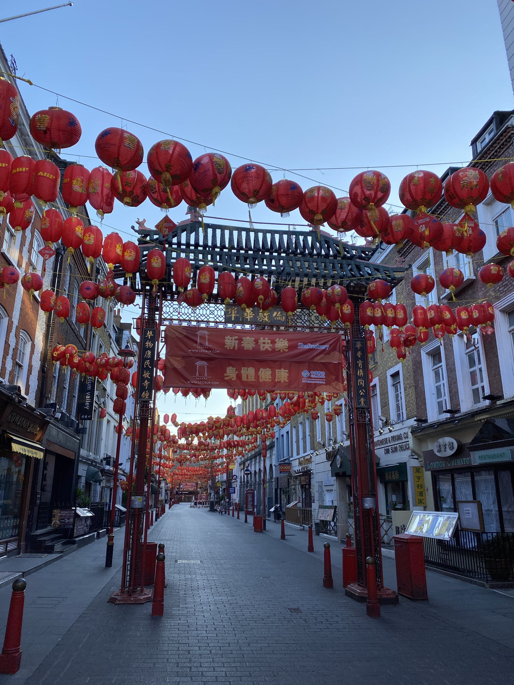
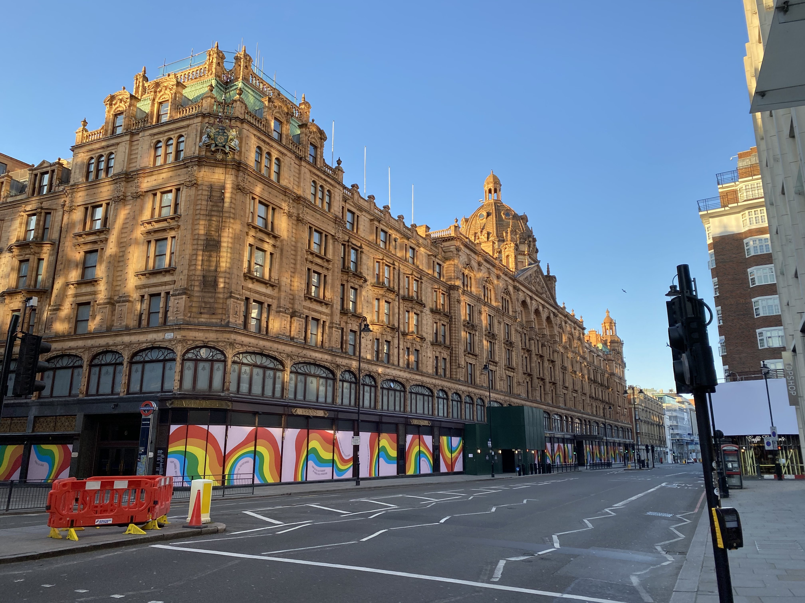
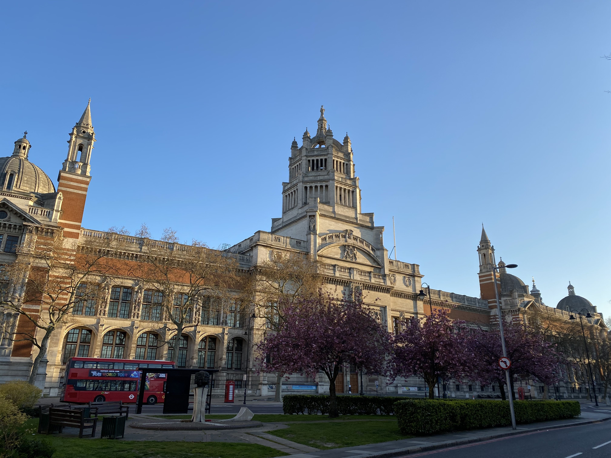

Even early on a Sunday morning, there are usually people and cars out in central
London. Given the COVID-19 lockdown, I thought this would be a unique
opportunity to see London without any traffic. I decided to vary my usual Hyde
Park cycle and ride around some of the main London landmarks. Excepting a few
buses, police cars and the occasional cyclist, it really was deserted.

Here’s what Lockdown London looked like 7am-8am on Sunday 5 April 2020.

