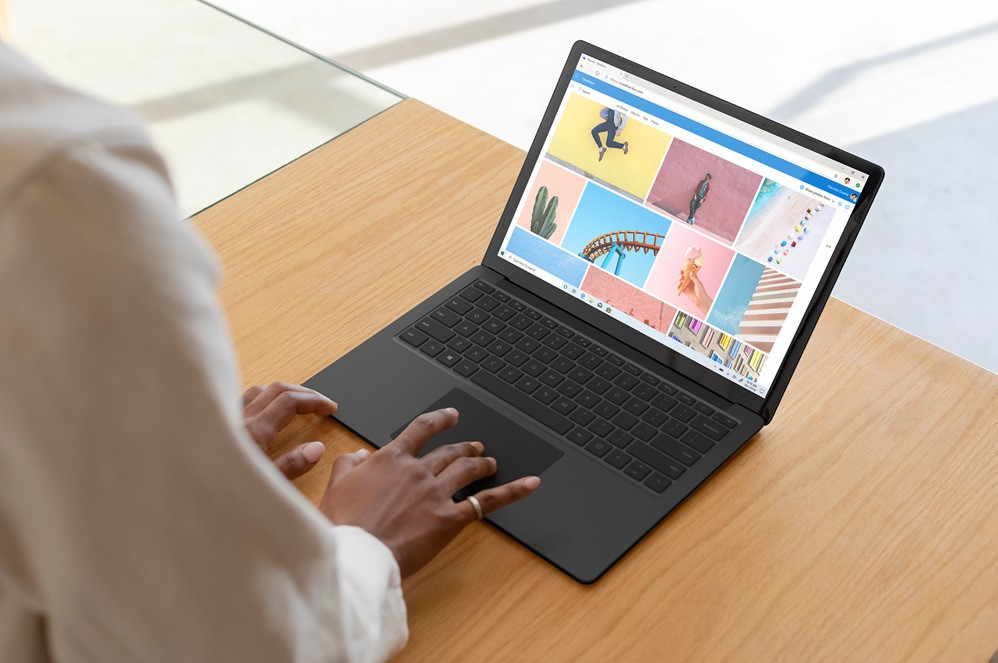
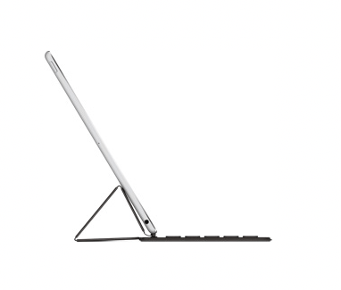
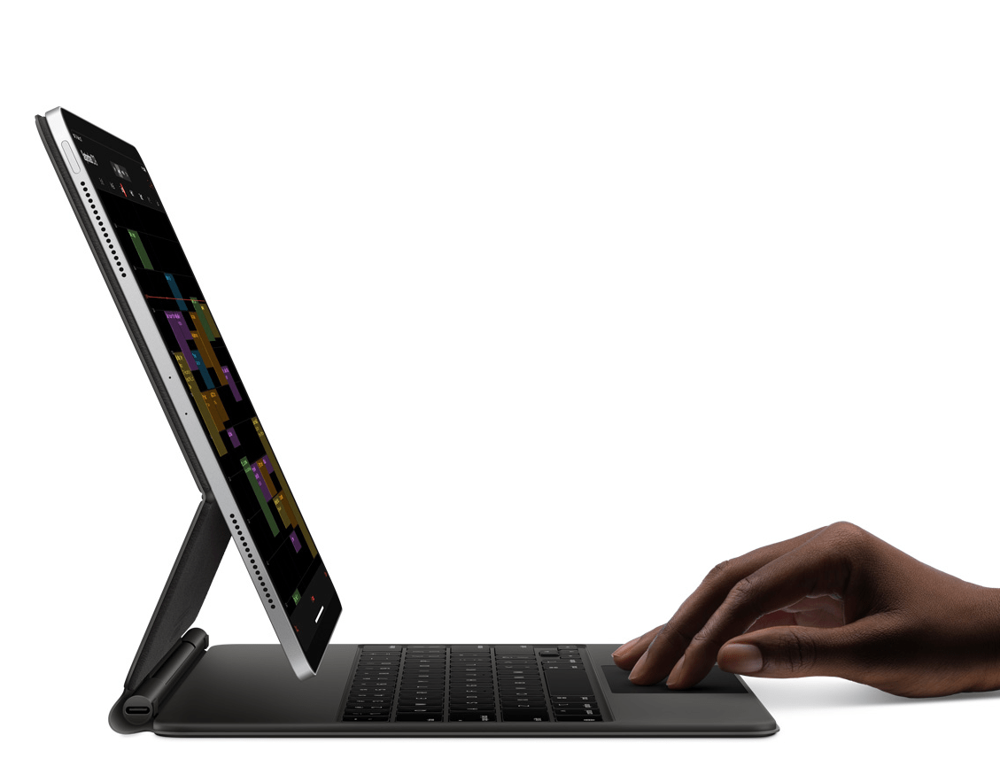

I purchased my first iPhone in 2008. This coincided with the release of the
awful Windows Vista the previous year – bugs, performance problems and
inconsistent interface elements. The superior iPhone UX convinced me I wanted
the same experience on my computer so I went over to OS X.

One of Apple’s biggest competitive advantages is how they can design the
software for the hardware, and the other way around. A fully integrated stack
means features like Apple Pay can work seamlessly across Apple Watch, macOS and
iPhone.

Microsoft has reinvented itself as a cloud platform company, [of which Windows
is just one component](https://stratechery.com/2018/the-end-of-windows/).
Despite this change in focus, they are investing in high quality hardware
products that can compete with Apple.

[macOS is becoming horribly
buggy](https://mjtsai.com/blog/2020/05/22/macos-10-15-slow-by-design/) with each
new release and although Apple has finally fixed [the Macbook butterfly keyboard
problems](https://mjtsai.com/blog/2019/11/01/tylenol-moment-for-apples-laptop-keyboards/) I
have reconsidered Apple products several times recently. This started
with [migrating my notes from Apple Notes to plain text Markdown
format](https://davidmytton.blog/the-best-note-taking-apps-for-mac-markdown-open-format-cross-platform/) but
11 years after leaving Vista, I have been reconsidering Windows.

## Surface devices

I have been intrigued by the Microsoft Surface lineup for some time, primarily
because they are making really nicely designed computers.

The Surface product range includes several devices with different form-factors,
but the two key products are the Surface Laptop and the Surface Pro.

### Surface Laptop

The Surface Laptop is just as its name describes. The keyboard is above a large
trackpad embedded in the body which is attached to a touchscreen. It’s a laptop
designed by Microsoft to run Windows.

I tried the Surface Laptop 3 when I had to send in my Macbook Air (2018) for
keyboard repair for the second time. Available in either metal – with a matte
black or sandstone finish – or fabric, with a metal or silver finish – the black
option was easily my favourite. I wish Apple offered the matte black option like
they used to for the old Macbooks! It easily shows up fingerprints but that is a
problem with matte surfaces in general, and is worth it for the cool black look.

The fabric option is nice to touch, but I wonder how easy it is to clean with
inevitable splashes. I’ve seen people with older Surface Laptops that have worn
through the fabric over time, which doesn’t look great.

Until you use a laptop with a touchscreen, you don’t realise how useful that
input method really is. Scrolling documents is far more natural and swiping away
notifications is much faster. Of course, keyboard shortcuts are still the best
way to navigate.

One thing that annoyed me was the function options on the keyboard do not
include a “skip track” button. I could pause the currently playing track, but
not skip. Weird not to include that. I also found that the contrast buttons
caused the screen brightness to change very suddenly whereas on a Macbook the
brightness fades to the next level. These seem like small things, but show a
level of attention to detail which Microsoft is missing.

### Surface Pro X

I also tried the Surface Pro X. This is a tablet in the Surface Pro group of
tablet form computers. It’s one of the best looking computers I’ve seen in a
long time – thin, all-black, with rounded edges. It has an optional attachable
keyboard with a fabric coating, and you can also choose to buy the Surface Slim
Pen.

This is in contrast to the Surface Pro 7, which is more bulky and square. It
simply doesn’t look as good. Microsoft really got the design right with the Pro
X.

macOS is a full operating system and although I have tried switching to the iPad
as my primary computer every few years since it was first released, the
limitations of iOS (now iPadOS) are too great. There are many people in the
Apple community who have switched, but it seems like they have to go through so
many contortions with so many hacks to get their workflows right that it isn’t
worth the effort. This isn’t a problem on a Surface Pro because it runs a full
Windows OS. When you detach the keyboard, the OS switches into a tablet UI mode
where the touch areas are larger, but it is still full Windows.

What really shines on the Surface Pro X is the Slim Pen. It is flat and easy to
hold, with magnets that allow it to slip into the charger slot if you purchase
the Signature Keyboard. This is a much more robust storage solution compared to
the iPad Pro, where the Apple Pencil has to clip onto the side and can easily be
knocked off.

When you remove the pen from the slot, Windows will ask what you want to do. You
can choose to trigger apps such as OneNote or Whiteboard which can also be
activated by clicking the eraser on the end of the Slim Pen. Writing on the
screen works in any of these apps due to the native Windows Ink support across
the OS. This can be used to input handwriting-to-text and I found it to be 100%
accurate. Windows Ink is well ahead of Apple’s handwriting recognition
functionality.

The Surface Pro group all use Intel x86 processors except for the Surface Pro X,
which uses a custom Microsoft-designed 3Ghz ARM chip. This means
tablet-optimised performance, long battery life and an on-board 4G eSIM. The
problem is that it requires applications to be compiled for ARM, otherwise they
run in 32-bit emulation. Apps only available in 64-bit are not supported.

That said, I had very few compatibility problems. All of the Microsoft programs
work fine, and most of them have ARM binaries. VS Code was one of the few that
didn’t, [but that is about to
change](https://github.com/microsoft/vscode/pull/85326). Unfortunately,
whilst [the notes app I used on
Mac](https://davidmytton.blog/the-best-note-taking-apps-for-mac-markdown-open-format-cross-platform/) – [iA
Writer](https://ia.net/writer) – does have a Windows release, it is not
available as a 32-bit or ARM build, so it refuses to install. It was the only
application that I couldn’t use from my normal workflow.

### The Surface Pro kickstand

We take the laptop display hinge for granted. Lift the lid on any Macbook and
the only thing that moves is the display on its hinge. The laptop body doesn’t
move. The body is much heavier than the thin screen, so it acts as a neat
counter-weight to prop up the display.

On a tablet, the display is the body. It is designed to be held in the hand. If
you attach a keyboard, you need some kind of prop to keep the display upright.

Apple has tried to solve this with their Smart Keyboard which uses a small,
triangular stand. It isn’t very adjustable and can be quite unstable.

The Apple Magic Keyboard is a bit better. It uses a floating cantilever to hold
onto the iPad using magnets.

The Surface Pro takes a very different approach. Instead, it has a kickstand
that folds into the main body of the tablet. When you want to work on a desk,
you pull out the kickstand and adjust it so the device is angled how you like.
The kickstand angle goes a long way so you can have it lying down almost flat,
great for writing with the pen.

The problem with the kickstand is that it significantly increases the total
area. A laptop takes up only enough desk-space to contain the body. Although
there is some “air space” consumed by the display overhang, other items can be
on the desk behind it. When you have a Surface Pro fully deployed with an
attached keyboard, it takes up a significant amount of space.

## How big is the Macbook Air vs Surface Pro X?

If we measure the Macbook Air alongside the Surface Pro X, the official
measurements include the body only:

|        | Macbook Air (2018) | Surface Pro X (2019) |
| ------ | ------------------ | -------------------- |
| Width  | 30.05cm            | 28.7cm               |
| Length | 20.13cm            | 20.8cm               |
| Area   | 604cm2             | 599cm2               |

However, if we include the Surface Pro X Signature Keyboard with the kickstand
deployed to a reasonable viewing angle, the dimensions change significantly.

|        | Surface Pro X reasonable viewing angle | Surface Pro X maximum angle |
| ------ | -------------------------------------- | --------------------------- |
| Width  | 29.0cm                                 | 29.0cm                      |
| Length | 30.9cm                                 | 39.1cm                      |
| Area   | 896cm2                                 | 1,133cm2                    |

## How much does the Surface Pro Keyboard weigh?

Aside from increasing the area, the keyboard also adds weight but is still
lighter than the Macbook Air.

| Macbook Air | Surface Pro X | Surface Pro X + Keyboard | Surface Pro X + Signature Keyboard with Slim Pen |
| ----------- | ------------- | ------------------------ | ------------------------------------------------ |
| 1.25kg      | 774g          | 1.109kg                  | 1.054kg                                          |

## Design tradeoffs

The result is that the official specs show the Surface Pro X being lighter and
smaller than the Macbook Air. However, they are not equivalent devices. When you
add the keyboard and deploy the kickstand to work on a desk, the Surface Pro is
almost as heavy and uses double the area. The lighter device also has
application limitations through it use of an ARM chip.

Design means making tradeoffs. You either like the kickstand or you don’t. The
iPad sacrifices stability and flexibility for a reduced area. The Surface Pro
offers better viewing angles and a more stable display but you need a larger
desk.

Microsoft is trying to give you the best of a full featured OS in a device that
is light, thin and mobile. Apple also uses ARM chips in the iPad but has
developed an entirely different, mobile-only platform. Apps either exist, or
they don’t. That is starting to blur with Mobile Safari now able to support
desktop class websites as of iOS13, [but iPadOS is still prohibitively
restrictive.](https://craigmod.com/essays/ipad_pro/)

## Conclusions

I ultimately decided to stay with my Mac, despite the buggy OS, because of the
software. macOS feels minimalist. The core apps are lightweight in design, such
as macOS Mail which I use as my primary mail client. I’ve never been a fan of
how heavy Outlook is, and the design of Windows Mail is very cluttered. It also
forces me to use HTML for my emails where I prefer plain text.

Windows has decades of UI layers which is advantage if you want to run old
software that use old APIs. However, that means there are occasions where the UI
drops you into something legacy from the Windows XP days. Apple forces you into
the newest APIs which allows the UI to have a more consistent experience, even
if some things break compatibility.

Windows 10 has come a long way since Vista. Security is now built in – all your
really need is Windows Defender – and there are little touches that need extra
apps on macOS, like clipboard history and [a built in
mini-calendar](https://www.howtogeek.com/450185/how-to-use-your-calendar-from-windows-10s-taskbar/).
I also like the ability to customise the taskbar and UI colours.
Further, [WSL](https://docs.microsoft.com/en-us/windows/wsl/compare-versions) means
that the development experience is almost as good as being on a native Unix
device, but macOS still beats WSL in performance.

Finally, Apple’s stance on privacy is a big differentiator. Windows has lots of
built-in [analytics and
advertising](https://www.howtogeek.com/269331/how-to-disable-all-of-windows-10s-built-in-advertising/) which
really shouldn’t be in your operating system.

Over the last year I have been working on a masters degree and anecdotally on
campus the second most popular devices are Windows Surface products. Apple
continues to be number one but I am glad that Microsoft is offering some real
competition. That is the only way innovation happens.
