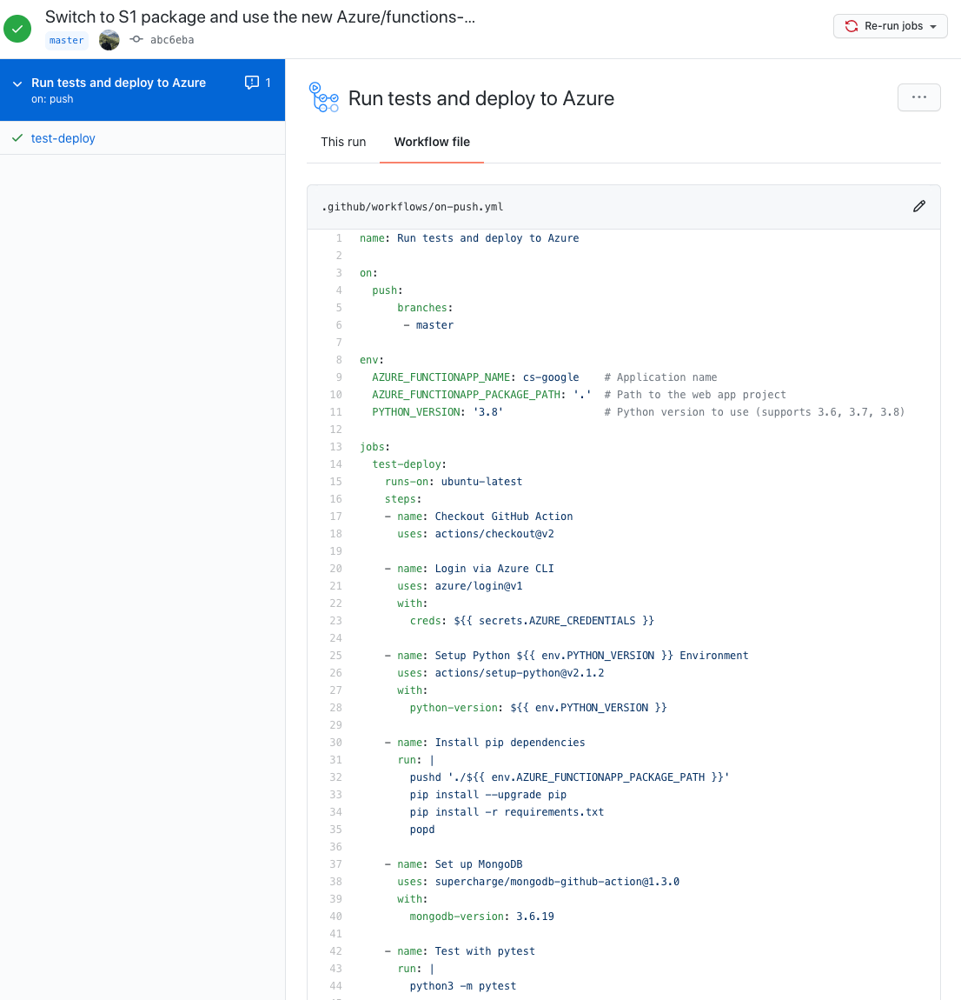
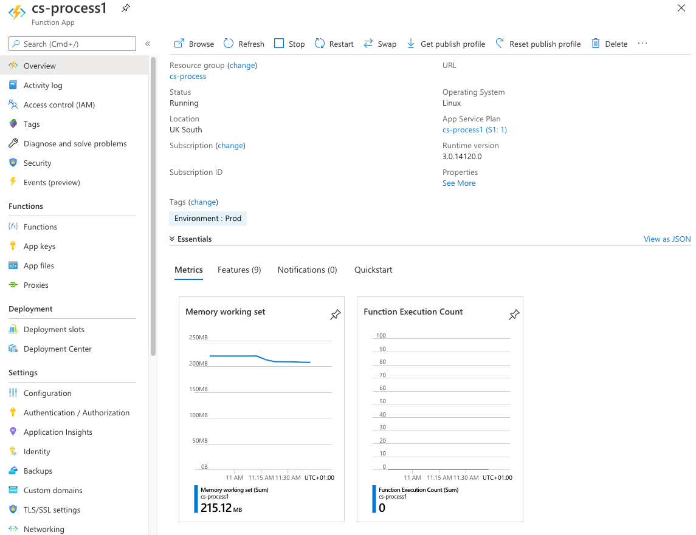
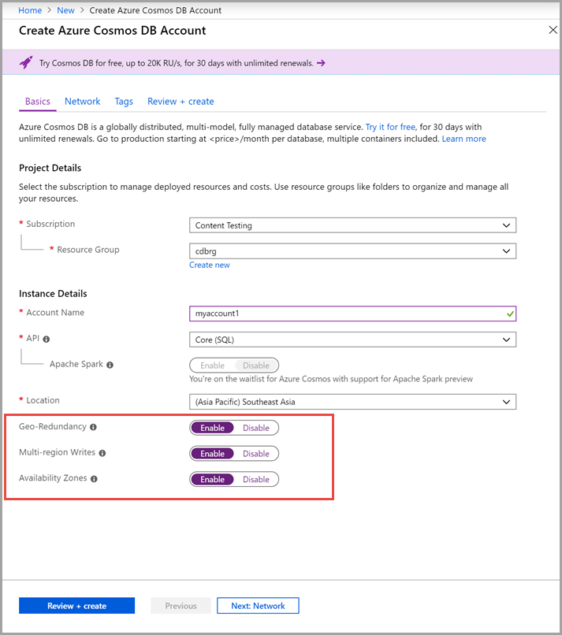

In March 2009, I started learning Python. When I have tried to learn a new
technology, I try and find something useful to do with it as a first project, so
I set about creating a SaaS product I could use to monitor my servers. I wrote
the web app in PHP and built the monitoring agent in Python, although everything
eventually converged on Python. This became Server Density, the company I then
went on to run through to acquisition in 2018.

For the first few years I was actively building functionality, including
architecting the infrastructure and figuring out how to scale it. This was not
easy. We were one of the earliest users of MongoDB, and although it helped solve
a lot of problems, it also brought its own: how do we get disks that are fast
enough? How do we design replicas for local and geo redundancy? How do we design
the schema for fast time-series queries? How do we back-up the data? We went
through several hosting providers and even at one point shipped physical disks
via courier because it was a faster way to bootstrap replica nodes in a new data
centre.

Over the last month I have been getting back into programming. I’m again using
Python (version 3.8 this time) to build something useful (I have nothing to
announce at this time), but that is where the similarities end. Although writing
the code itself is the same, 2020 is a different world compared to 2009. I
thought it would be fun to explore those differences.

## The coding environment

Python is just one option amongst many server-side language options with Go,
Rust and Node being popular choices for web development today. PHP still has a
bad reputation.

I don’t remember what editor I used in 2009 but it was certainly not much more
than a text editor with syntax highlighting. JetBrains was around in 2009 but
PyCharm was not released until 2010. This meant a lot of trial and error,
writing code, executing it, iterating. In 2020, there are [almost 40 options for
Python
developers](https://stackoverflow.com/questions/81584/what-ide-to-use-for-python),
and most of those support other languages.

Today I am using VS Code. Microsoft have done a great job at creating a
cross-platform IDE (it is the only Electron app that is any good). It provides
built-in linting (syntax and flake8), extensions to help me write valid yaml or
JSON, git versioning, a full debugging environment where I can step through code
execution to examine state, and management extensions to help me interact with
my cloud infrastructure. I could even spin up a cloud environment and [code in
my
browser](https://visualstudio.microsoft.com/services/visual-studio-codespaces/).

.")

## Deploying code

Before deploying to production, code needs to be tested with all the correct
dependencies. You need your test environment to look as much like production as
possible, so how do you do that if you code on a Mac/Windows but use Linux
servers?

In 2009, this meant having a server running Hudson, which became Jenkins in 2011. Luckily, GitHub was founded in 2008 so code could be pulled from a repo,
dependencies installed, databases set up, and then tests run. This was all
manual work.

Somehow you then had to get the build artefacts over to your production
server(s). At Server Density, we built a custom system which would upload the
files to a cloud storage bucket (object storage being one of the earliest cloud
products) and then used Puppet to deploy out to our servers. It worked, but was
a custom hack.

Today, the build environment is [a product feature of
GitHub](https://github.com/features/actions). I can run Linux, macOS or Windows
containers to build and test my code. There is a large marketplace of actions.
As I am deploying on Azure, there is an official action to push my code over to
production. GitHub keep everything secure and patched in the build environment
and [Dependabot](https://github.blog/2020-06-01-keep-all-your-packages-up-to-date-with-dependabot/) notifies
me if there are security updates for any libraries I’m using (with a pull
request ready to merge). If I had a team, we could collaborate using pull
requests, project boards, and issue tracking. All available at no cost within
the generous free quota.

## Infrastructure

Despite all those improvements, the biggest changes have come from managing
infrastructure. The first Server Density server was a small VM on Slicehost
(later acquired by Rackspace) but we quickly hit limits and moved over to
Softlayer. The bottleneck was disk performance for our MongoDB databases. In
2009, AWS was the only cloud provider and they had few features, and no
high-performance disks for many years. Softlayer were able to sell us physical
servers with SSDs.

Every server we ran at Softlayer was unique. We managed everything with Puppet
but we would regularly SSH into servers to debug problems. We managed our own OS
patching, installed packages, purchased SSL certificates and wrote the Apache
(later Nginx) configs to serve them, deployed across data centres, figured out
how to deploy RabbitMQ in high-availability, and used anycast routing for
self-managed load balancing.

Today, none of that is necessary. My main web app is
a [Flask](https://flask.palletsprojects.com/en/1.1.x/) app which GitHub Actions
packages, then deploys to a dedicated app instance on Azure in the region I
select. I choose a plan of resources and Azure provides a managed Python
environment that ensures the instances scale up to meet demand, and that it is
always patched for any security flaws. Azure deploys an automatically generated
SSL certificate for free, and keeps it renewed. All this is within the free
quota.

In addition, I have several functions which run in response to specific events.
Using Azure Functions, I have self-contained code which listen to a queue and
are ready to respond within milliseconds. Otherwise they sit idle, costing
nothing. The queue is managed for me – it’s one configuration setting to decide
whether it is deployed in a single zone, across a region or globally. I pay a
bit more in money but nothing in time, or code.

When I deploy new code, the deployment slot feature drains all the live traffic
from the old instance and swaps them out without users noticing. In the past,
this is all logic that would have to be custom built, or purchased from an
expensive load balancer vendor.

Everything connects to [Azure
CosmosDB](https://docs.microsoft.com/en-us/azure/cosmos-db/introduction). The
database exposes multiple APIs – Cassandra, MongoDB, Gramlin, Table and Etcd. I
chose MongoDB because I know the SDKs and I could choose to migrate to my own
MongoDB instance in the future. In the meantime, it is a one click option to
deploy the database across zones, regions, and globally. [Once I choose my
consistency
model](https://docs.microsoft.com/en-us/azure/cosmos-db/consistency-levels),
Azure automatically sets everything up and scales it on demand, keeps backups,
and charges me by the hour (again with a free quota).

My resources are defined [within JSON
templates](https://docs.microsoft.com/en-us/azure/azure-resource-manager/templates/overview) alongside
the code they support. The GitHub process deploys the template which is
declarative and idempotent. When I am ready to go live, I can scale the
resources up across regions by adjusting a variable, and then deploy [a globally
distributed load
balancer](https://azure.microsoft.com/en-us/services/frontdoor/) to
automatically send users to the app instances closest to them.

In 2020, I can have a globally distributed auto-scaling application for base
fees of around $100-200/m, plus bandwidth. The same setup at Server Density cost
us $x000s/month (excluding the huge time series database). I’m using Azure as an
example because it is what I’m using, but the same applies to Amazon or Google –
they all have these features as standard.

## Other things

My application makes use of [Auth0](https://auth0.com/) to manage user signup
and login. It took 10 minutes to integrate into my Python web app rather than
days to properly design a secure user signup and login system, and I know Auth0
will do a better job at security. I can enable SSO or social logins with minimal
hassle later if users demand them. In the past, this would have been significant
development time, and many SaaS products leave SSO for their first enterprise
contracts due to the hassle.

When I was building Server Density in the UK in 2009, there were no good options
for payment processing. I had to get a merchant account with a bank and connect
it to a payment processor (via a PHP SOAP API). That took weeks. Today, if I
want to take this project commercial I can integrate Stripe into my app within a
few minutes and it will also deal with all the invoicing, yet another piece of
software I had to write at Server Density!

## Conclusions

It no longer takes months to set up redundant, sophisticated, global
infrastructure which can be templated in JSON to ensure it is consistent and
version controlled. It has taken me about 2-3 days of full time equivalent work
to learn the Azure products, deploy, test, and then write the JSON templates
automate everything through GitHub. This means developers can focus on what
differentiates their product and spend more time iterating on user feedback.

Reaching scale is still difficult, but this is more because of commercials
rather than technical challenges. There will always be weird problems that
appear when you deal with large scale infrastructure, but there is now an
industry of vendors (Amazon, Google, Microsoft) who have the experience to help
you out.

[Who’d have thought, 10 years ago, we’d be sitting
here](https://www.youtube.com/watch?v=VKHFZBUTA4k) with a geo-redundant database
serving requests billed by the millisecond through a globally distributed load
balancer whilst the underlying software is patched automatically?
