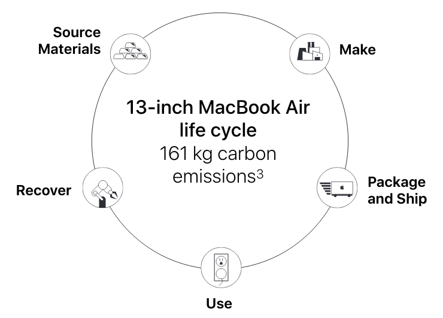

Apple is one of the few companies [publishing the carbon footprint of their
products](https://www.apple.com/environment/). These reports go all the way back
to 2009 and they publish reports for new products as soon as they are released.
They’re based on the ISO 14040 and 14044 international standards for lifecycle
assessment, include multiple configurations to match the options available for
purchase, and [assume lifetimes](https://www.apple.com/environment/answers/) of
4 years for macOS/tvOS devices, and 3 years for iOS, iPadOS, and watchOS
devices.

For example, [the new MacBook Air
13″](https://www.apple.com/environment/pdf/products/notebooks/13-inch_MacBookAir_PER_Nov2020.pdf) with
the Apple Silicon M1 chip with 256GB of SSD storage has a carbon footprint of
161 kgCO2. Microsoft does the same with its Surface lineup, which [I compared
with Apple devices in a previous
post](https://davidmytton.blog/the-environmental-impact-of-buying-a-new-laptop-comparing-the-macbook-air-and-surface-laptop/).

Even with the new MacBooks, only 15% of the carbon footprint is in using it.
Everything else is manufacturing and transport, at least [until Apple reaches
its net-zero goal by
2030](https://www.apple.com/newsroom/2020/07/apple-commits-to-be-100-percent-carbon-neutral-for-its-supply-chain-and-products-by-2030/).

For consumer devices, my conclusion is still: don’t buy a new laptop.

> Apple produces the most environmentally friendly laptops from both a carbon
> footprint and energy efficiency perspective, but it depends on which model you
> compare. Comparing the devices is interesting but if there is one thing to
> take away from this analysis it is: don’t buy a new laptop. The majority of
> the environmental footprint is in the production. If your laptop is working
> fine then why buy a new one?
>
> <cite>[The environmental impact of buying a new laptop – comparing the MacBook
> Air and Surface
> Laptop](https://davidmytton.blog/the-environmental-impact-of-buying-a-new-laptop-comparing-the-macbook-air-and-surface-laptop/)</cite>

## Carbon footprint of servers

Servers are different.

Everything we do online uses servers inside data centres which use a lot
of [energy](https://davidmytton.blog/how-much-energy-do-data-centers-use/) and [water](https://davidmytton.blog/how-much-water-do-data-centers-use/).
Servers are just like laptops – they have processors, memory, disks, circuit
boards and power supplies. They just don’t have a keyboard, display, or radio
components like wi-fi.

Companies
like [Google](https://www.wired.com/2012/03/google-miner-helmet/) and [Amazon](https://www.wired.com/2012/11/amazon-google-secret-servers/) build
their own custom servers, usually with the designs kept secret. [Microsoft and
Facebook are more open](https://www.opencompute.org/). At their scale it makes
sense to create custom designs, but everyone else buys them from server vendors
like Dell, Lenovo, and SuperMicro.

Server power consumption is very important because when you rack your own
servers, you have to pay for power. As a result, power specs for each server are
easy to find. However, finding carbon footprint reporting that includes the
manufacturing is more difficult.

Apple is the standard to beat, but something is better than nothing. Dell is one
of the few companies that publishes something. Although reporting is missing for
many of its products, and the reporting is for a single product spec [using a
non-standards-based tool](https://msl.mit.edu/projects/paia/main.html), it is
still useful as an illustration.

Let’s take a [Dell PowerEdge R240 1U rackmount
server](https://www.dell.com/en-uk/work/shop/productdetailstxn/poweredge-r240) as
an example:

")

[The estimated carbon footprint single CPU model
R240](https://i.dell.com/sites/csdocuments/CorpComm_Docs/en/carbon-footprint-poweredge-r240.pdf) with
16GB RAM and x2 1TB disk drives is 5,260 kgCO2e, of which 22% is in the
manufacturing and 77% in use. This assumes a 4 year lifecycle.

However, there is significant uncertainty in that calculation. The standard
deviation is +/- 4,860 kgCO2e, the majority of which is in the use stage.

")

This variation is not explained by Dell, but we can speculate that it is to do
with factors such as server load, time spent idle, and maybe even the [carbon
intensity of the electricity
grid](https://davidmytton.blog/how-can-data-centers-use-100-renewable-electricity/) (the
report assumes the EU as the server location).

")

There is also a big difference across product class. The R240 is a small, cheap,
1U rackmount. If we compare it to [a larger 4U 4-CPU, storage and memory dense
Dell
R930](https://www.dell.com/en-uk/work/shop/productdetailstxn/poweredge-r930), [the
carbon
footprint](https://i.dell.com/sites/csdocuments/CorpComm_Docs/en/carbon-footprint-poweredge-r930.pdf) hits
13,300 kgCO2e +/- 14,200 kgCO2e. 85% of that is in the manufacturing but the
variance is so large that this breakdown can’t be trusted.

## ARM the future of low power server chips?

The [R930 maximum power is
reported](https://downloads.dell.com/rdoc/dell%20poweredge%20r930,e37s,e37s001,dell%20regulatory%20and%20environmental%20datasheet.pdf) at
1,668 W and 906 W idle. The [R240 maximum
power](https://downloads.dell.com/rdoc/dell%20poweredge%20r240%20e57s%20e57s001%20dell%20regulatory%20and%20environmental%20datasheet%20en-us.pdf) is
174 W and 64 W idle. These Dell servers all use Intel chips, like most laptops.
However, things are starting to get interesting with ARM chips.

Due to their reputation for energy efficiency, ARM chips have been in mobile
devices like phones for over a decade. They are now starting to appear in
laptops – Apple just launched what will probably be the first mainstream device
with their [M1](https://en.wikipedia.org/wiki/Apple_M1) “Apple Silicon” chip,
but Microsoft’s Surface Pro X is another consumer-like device.

ARM chips are starting to come to servers, too. Amazon has its custom
ARM-based [Graviton](https://aws.amazon.com/ec2/graviton/) chip and
it [claims](https://pages.awscloud.com/Enable-Up-to-40-Better-Price-Performance-for-Your-Workloads-with-AWS-Graviton2-Based-Amazon-EC2-Instances_2020_0501-CMP_OD.html) 20%
lower cost and up to 40% higher performance for M6g, C6g, and R6g instances over
M5, C5, and R5 instances i.e. Graviton instances [are faster and
cheaper](https://www.anandtech.com/show/15578/cloud-clash-amazon-graviton2-arm-against-intel-and-amd) than
Intel or AMD equivalents.

And for those running your own hardware, companies
like [Ampere](https://amperecomputing.com/) are already shipping rackmount
servers with custom ARM chips, such as the Ampere Altra which has a [TDP of 45W
for its baseline
model](https://www.anandtech.com/show/15949/ampere-altra-1p-server-pictured-gigabytes-2u-with-80-arm-n1-cores-pcie-40-and-ccix).
Unfortunately, they don’t yet publish a carbon footprint report but compare the
maximum power of 45W for a 32 core ARM-based server to the 174 W of a single CPU
(up to 8 cores) Intel-based server. The clock speed is lower, but if you can
parallelize your workloads then ARM chips offer both performance and power
advantages.

")

## Conclusions

For consumers, the same rule applies: don’t buy anything new unless you have to.

For cloud users, see if you can make use of ARM-based instance types such as the
AWS Graviton instances. Most applications will have no issue compiling for ARM
and many dependencies probably already have ARM binaries. This will only
accelerate as developers adopt the new Apple devices.

For those racking their own servers, the availability of server-class ARM
rackmounts is exciting, but likely to be held back by software performance. But
given usual hardware lifecycles, by the time refreshes come around the software
support – accelerated by the availability of cloud instances and developer
laptops running ARM – will likely have improved ([see these 2017
benchmarks](https://blog.cloudflare.com/arm-takes-wing/), likely improved by
now).

With such large variances for servers, understanding true power draw is going to
be key to accurately estimating carbon footprint. Manufacturing carbon intensity
is a fixed, one-time cost. It might come down over time, but that only affects
newly manufactured devices. In contrast, use-stage carbon footprint changes as
the device continues to be used and the grid decarbonises. As usual, we need
more and better data.
