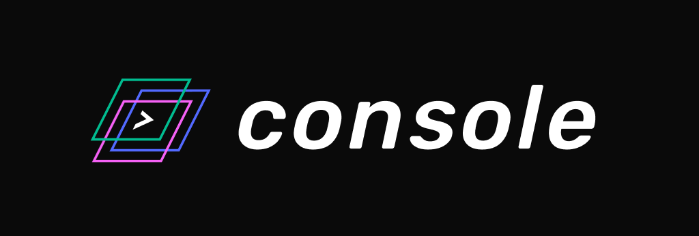

I started this blog at the end of 2017 with an aim to write ~weekly on tech and
startups. At the time I was still running my SaaS company, Server Density. I
find writing a good way to learn, research, and formalise my opinion on
particular topics, so used this blog as way to better understand topics on my
mind.

Server Density was acquired by StackPath in 2018, and in 2019 I left to do a
Master’s degree. The subject of the MSc was added as a new topic to this blog:
environmental technology. This developed into [several academic peer reviewed
articles](https://davidmytton.blog/publications/) in 2020, with more in the
pipeline for 2021.

Having finished the MSc at the end of 2020, the question then became: what next?

## Sustainable computing research

In the final half of my MSc, I focused on energy policy and technologies. This
involved learning about how energy systems work including a detailed
understanding of the renewables transition. I was able to combine this with my
experience of tech and cloud computing to begin researching [sustainable
computing](https://davidmytton.blog/sustainable-computing-where-to-focus/) and [data
center energy](https://davidmytton.blog/how-much-energy-do-data-centers-use/).
My thesis was on the energy intensity of video streaming, which I hope will be
published this year.

Academia is very different from being in a startup, and business in general, but
as I have enjoyed the research and writing process it is something I would like
to be able to continue.

Although it has been obvious for many years that digital and cloud are the
future, our reliance on technology sector was accelerated with the 2020
pandemic. The sudden switch to work-from-home has highlighted the importance of
energy efficiency, transparency, and the critical infrastructure that underlies
it all. Understanding how to make that sustainable is a major open question.

The good news is I am going to be able to continue to contribute to solving this
problem! I have joined [Uptime Institute](https://uptimeinstitute.com/) as a
part-time Research Affiliate focused on sustainable computing.

Uptime Institute is an independent advisory organisation focused on efficiency
and reliability of critical infrastructure, particularly IT and data centers.
They work with all the major tech companies and are a big contributor to how IT
infrastructure is designed, built, and managed. My work there will be mainly
writing reports on sustainability.

Much of this will be reposted here on my blog and my first report on renewable
electricity and data centers will be out shortly.

## My new startup – Console

I have also started a new company: [Console](https://console.dev/) – a free
weekly email digest of the best tools and beta releases for developers.

Whether it is a new CLI, cloud service, API, or even a new language, it is
difficult to stay up to date with the latest tools and technologies. There is
always something new to play with. I really enjoy trying new tools, but unless
you constantly live on Twitter, Reddit, Hacker News, and developer forums, it is
easy to miss the best things.

Console aims to become the
place [developers](https://blog.console.dev/focusing-on-developers/) go to find
the best tools. Starting as a weekly newsletter, each week we will pick out the
most interesting tools and new releases. We keep track of everything – dev
tools, devops, cloud, and APIs – so you don’t have to.

This will be my full-time focus, alongside my two co-founders. There are no
plans to raise money, but I will be continuing my angel investing and pro-bono
advisory work at Seedcamp.

It’s exciting to be building a company again!

