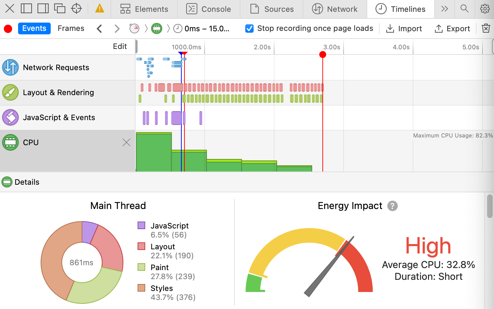
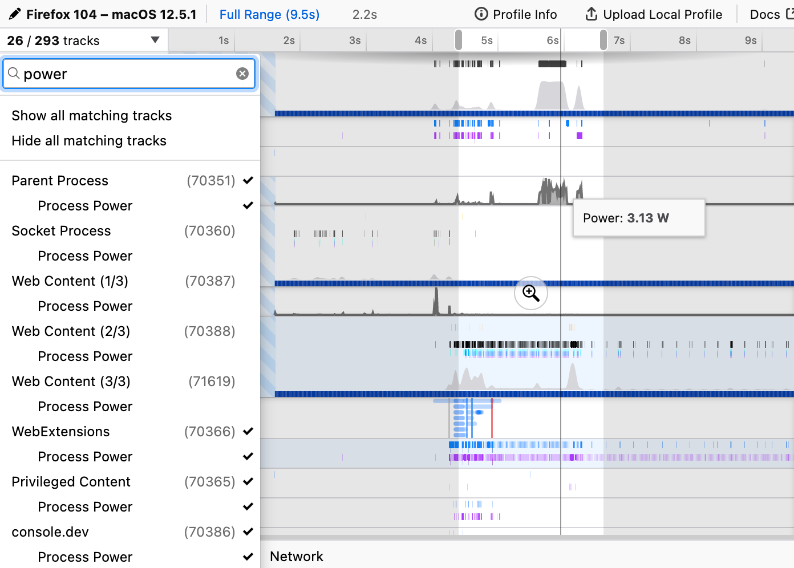

Network energy consumption is not proportional to data
transferred[^proportional]. The theory behind this is demonstrated in a
conference paper, [Malmodin
(2020)](https://online.electronicsgoesgreen.org/wp-content/uploads/2020/10/Proceedings_EGG2020_v2.pdf),
and applied to video streaming in [Carbon Trust,
2021](https://www.carbontrust.com/resources/carbon-impact-of-video-streaming).
We can see this from statistics published by telecoms operators showing their
network energy consumption decreased even as data volumes grew.

[^proportional]:
    The theory behind this is demonstrated in a conference
    paper, [Malmodin
    (2020)](https://online.electronicsgoesgreen.org/wp-content/uploads/2020/10/Proceedings_EGG2020_v2.pdf),
    and applied to video streaming in [Carbon Trust,
    2021](https://www.carbontrust.com/resources/carbon-impact-of-video-streaming).

kWh/GB energy intensity values represent the average energy per unit based on
knowing the total energy consumption and the total data transferred. This method
is useful for allocating energy across the entire network when the total energy
and total data transfer are known, but produces misleading results if used to
measure how energy consumption changes based on a change in data volume.

Therefore, website carbon emissions calculators [are not
useful](https://www.devsustainability.com/p/approaches-to-calculating-network-website-energy-and-carbon) because
they use an invalid method of calculating energy consumption.

.")

The network is also not the largest source of energy consumption when looking at
the system end to end. The user device is often a large part of the
environmental footprint of a particular application. This varies significantly
by device and also by application, but to take video streaming as a common
application, the user device makes up ~50% of the total energy profile.

.")

This means that understanding the energy consumption of the user device is
important to being able to optimize their efficiency.

## The browser as the power profiler

With so many applications accessed through the web browser, profiling
applications has become an important part of developing software. Every browser
has its own set of devtools which allow inspecting the source code, analyzing
network requests, profiling memory & CPU usage, and various other things.

Safari has had a power meter available in the developer tools for a long time,
but it is displayed as a gauge that shows the “energy impact” in terms of “low”,
“medium”, and “high”. It primarily focuses on CPU and recommends that idle pages
keep CPU at less than 3%. This is directionally useful, but doesn’t offer any
numbers. We really need actual numbers to be able to make comparisons and track
trends.



## Profiling website power consumption in Firefox

[Firefox 104 (Aug 24 2022)](https://www.mozilla.org/en-US/firefox/104.0/releasenotes/) introduced a
new component in the profiler which reports power usage in watts[^greencoding].
This is available by querying power APIs made available through Windows 11 or
Windows 10 (`SDK 10.0.17763 (Windows 10 1809 / Redstone 5)` and later) and macOS
on Apple Silicon devices.

[^greencoding]:
    Thanks to the [Green Coding
    blog](https://www.green-coding.org/blog/firefox-104-energy-measurements/) for
    highlighting this new functionality.

On Windows, the [Energy Metering Interface
(EMI)](https://docs.microsoft.com/en-us/windows-hardware/drivers/powermeter/energy-meter-interface) allows
drivers to expose energy consumption data. This returns the total energy
consumption up to the present, so can be queried multiple times by a profiler to
determine the energy consumption during the period. [The Firefox code can be
seen doing
this](https://hg.mozilla.org/mozilla-central/file/070c2bc9f8138aa9200c0e5e4af123c9e79fdaec/tools/profiler/core/PowerCounters-win.cpp#l90):

```c
void AddSample(ULONGLONG aAbsoluteEnergy, ULONGLONG aAbsoluteTime) {
    // aAbsoluteTime is the time since the system start in 100ns increments.
    if (aAbsoluteTime == mPreviousTime) {
      return;
    }

    if (aAbsoluteEnergy > mPreviousValue) {
      int64_t increment = aAbsoluteEnergy - mPreviousValue;
      mCounter += increment;
      mPreviousValue += increment;
      mPreviousTime = aAbsoluteTime;
    }
}
```

On macOS, the OS [provides an
API](https://github.com/apple/darwin-xnu/blob/8f02f2a044b9bb1ad951987ef5bab20ec9486310/osfmk/mach/task_info.h#L464) to
return the energy consumption of a [specific
task](https://developer.apple.com/documentation/kernel/1537934-task_info) in
nano-joules. [Firefox converts this to
picowatt-hours](https://hg.mozilla.org/mozilla-central/file/070c2bc9f8138aa9200c0e5e4af123c9e79fdaec/tools/profiler/core/PowerCounters-mac.cpp#l23)[^consistency]
for consistency with Windows:

[^consistency]:
    This conversion is important because *joules* represent the
    energy whereas *picowatt-hours* represents the power consumption. “Power is
    the rate at which something uses energy.” **Source:** [Sustainable energy
    without the hot air](https://www.withouthotair.com/).

```c
private:
  int64_t GetTaskEnergy() {
    task_power_info_v2_data_t task_power_info;
    mach_msg_type_number_t count = TASK_POWER_INFO_V2_COUNT;
    kern_return_t kr = task_info(mach_task_self(), TASK_POWER_INFO_V2,
                                 (task_info_t)&task_power_info, &count);
    if (kr != KERN_SUCCESS) {
      return 0;
    }

    // task_energy is in nanojoules. To be consistent with the Windows EMI
    // API, return values in picowatt-hour.
    return task_power_info.task_energy / 3.6;
  }
```

The result is we can profile the power consumption of a website. You can
separate the various processes which means you can isolate the website or
application from Firefox itself and the various web rendering processes. This
includes the decoder component when streaming videos, which is important to be
able to understand what is consuming the most energy.

Isolating each component allows the developer to focus on the code they control
without the profiling metrics being impacted by things out-of-scope, such as
background processes and the OS itself.

**Update 2022-09-06:** [A change was
merged](https://github.com/firefox-devtools/profiler/pull/4172) into the Firefox
Profiler UI which now displays the sum of the power consumption in the selected
time range.



## What about other browsers?

Unfortunately, neither Safari nor Firefox are popular browsers on
desktop[^statcounter] so the question is if/when will this appear in Chrome (and
then Brave, etc)?

[^statcounter]:
    Statcounter shows desktop share at 66% Chrome, 10% Edge, 9%
    Safari, and 8% Firefox as of Sept 2022.

There is currently [an open
proposal](https://github.com/MicrosoftEdge/DevTools/blob/b8bfbe9439e87896b23d52fd12fef2dcff8843d4/explainers/Sustainability/explainer.md) for
“sustainability” metrics in Microsoft Edge, but this is different from showing
power consumption. [My
feedback](https://github.com/MicrosoftEdge/DevTools/issues/92#issuecomment-1235324954) is
that energy metrics are more useful than a carbon value or a sustainability
score because they are more suitable for optimization by developers. Let’s see
what happens.
