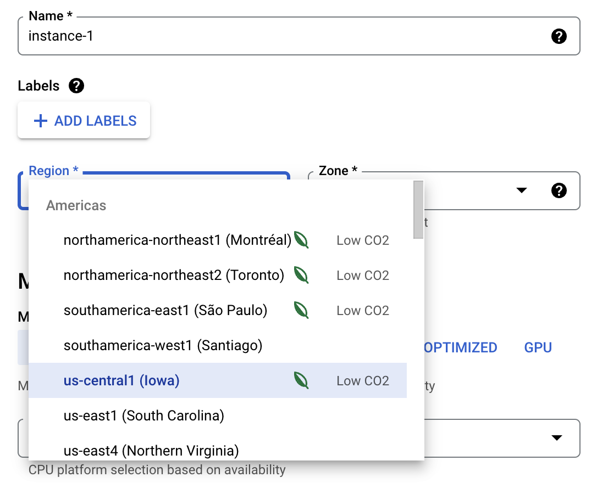

A new [proposal for Microsoft’s Edge
browser](https://github.com/MicrosoftEdge/DevTools/blob/b8bfbe9439e87896b23d52fd12fef2dcff8843d4/explainers/Sustainability/explainer.md) to
add sustainability metrics into the devtools [got me
thinking](https://github.com/MicrosoftEdge/DevTools/issues/92#issuecomment-1235324954) about
whether carbon is the right metric for developers to focus on.

Carbon dioxide and its equivalents are the key to national and international
net-zero emissions targets. This is the right measure because we know that CO2e
is the main driver of climate change. Governments can monitor progress by sector
and programs such as transitioning electricity generation to clean energy have a
large impact. There is also a direct relationship with the cause of those
emissions. For electricity, burning fossil fuels causes CO2e emissions, so
stopping that makes sense.

However, computing systems and software do not generate carbon emissions.
Generating the electricity they use is where those emissions come from. There is
a relationship between using computing systems and energy consumption, but that
is not necessarily linear, and might not emit carbon. So it’s more complicated.

## Relevant system boundaries

Modern computer systems are rarely isolated. Native, local-only software is
almost a thing of the past. Whether it’s email, video streaming, conferencing,
or gaming, your device - a laptop or phone - is typically connected via a
network to software being delivered through the cloud. This means the system
boundary has multiple components.

Carbon emissions vary in time and space. The emissions of the grid powering a
data center in the US will be different from the emissions where your laptop is
connected to in the UK. Which part of this does the software developer have
control over?

.")

## Optimizing energy on the client

Answering this question requires considering where your code runs. The web
browser on the user device is one place. Whether the code is using the CPU, GPU,
or maybe even a specialist processor, energy is required.

Client power consumption metrics are useful for developers because they can be
optimized. The same operation running on the same computer is likely to consume
the same amount of power each time it is run. [As I wrote about last
week](/is-carbon-the-right-metric-for-developers-to-optimize/),
Firefox and Safari are now exposing power metrics alongside other performance
profiling to help developers optimize their code. Optimizing performance is
often a proxy for optimizing power consumption, [but not
always](https://www.devsustainability.com/p/paper-notes-energy-efficiency-across-programming-languages).

Client carbon metrics are not as useful. If there are thousands of devices all
connected to different electricity grids at different times and locations, and
so having varying carbon intensity, how can a developer optimize them?

Certain tasks can be scheduled differently, such as [how Windows uses local grid
carbon intensity to decide when to install
updates](https://arstechnica.com/gadgets/2022/03/microsoft-is-trying-to-lower-carbon-emissions-via-windows-update-of-all-things/).
Computers often perform background tasks, so this is a good example of
intelligent scheduling, but it is limited to tasks which run periodically. The
carbon emissions of that same task will vary every time, making it a lot more
difficult to optimize, especially over many clients. But, if you need to have a
meeting now, it’s not very helpful if Zoom refuses to connect until the carbon
intensity falls.

This means that energy is where developers have the most leverage. If you have
to use the application right now, reducing its carbon footprint by optimizing
its power consumption is the only option.

.")

## Optimizing carbon on the server

In contrast to the client, software runs on a server in fewer, known locations.
When picking those locations, carbon can be part of the decision. For example,
Google Cloud makes it easy to see which region has a lower carbon intensity.
Without any code changes, developers can reduce the carbon emissions from the
energy used to power the data center where their code runs just by picking one
region over another.

At a larger scale, the owners of the data center have more control over the
carbon emissions of their facilities. [There are many issues with Renewable
Energy Credits and Power Purchase
Agreements](https://davidmytton.blog/recs-cannot-be-used-to-back-claims-of-100-renewable-energy/),
but they are part of the journey towards [100% renewable energy
24/7](https://davidmytton.blog/how-can-data-centers-use-100-renewable-electricity/).
Developers are probably not making these decisions, but they may influence which
cloud provider or colo data center their company uses. Even just deciding to use
Google over Amazon because of their environmental efforts, or racking your
equipment in a data center that sources its primary power from hydro, has a real
impact.

And even if they don’t, knowing the location and having flexibility over where
(and when) the code runs means that carbon aware scheduling can become useful.
This is easier with tasks that can be scheduled rather than those that are
real-time and latency sensitive. Introducing carbon scheduling into batch
processing is easier to do on the server, but there are still [considerable
barriers to achieving
it](https://www.devsustainability.com/p/paper-notes-mitigating-curtailment).

## The more metrics the better

Regardless of which metric is better, it’s great to see systems become more
transparent. Several years ago it was difficult to get even basic energy and
carbon data out of cloud providers, network operators, browsers, and operating
systems. Measuring software power consumption meant buying a power meter and
attempting to separate your code from all the other things the OS is doing. Now
we have carbon calculators, power reporting, and APIs to return the precise
power consumption of a specific task.

All this new data means we can start to be a bit more critical about what
metrics are useful for which purpose. The long term goal is to measure and
optimize both energy and carbon, but for now my recommendation is energy is more
useful on the client whereas carbon is easier to optimize on the server.
