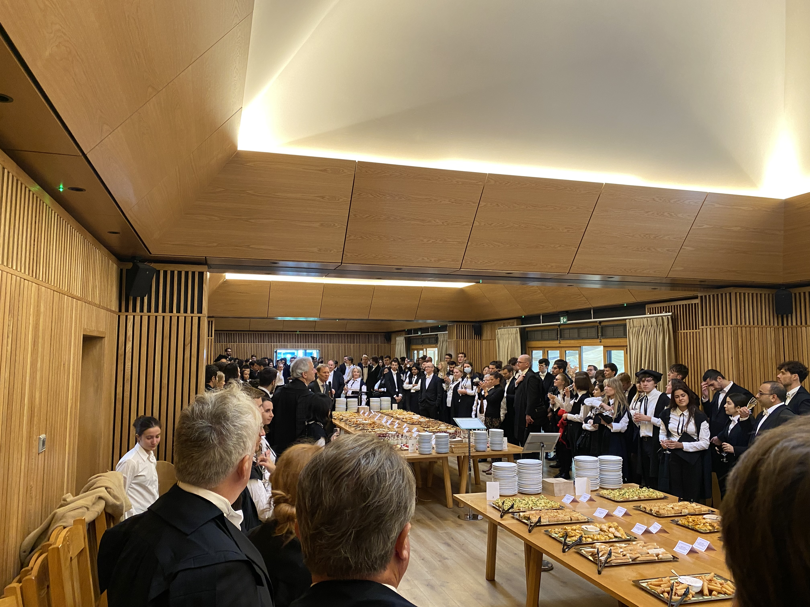

In October 2022 I started a [DPhil (PhD) in Engineering
Science](https://www.ox.ac.uk/admissions/graduate/courses/dphil-engineering-science)
at the University of Oxford (part time). Research groups in the [Department of
Engineering Science](https://eng.ox.ac.uk/) are broad, covering fields such as
thermofluids and turbo machinery, solid mechanics and materials engineering,
electrical and optoelectronic engineering, and energy systems.

My area of research falls into that final group, specifically [Energy and
Environmental
Informatics](https://oerc.ox.ac.uk/research-groups/energy-and-environmental-informatics/).
It is a continuation of the [“sustainable computing”](/sustainable-computing/)
research I started through the Environmental Technology MSc I completed at
Imperial College London in 2020. Having picked the “Energy Policy” specialist
module as part of the MSc, I found that I could link my tech experience
(particularly cloud computing and software development) with the science of
energy systems.

I wrote a few journal publications that coincided with increased public interest
in the environmental impact of computing, networks, and data centers, and I
ended up being on national television and quoted in a range of mainstream
newspapers. It’s rewarding to see my research having an impact, particularly in
an area like sustainability, so I decided that being attached to a university
would be a good way to continue it.

This post is a perspective on applying to Oxford and how the first term went.

## Applying to Oxford

Applications for the course opened on Sep 1, 2021, but I started the process a
year earlier. I knew the general area I was interested in, so the first step was
to find a potential supervisor. Despite the growing importance of sustainable
computing, there are not many people actively researching the topic around the
world, and only a few in the UK.

My first contact was in early 2020 and I combined it with proposing to write a
paper based on some work I was finishing at Imperial. This ended up in the 2022
publication “[Sources of data center energy estimates: A comprehensive
review](https://doi.org/10.1016/j.joule.2022.07.011)”, but the work started in 2020. This was useful for my application because I was already collaborating on
a real project within the group.

The application itself consisted primarily of a 1,000-word research proposal,
plus an academic CV and three references. Having submitted this in September, I
was invited to an interview with my potential supervisor and the lead postdoc
via a video call in Jan 2022. I was asked to review a student report on data
center energy and prepare a slide deck with my feedback. We also discussed my
research proposal, but as I had already been working within the group, this felt
more like a friendly chat. A second, independent, interview was scheduled the
same day with the department head.

Oxford publishes the number of applicants and places for each course. The
three-year average (applications for entry in 2019-20 to 2021-22) was 451
applicants for 98 full-time places, and 15 applicants for 5 part-time places.
It’s unclear how they decide places and offers, but I believe each candidate is
scored by each interviewer, ranked, and then a discussion happens to decide who
to make offers to. I received my offer on Mar 3, 2022.

## Start of term

Oxford is unusual in how short the terms are. Michaelmas 2022 started on Oct 9,
2022, and finished on Dec 3, 2022. Hilary 2023 has just started (Jan 15) and
finishes on Mar 11. Most of my time is self-directed and not based in Oxford, so
the terms are less relevant. However, I decided to spend the first 2 weeks of
the term physically in Oxford so I could enjoy all the benefits of being at such
a historic university.

Oxford is famously made up of different colleges (45 in total) and all students
are members of a college. However, unlike undergraduate degrees where you are
primarily based in a college so it is the college who offers the place, graduate
applications are made to a particular department. If the department offers you a
place, you are guaranteed a place by a college. You can specify a preference,
but there’s no public information about how colleges choose to make an offer and
how successful applicants are distributed. I was offered a place by a different
college ([Kellogg](https://www.kellogg.ox.ac.uk/)) from the one I expressed a
preference for. This seemed to be the case for many other people I spoke to.

For undergraduates, the college is a big part of the experience – it’s where
they live, eat, socialize, and have tutorials. For graduate students, the
department is the focal point. That doesn’t mean the college isn’t there, but
it’s less important.

My university card, known as a “bod card”, gives me access to [26 different
libraries](https://www.bodleian.ox.ac.uk/libraries) which collectively make up
“the Bodleian Library”. All of these have different subject specializations and
are in different buildings of varying architectural styles, so I spent most of
my first 2 weeks exploring the different options. My favorite is [Duke Humfrey’s
Library](https://en.wikipedia.org/wiki/Duke_Humfrey%27s_Library) which is inside
the Bodleian Old Library. Originally built between 1450-1480 and used in the
Harry Potter films as the Hogwarts Library, it’s amazing to be able to work in
such a historic setting. The only drawback is that you must leave all personal
items in lockers and can only take a laptop (loose, no case) because of the
sensitivity of the old books. The Radcliffe Camera is also a good choice, but it
gets busy during term time so can be hard to find a free space.

The city is the university, so you can go into university owned places such as
the Botanic Gardens and other colleges for free (Baliol, New College, and
Magdalen have impressive grounds). Once you join Oxford, you’re a member for
life.

.")

## A system for meeting people

Oxford is also famous for the connections you make, but it is not clear why it
is so successful until you get there. Oxford benefits from attracting such
interesting and capable people, but the whole system is set up to maximize
opportunities to meet them.

This starts with how communal dining works – lunch and dinner are available
every day during term time, and you simply sit next to whoever you want at the
long dining tables. The first time I experienced this was awkward because you’re
probably sitting next to people you don’t know, but you quickly find out that’s
the whole point. Everyone is friendly, and the first questions are invariably
“what are you studying?” and “where are you from?”. Colleges organize
“exchanges”, so you also get to visit different ones and meet people outside
your own college.

This continues at the formal dinners. Each college does this their own way, but
if you wander around Oxford around 6pm any evening, you will usually see
students running to dinner in smart suits and academic gowns. These dinners are
another opportunity to meet new people because the seats are randomized, selling
out months in advance (especially in Kellogg because the food is so good). You
can buy tickets for guests, and you'll sit next to them, but there are always
new people around you. This makes it just as fun to go by yourself as with
friends.

A surprising amount of event organization happens via Facebook. This is a bit
annoying because I deleted my account many years ago. I almost ended up creating
an account just to join the various groups, but there are email mailing lists
for groups, clubs, etc, and most of the events I was interested in were also
announced there. That and WhatsApp groups (acceptable because message content is
end to end encrypted). Oxford IT is all based on Microsoft 365 with a single
signon account that works well.

## Researching sustainable computing

The original research proposal that formed my application is already out of
date! A part-time PhD is 6-8 years in length, so a big challenge is relevancy.
Technology changes so quickly that anything I started now is going to be out of
date by then!

I'm therefore aiming to publish as I go, and I have started several papers which
I hope to be out in 2023. After these, I’m expecting more output to involve
open-source software, such as [my contributions to the Cloud Carbon Footprint
project](https://github.com/cloud-carbon-footprint/cloud-carbon-coefficients). I
wouldn’t want to be in academia full time because it [operates very slowly
compared to the startup world](/startup-cadence-academic-cadence/), so it's good
to be able to take the best from both worlds by being attached to a high-caliber
institution and able to meet and work alongside such interesting people.
