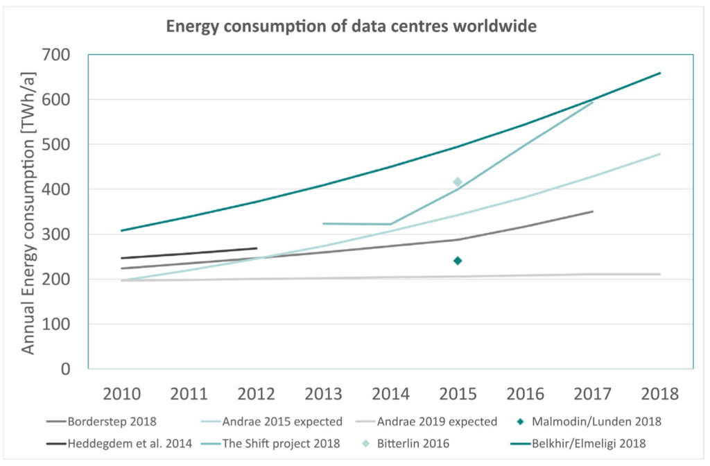
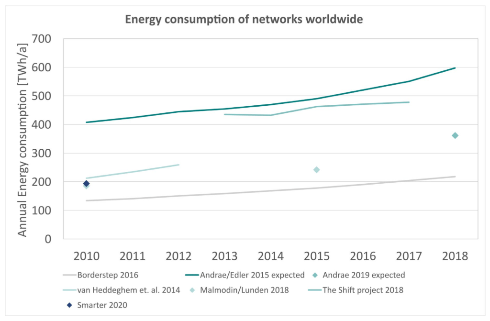
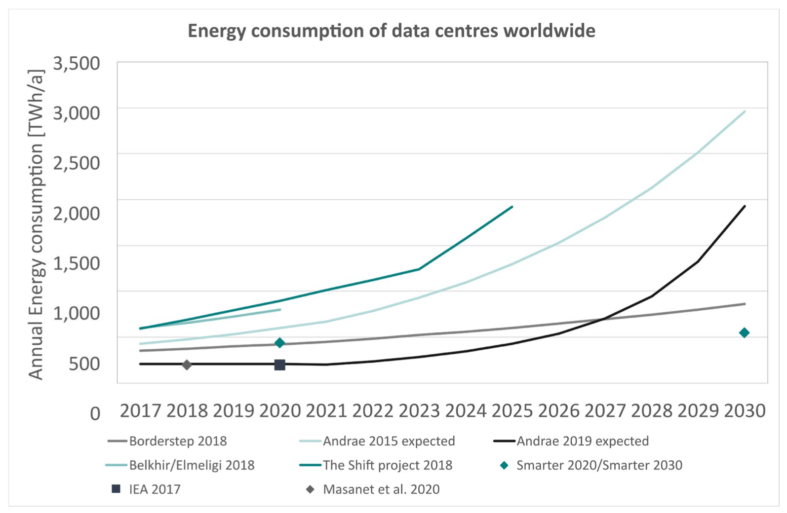

## Paper

Montevecchi, F., Hinterholzer, S., Stickler, T. & Hintemann, R.
(2020) *Energy-efficient cloud computing technologies and policies for an
eco-friendly cloud market: final study report*. Available
from: [https://dx.doi.org/10.2759/3320](https://dx.doi.org/10.2759/3320)

## Abstract

> The study on “Energy-efficient Cloud Computing Technologies and Policies for
> an Eco-friendly Cloud Market” is a 16-month service contract funded by the
> European Commission, Directorate-General for Communication Networks, Content
> and Technology, which addresses the issue of exponentially growth in energy
> consumption due to the expansion of cloud services at a European level,
> covering all aspects related to the underlying technological and structural
> base. An overview over the relevant technological developments, as well as
> current voluntary and regulatory policy instruments are developed and provide
> insights into potentials for a reduction of energy consumption as well as
> suitable policy options (including Green Public Procurement) to foster
> eco-friendly efficient cloud services and an energy efficient data centre and
> network landscapes.

## Notes

- The executive summary provides a good overview of the key findings of the
  report, which highlights that a lot of work has been done on data center
  energy but there remain major gaps in the analysis of computer networks,
  data storage, and software development in general.
- The context for the report is a major increase in the energy consumption of
  data centers in the EU28: 53.9 TWh/a to 76.8 TWh/a between 2010 and 2018.
  This is expected to grow 21% to 92.6 TWh/a by 2025.
  - This does not match [the narrative in a paper last
    year](https://science.sciencemag.org/content/367/6481/984) which
    suggests only a modest increase in data center energy expected over the
    coming years, primarily due to the move to cloud computing and improving
    energy efficiency.
- Cloud data centers were responsible for 10% of data centre energy
  consumption in 2010, increasing to 35% in 2018 and expected to rise to 60%
  in 2025.
- Computer networks are becoming more efficient over time, but the volume of
  data is increasing so rapidly that these improvements will be offset by the
  growth in that data, so total energy consumption will increase overall.
- Public sector procurement in the EU already considers energy efficiency for
  many product categories such as buildings and appliances, but there is not a
  specific process for cloud services. The report notes how energy efficient
  cloud computing is not currently a consideration in procurement processes.
- Best practices for data center efficiency already exist and involve widely
  deployed technologies such as cooling systems, server virtualization,
  infrastructure efficiency, and use of renewable energy for data centers. No
  such best practices exist for networks, storage, or software development.
- “Cisco has identified 24 cloud companies that generate billions of dollars
  in revenue from cloud services. The data centres operated by these companies
  are considered hyperscale data centres. Cisco expects the number of these
  data centres worldwide to increase from 338 to 628 between 2016 and 2021.
  According to Cisco, 53% of all data centre servers will be operated in
  hyperscale data centres by 2021 and 55% of data centre IP traffic will be
  caused by hyperscale data centres (Cisco, 2018a).”
  - Unfortunately, these stats are from a Cisco Whitepaper which is no
    longer available online. I have seen the same source cited elsewhere but
    never been able to find the original paper because Cisco don’t maintain
    a history online. They redirect the original URL to the latest version
    of the report which doesn’t include this data. [This is a major issue
    with the lifespan of
    references](https://davidmytton.blog/dead-references/).
- The report highlights the wide range of estimates of the annual energy
  consumption of data centers – 200TWh – 800TWh. The higher values are
  somewhat extreme (the colours chosen for this graphic are not ideal).

- The estimates for network energy consumption are just as wide – 200TWh –
  600TWh:

- These graphs become even more absurd when future projections are plotted.
  There are a lot of studies which make extreme assumptions based
  on [simplistic extrapolation](https://xkcd.com/605/):

- The report re-uses [methods and data from earlier Borderstep Institute
  papers on IT energy consumption from the same
  authors](http://ceur-ws.org/Vol-2382/ICT4S2019_paper_16.pdf). This is
  important because most data center estimates are based on data published by
  Koomey et al over the last 10-15 years. It is good to have several
  independent methodologies so that figures can be compared. For example, in
  the graphs above, Andrae uses a baseline from Koomey, and The Shift Project
  also uses a baseline from Andrae.
- A discussion of edge data centers is factored into the projections of future
  energy consumption because the report suggests that 40% of data center
  energy consumption will be from edge data centers by 2030.
- From a technology perspective, Moore’s Law has been the most important trend
  in energy efficiency over the last decade, and PUE improvements have been
  most important for data center energy. Suggestions that both of these are
  coming to and end are concerning.

## Conclusions

The report is a detailed review of the major issues across sustainable computing
and what the EU public sector should do next. It is right to highlight the need
for buyers to start asking questions about energy efficiency in the procurement
process for cloud services. Until those questions are asked, vendors will feel
no pressure to invest in reporting and transparency.
