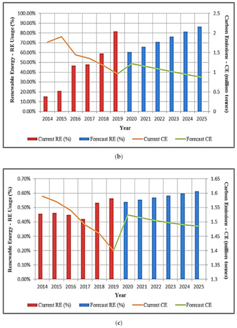

### Paper

Syed, S., Arfeen, A., Uddin, R. & Haider, U. (2021) An Analysis of Renewable
Energy Usage by Mobile Data Network Operators. *Sustainability*. 13 (4), 1886.
Available from: doi: [10.3390/su13041886](https://doi.org/10.3390/su13041886).

### Abstract

> The exponential growth in mobile data traffic has resulted in massive energy
> usage and therefore has increased the carbon footprint of the Internet. Data
> network operators have taken significant initiatives to mitigate the negative
> impacts of carbon emissions (CE). Renewable Energy Sources (RES) have emerged
> as the most promising way to reduce carbon emissions. This article presents
> the role of renewable energy (RE) in minimizing the environmental impacts of
> mobile data communications for achieving a greener environment. In this
> article, an analysis of some selected mobile data network operators’ energy
> consumption (EC) has been presented. Based on the current statistics of
> different mobile network operators, the future energy values are estimated.
> These estimations of carbon emissions are based on the predicted data traffic
> in the coming years and the percentage consumption of energy from renewable
> sources by the network operators. The analysis presented in this article would
> be helpful to develop and implement energy policies that accelerate the
> process of increasing the renewable shares in total energy requirements.
> Incrementing the share of renewable energy in total energy requirements can be
> a way forward to reach Goal 7 of the United Nations Sustainable Development
> Goals (SDGs).

### General notes

- This paper aggregates data from the sustainability reports of Vodafone,
  Telefonica and Telstra, examines their annual data rates, total energy
  consumption and renewable energy purchases, then makes predictions for how
  renewable energy will affect carbon emissions over the 6 years to 2019-2025.
- The authors believe this is an important topic because of the recent growth
  in internet data volumes, the growth in the usage of mobile devices and the
  correlation between data usage and energy consumption. They make reference
  to [a claim that mobile base stations make up 70% of the energy consumption
  of mobile networks](https://doi.org/10.1007/s11235-016-0156-4) and link
  carbon emissions with the generation of the electricity being consumed.
- It is true that electricity generation causes carbon emissions because the
  majority of global electricity is generated using fossil-fuels ([only 5%
  renewables as of
  2019](https://www.bp.com/en/global/corporate/energy-economics/statistical-review-of-world-energy/renewable-energy.html)).
  However, the variability of the grid mix means that carbon intensity changes
  on a regular basis. The mobile operators included in this paper are global
  organisations and so their electricity carbon intensity will vary
  significantly by region. Linking total electricity consumption to total
  carbon emissions is a historical calculation based on known carbon emissions
  factors – it is much more difficult to predict future carbon emissions. The
  grid mix cannot easily be predicted in advance. New renewables projects are
  always in development. Energy efficiency may improve. The weather changes. I
  see no evidence that these factors have been considered by the predictions
  in this paper (nor noted as a limitation).
- The quality of the language in the manuscript is poor – there are numerous
  typos, many repeated sentences, and it is quite difficult to follow in
  places. English language ability should not be a barrier to publishing
  scientific research so I wonder why the publisher has not provided editing
  and proofreading prior to publication.
- The workings are missing. There is no way to verify the calculations
  presented in the manuscript because they are not provided. I cannot find any
  supplementary information such as the graph sources, parameterised
  equations, or the regression analysis that the results are based upon. The
  equations included in the manuscript are not fully explained.

### Specific comments

- The “related work” section seems like a missed opportunity – it is just a
  description of other papers about renewable energy rather than a proper
  literature review explaining why those papers are relevant.
- The authors state:

> The operators’ goal is to save the environment and reduce carbon emissions by
> applying sustainable energy usage techniques.

but is that true? That might be the marketing goal but what about simply
reducing energy costs? This paper is not a study of operator sustainability
strategies so I would be cautious about attributing intention.

- The selection of these three mobile operators appears arbitrary. The authors
  say:

> The reason for selecting these three operators is that Vodafone, Telstra and
> Telefonica are among the world’s top ten telecommunication networks. These
> companies have subscribers from all over the world. Some of the leading
> telecommunication companies are working in numerous countries. However, their
> significant share is from one country, like AT&T, which generates more than
> 90% of its capital share from the USA only. The reason for the inclusion of
> Telstra is to check the status of relatively smaller network operators
> regarding energy efficiency. The secondary reason for considering these three
> network operators is that the operators’ most current and comprehensive data
> is also available, through which analysis can be performed.

but these do not seem like robust inclusion criteria. Just looking at [a
Wikipedia article on the largest mobile operators by number of
subscribers](https://en.wikipedia.org/wiki/List_of_mobile_network_operators) shows
many other operators that have not been included. Why has Telstra been picked to
represent a “smaller network operator”. I appreciate the difficulty of finding
sufficient data to analyse operators – increasing transparency is one of my own
research themes – but the paper does not define what “top” means.

- The description of how the percentage of renewable energy is calculated says
  “using the TREND function”. What is the trend function? [Presumably the
  linear trend function in
  Excel](https://support.microsoft.com/en-us/office/trend-function-e2f135f0-8827-4096-9873-9a7cf7b51ef1),
  but that is not explained and the values used are missing.

- Figure 5 shows carbon emissions reductions, current and forecast, and all
  three show a sudden increase from 2019 to 2020. This is interesting because
  it is the end of the actual values (2019) and start of the projected values
  (2020). It is most pronounced in Figure 5c. The paper says:

> From the analysis, it is noticed that initially, the share of renewable energy
> usage is likely to decline as compared to its current use, due to the enormous
> increase in data usage. Despite the initial reduction, the use of renewable
> energy sources is estimated to increase afterward.

However, this is not really an explanation, just a description. It is not clear
what the explanation for this jump is.

- In the discussion, this doesn’t make sense:

> Though all these mentioned mobile data operators have experienced incremental
> data traffic, the electricity consumption has not been changed or differs
> negligibly. The reason for unchanged electricity is the use of renewable
> energy by these mobile data network operators.

Perhaps this is a drafting error and they mean that despite the increased data
traffic, the carbon emissions do not change because of the use of renewable
energy. Using renewable energy will have no impact on electricity consumption.

### Conclusions

There is value in analysing the sustainability reporting of major mobile
operators because of the significant increase in mobile traffic over the past
few years. Despite expected future growth of mobile data traffic, mobile
technology has received only limited research attention.

Unfortunately, this paper is a missed opportunity. Equation parameterisation and
workings have not been provided so the results cannot be verified. The methods
have not been adequately explained and the discussion makes some strange
statements that do not make sense. Some of the results presented have
characteristics that are unexplained. The manuscript also needs significant
language editing.
