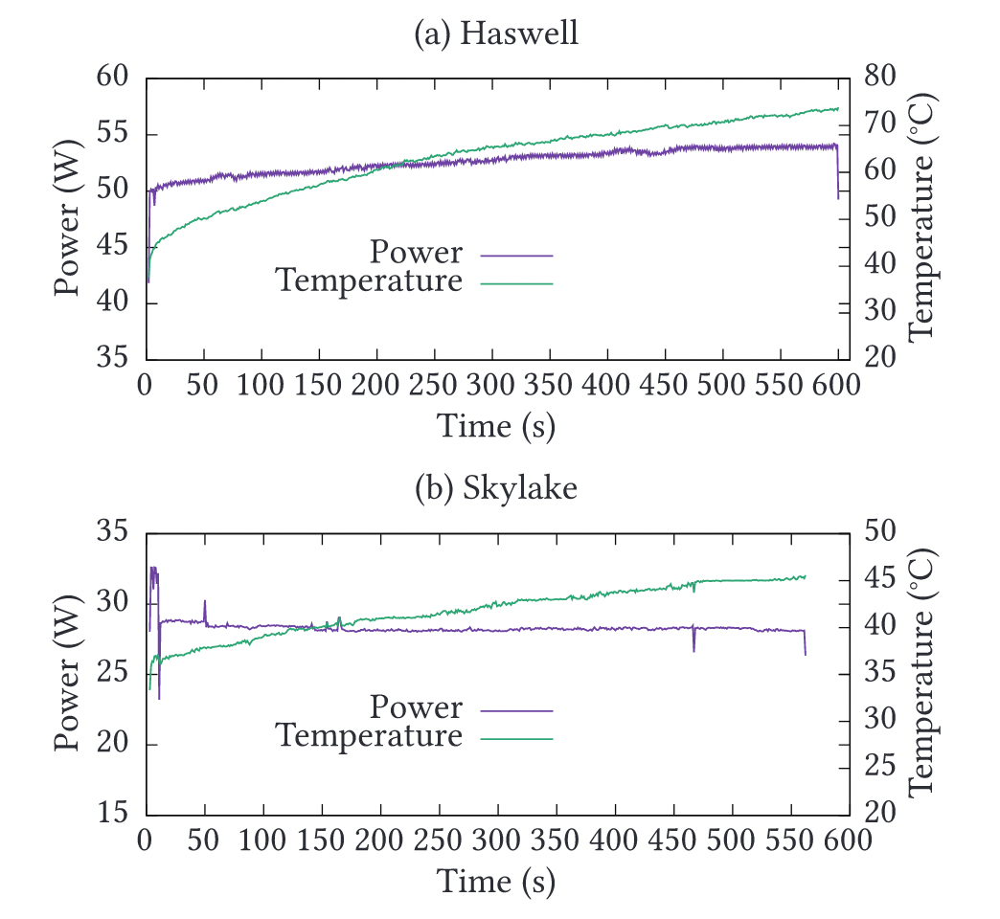

## Paper

Khan, K.N., Hirki, M., Niemi, T., Nurminen, J.K., Ou, Z., 2018. RAPL in Action:
Experiences in Using RAPL for Power Measurements. ACM Transactions on Modeling
and Performance Evaluation of Computing Systems 3,
9:1-9:26. <https://doi.org/10.1145/3177754>

## General Notes

- This paper presents an analysis of accessing and validating process power
  consumption metrics available for Intel CPUs via the Running Average Power
  Limit (RAPL) interface. This is a commonly used method for examining power
  consumption, such as [when comparing programming language
  efficiency](https://davidmytton.blog/paper-notes-energy-efficiency-across-programming-languages/).
- RAPL is not the only method for measuring power consumption. The Intelligent
  Platform Management Interface (IPMI) is also an option, but it was [considered
  to be insufficiently accurate](https://doi.org/10.1109/CLOUD.2016.0091).
- An advantage of using RAPL is that it is built into the chip hardware. It can
  measure the entire chipset including embedded DRAM and GPUs, although this
  paper focuses on the CPU. This also means there is no measurement overhead
  because the metrics are enabled from boot, managed by the SoC, and are running
  regardless of whether you want them or not.
- RAPL was introduced in the Intel Sandy Bridge architecture, and is available
  in all subsequent processors. It measures a particular power domain, which was
  expanded in the Skylake architecture from Powerplane 0 and Powerplane 1 to
  include a new domain called Psys which covers the entire SoC.

- Access to the metrics are via Model Specific Registers (MSRs). These are
  32-bit registers with different units depending on the chip (Sandy Bridge uses
  energy units of 15.3μJ, whereas Haswell and Skylake uses units of 61μJ.) and
  are updated every ~1ms. This presents several challenges:
  - The 32-bit register will roll over. No timestamps are provided, so you must
    track this yourself. The paper provides a method for calculating the
    overflow time based on the energy units and the power consumption. The
    higher the power consumption, the faster the counters are incremented. They
    use the example of a Haswell processor consuming 84 W triggering an overflow
    after 52 mins, however that is quite low power. [It is quite easy to
    benchmark](https://medium.com/teads-engineering/estimating-aws-ec2-instances-power-consumption-c9745e347959) processors
    to 5 times that (400-600 W), which would significantly reduce the time
    between rollovers.
  - You will need to determine the chip type to know which registers to query
    their units.
  - Directly accessing the registers is only available to the root user on
    Linux, although there are alternative methods of polling them, such as via
    the `/sys/class/powercap` filesystem, via [perf
    events](https://perf.wiki.kernel.org/index.php/Main_Page), or via the [PAPI
    library](https://icl.utk.edu/papi/). Using the PAPI interface can add up to
    30% of overhead to the measurement, although it depends on which RAPL
    attributes you request.
  - The 1ms update period is not consistent and has some jitter. This is a
    problem if you need measurements with more granularity e.g. where you want
    to profile a single function or code which executes faster than 1ms.
- The system temperature has an impact on power consumption. The paper reports
  that for Haswell, the package power grows by approximately 10–12% between 37C
  and 74C. For Skylake, this is 8-10% for between 23C and 32C. As the
  temperature increases, the cooling system, e.g. the fan, has to do more work.
  Getting accurate measurements requires warming up the processor from a cold
  start to avoid a sudden spike in power consumption as the cooling kicks in.

- Registers are updated non-atomically, which means you need to know in which
  order they are updated and allow an appropriate time in between each one to
  ensure that you are getting the right result.
- Individual core measurement is not supported, which limits the usefulness of
  power consumption against real world multi-threaded code or where
  hyperthreading is used.

## RAPL and cloud instances

This paper was published in 2018, which is a long time ago in the cloud
computing world! They have a section on using RAPL on Amazon EC2 where they were
able to query the RAPL interface without any problems. However, the temperature
metric remained at a constant 25C (probably falsified by the hypervisor), which
meant they couldn’t calibrate their tests against temperature.

Furthermore, the EC2 hypervisor intercepted the readings and the clock speed was
lower than their other tests, which created a polling delay. Virtualized CPUs
are not guaranteed to map directly to physical CPUs, which is a particular
problem in shared cloud environments where the resources are shared amongst
other users. They could not perform the same validation as with the rest of the
paper where the register values were compared against power meter measurements.

Since then, [other
researchers](https://medium.com/teads-engineering/estimating-aws-ec2-instances-power-consumption-c9745e347959) have
found that the newer EC2 KVM hypervisor instances no longer provide access to
the RAPL metrics. This is not a bad thing because the limitations above mean the
results are probably not that useful. Using bare metal cloud instances seems
like the only way to get access to the RAPL data now.

Although we do now have carbon calculators for Amazon, Google, and Microsoft
cloud environments, these are abstracted away from the underlying energy data.
This makes it difficult to optimize cloud applications for energy efficiency.
